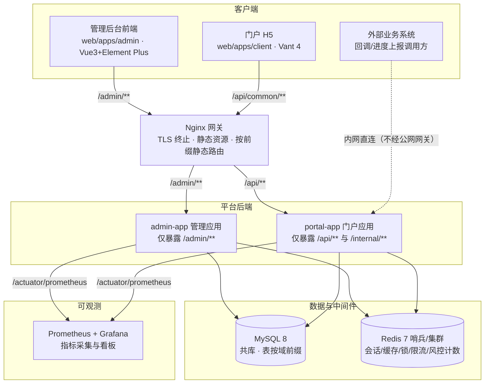
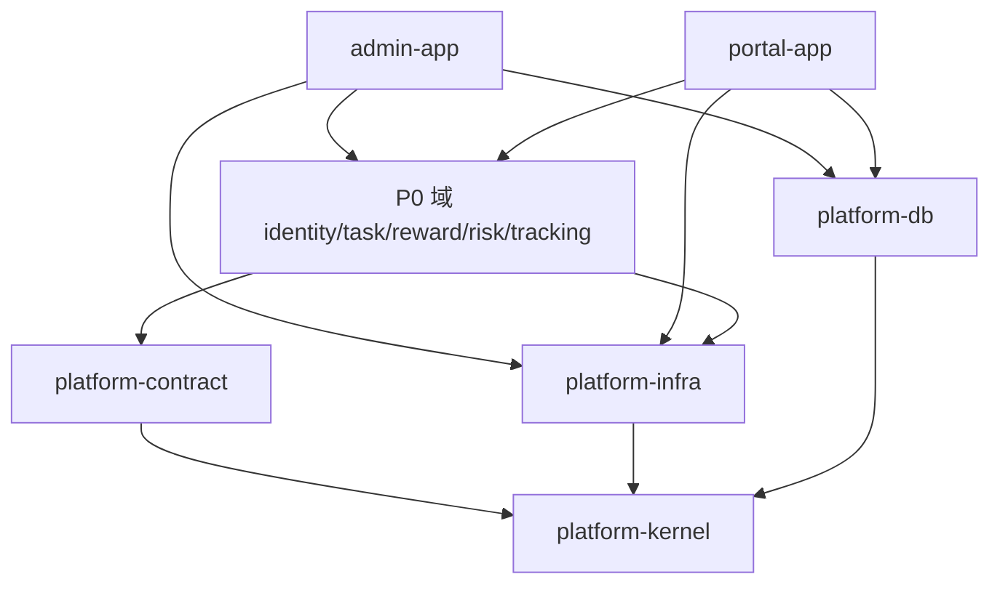
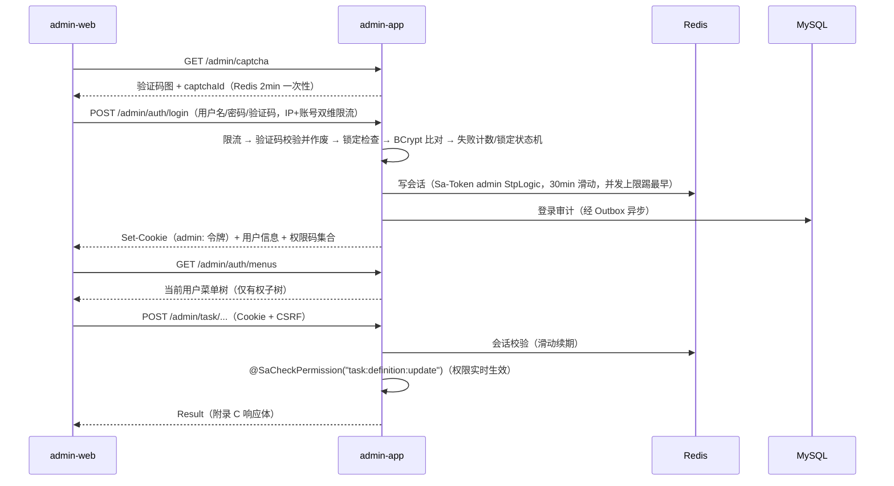
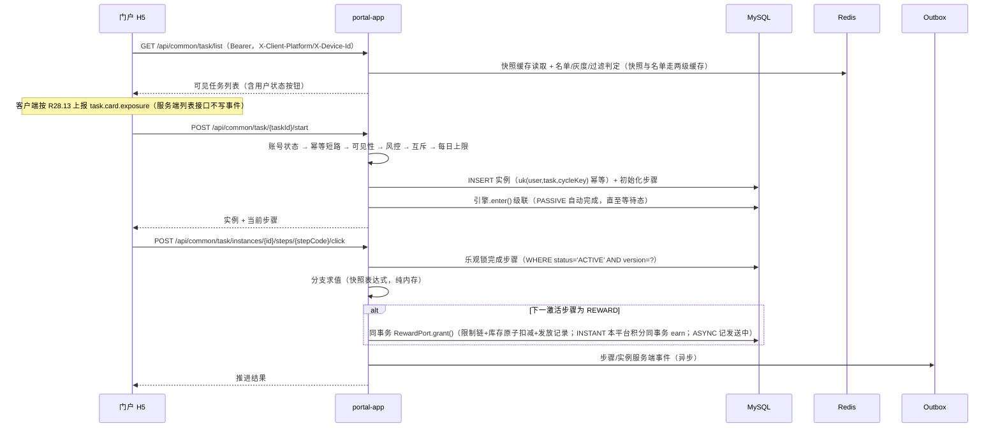
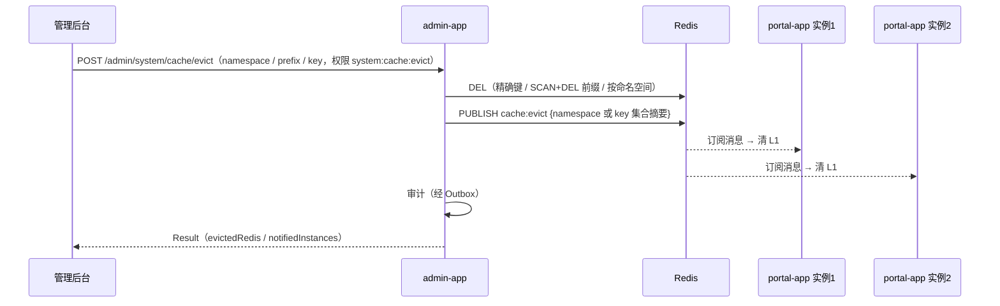
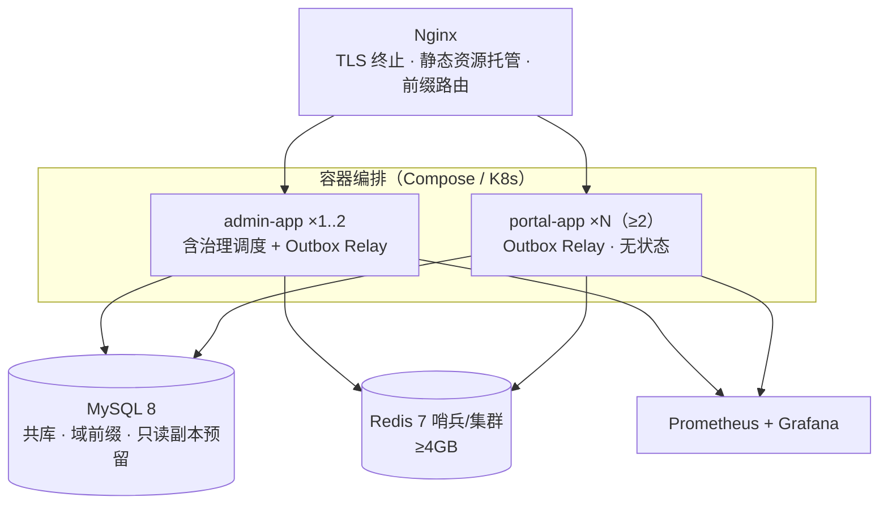

# 设计文档 · 架构与横切（§2 / §6 / §3.11）

> 本文是 [design.md](design.md) **v2.13** 分册。§ 编号与总册索引一致，引用仍写 design §x.y。
> 需求：[requirements.md](requirements.md) v3.9　选型：[component-selection.md](component-selection.md)
> 总册索引（§ → 锚点）：[design.md](design.md) §0.2。本章跳转：搜索 `<!-- §x.y -->`，不要记行号。

---

<!-- §2 -->
## 2. 架构总览与架构红线

<!-- §2.1 -->
### 2.1 系统上下文



**外部交互方清单：**

| 交互方 | 进入点 | 协议与鉴权 | 需求依据 |
|--------|--------|-----------|---------|
| 管理后台前端 | `/admin/**`（经 Nginx） | HTTPS + 后台会话 Cookie（HttpOnly + Secure + SameSite=Strict）+ CSRF 防护 | R1.13 |
| 门户 H5 | `/api/common/**`（经 Nginx） | HTTPS + `Authorization: Bearer <client:...>`；广告位与埋点上报支持匿名 | R1.13、R30.6、R28.3 |
| 外部业务系统 | `/internal/**`（内网直连 portal-app，Nginx 不代理此前缀到公网） | HMAC-SHA256 签名（X-App-Id/X-Timestamp/X-Nonce/X-Sign）+ appId 维度限流 | R15.2、R15.5 |
| Prometheus | `/actuator/prometheus`（两应用） | 内网抓取 | NFR 可观测性 1 |

<!-- §2.2 -->
### 2.2 逻辑架构：Maven 多模块与依赖规则

#### 2.2.1 模块清单

Maven 坐标统一 `groupId = com.mkt`；Java 包名与 artifactId 一一对应。

| artifactId | 包名 | 层 | 职责 | 阶段 |
|------------|------|----|------|------|
| platform-kernel | `com.mkt.kernel` | 基础 | Result 统一响应、ErrorCode 接口与分段错误码、BusinessException、UserContext、JsonUtil（tools.jackson 单例）、分页模型、全局异常处理器、traceId/MDC | P0 |
| platform-contract | `com.mkt.contract` | 基础 | 跨域三端口 RewardPort / UserAttributePort / RiskCheckPort + 事件常量。无实现、无 Spring Web | P0 |
| platform-db | `com.mkt.db` | 基础 | Flyway 迁移脚本唯一定义处（`db/migration/V<序号>__<域>_<描述>.sql`）+ 数据源/Flyway 配置。**全部建表 SQL 只允许出现在此模块** | P0 |
| platform-infra | `com.mkt.infra` | 基础设施 | Redis 客户端、两级缓存、锁、限流、Sa-Token 会话、Outbox Relay | P0 |
| domain-identity | `com.mkt.identity` | 业务域 | 模块 A（R1–R6）+ 模块 B（R7–R10） | P0 |
| domain-task | `com.mkt.task` | 业务域 | 模块 C（R11–R16） | P0 |
| domain-reward | `com.mkt.reward` | 业务域 | 模块 D（R17–R20）：奖品、发放、积分（`com.mkt.reward.points`） | P0 |
| domain-risk | `com.mkt.risk` | 业务域 | 模块 E（R25–R27） | P0 |
| domain-tracking | `com.mkt.tracking` | 业务域 | 模块 F（R28–R29） | P0 |
| admin-app | `com.mkt.admin` | 应用 | 装配全部领域模块；仅暴露 `/admin/**` 控制器；承载业务治理类调度（定时发布、过期翻转、积分过期、聚合等）与 Outbox Relay | P0 |
| portal-app | `com.mkt.portal` | 应用 | 装配 P0 全部领域模块（必须含 task 与 reward，见 RL-05）；仅暴露 `/api/**` 与 `/internal/**` 控制器；无状态水平扩展；承载 Outbox Relay | P0 |

> 模块 E（风控）与模块 F（埋点）按 requirements §交付范围属 P0；模块 G（广告位 R30）标注为"P1 先于或伴随 R23 交付"，骨架建模块的时间点随任务排期，不影响本架构。

#### 2.2.2 依赖规则（ArchUnit 强制，规则定义见 §2.8）



| 依赖规则 | 说明 |
|----------|------|
| 分层方向 | 应用 → 业务域 → 基础设施/契约 → kernel，禁止反向依赖与同层环 |
| 域间直依 | 域模块之间无 Maven 依赖（RL-02） |
| 跨域同步调用 | 仅经 contract 端口：task → RewardPort；task/reward → UserAttributePort；identity/task/reward → RiskCheckPort。积分入账在 domain-reward 模块内调用 | 
| 跨域异步通知 | 仅允许发布/订阅 `platform-contract` 中的领域事件（经 Outbox 投递，RL-07） |
| 数据访问隔离 | 任何域禁止 import 另一域的 Mapper/Entity；跨域数据需求走端口或事件（RL-03） |
| 迁移集中 | 业务域模块不包含 SQL 迁移；建表变更只出现在 platform-db（RL-09） |
| contract 纯度 | platform-contract 不依赖 Spring Web/数据访问，仅 JDK + kernel（RL-06） |

#### 2.2.3 跨域端口契约（三端口）

> 端口 = 跨域同步调用的唯一通道（同 JVM、Spring 注入）。域不能互相访问对方表，所以读别人的数据必须走端口。**写路径只保留三个端口**（Reward / UserAttribute / RiskCheck）。R5.6 只读门面见文末 TaskReadPort（D-13），禁止写方法。

**RewardPort**（提供方 domain-reward；调用方 domain-task 步骤引擎、admin 手工补发）：

| 成员 | 签名 / 定义 | 语义 |
|------|------------|------|
| grant | `GrantResult grant(long prizeId, long userId, GrantSource grantSource, String sourceId, GrantContext ctx)` | 与调用方**同事务**（传播 REQUIRED）执行 §5.6.2 全流程；幂等键 = (grantSource, sourceId, prizeId)；异常封闭三类：`RetryableGrantException`（可重试，调用方整级联回滚）/ `PermanentGrantException`（封闭枚举 PRIZE_DISABLED、PRIZE_DELETED、USER_INVALID）/ 规则链业务异常（§5.6.2 原样上抛） |
| userSummary | `UserRewardSummary userSummary(long userId)` | **只读**（D-13 / R5.6 / R4.5）：`pointsBalance`、`prizeSummary{won, granted}`。不走发放写路径。用户无账户则余额 0、摘要为 0 |
| prizeEnabled | `boolean prizeEnabled(long prizeId)` | **只读**（D-13 / R12.3）：奖品存在、未删除且 `status=ENABLED` 时 true。发布校验 REWARD 步骤走此方法，**禁止** task 域直查 `rwd_prize` |
| GrantResult | 记录 | `recordId: long、status: 领取七态之一、fulfillmentStatus: NONE\|SENDING\|ARRIVED\|FULFILL_FAILED、prizeId: long、hitIdempotent: boolean`（命中幂等键时 true，其余字段取既有记录值） |
| GrantContext | 记录 | `reason?: string`（MANUAL_GRANT 必填）、`bypassRules?: ("REGION"|"LEVEL"|"TAG")[]`（仅 MANUAL_GRANT 允许，R17.5）、`operatorId?: long`（MANUAL_GRANT 必填）、`simulated: boolean`（默认 false，P1 模拟器专用）、`elapsedSeconds?: Long`（task 在 GRANT 时填入；非 TASK_STEP 或同请求新建实例则 null，D-09） |
| GrantSource | 枚举 | TASK_STEP / SIGNIN_DAY / ACTIVITY_PARTICIPATION / MANUAL_GRANT / SIMULATE（= §3.4 grant_source 列封闭枚举） |

**PointsPort**（`domain-reward` 内部接口，发放/领取/过期调用，不属于跨域端口）：

| 成员 | 签名 | 语义 |
|------|------|------|
| earn | `long earn(long userId, int points, Instant expireAt, String sourceType, String sourceId)` | 同事务原子入账，返回流水 ID |

**RiskCheckPort**（提供方 domain-risk；调用方 domain-identity（注册/登录，只跑 IP/设备名单）、domain-task（start 领取，名单+R26）、domain-reward（grant 规则链尾，R18.7）。**步骤推进入口不调用本端口**，只在 task 域内查用户黑名单冻结，R25.4/R25.7）：

| 成员 | 签名 / 定义 | 语义 |
|------|------------|------|
| check | `RiskVerdict check(RiskScene scene, RiskSubject subject)` | 执行 §5.9 判定链。`REGISTER`/`LOGIN` **只跑名单、跳过 R-a–R-f**（R26.3）。**不抛业务异常**，拒绝语义由 verdict 表达、调用方决定错误码映射；命中留痕（risk_hit_log REQUIRES_NEW + risk.hit.recorded 事件）在端口实现内完成 |
| userSummary | `UserRiskSummary userSummary(long userId)` | **只读**（D-13 / R5.6）：`hitCount`、`listStatus[]`。不跑判定链、不写命中 |
| RiskScene | 枚举 | REGISTER / LOGIN / CLAIM / GRANT（= §5.9 场景集） |
| RiskSubject | 记录 | `userId?: long、ip: string、deviceId?: string、elapsedSeconds?: Long`（null = 跳过 R-e，D-09） |
| RiskVerdict | 记录 | `action: PASS\|REJECT\|SILENT_REJECT\|MARK`（步骤冻结不经本端口） |

**UserAttributePort**（提供方 domain-identity；调用方 domain-task / domain-reward）：门户用户画像与账号状态。用户表在 identity 域，task 做过滤/灰度/分支/领取锁、reward 做限领地域/等级/标签与 `USER_INVALID` 判定时**不得直查 `sys_portal_user`**（RL-03）。一次返回全部字段，调用方在内存计算 `hasTag` / `registerWithinDays`。

| 成员 | 签名 | 语义 |
|------|------|------|
| attributes | `UserAttributes attributes(long userId)` | 点查，走 `identity:user-attr` 缓存。用户不存在：画像字段 null、`accountStatus=NOT_FOUND`，不抛错。 |
| lockAndGet | `UserAttributes lockAndGet(long userId)` | **领取事务内**由 identity 对 `sys_portal_user` 执行 `SELECT ... FOR UPDATE` 后返回，**不读缓存、不写缓存**。用于 R13.6 账号状态 + 每日上限串行。task / reward 禁止自己对用户表加锁。 |
| UserAttributes | 记录 | `province? / userRole? / orgId? / userLevel? / tags[] / registeredAt? / accountStatus`。`accountStatus ∈ {ACTIVE, DISABLED, DELETED, NOT_FOUND}`：`deleted=1` → `DELETED`；`status=DISABLED` → `DISABLED`；行不存在 → `NOT_FOUND`；否则 `ACTIVE`。`user_level` 非法则 `userLevel=null`。 |

实现：仅 identity 访问 `sys_portal_user`，解析 `tags` JSON。`attributes` 缓存 `identity:user-attr`；档案变更、启停、逻辑删除 afterCommit evict。`lockAndGet` 与调用方同事务（REQUIRED）。

**TaskReadPort**（提供方 domain-task；调用方 identity 详情 / 门户档案聚合。**只读门面，禁止任何写方法**。写路径仍只有上面三个端口，D-13）：

| 成员 | 签名 | 语义 |
|------|------|------|
| instanceCounts | `InstanceCounts instanceCounts(long userId)` | `inProgressInstanceCount` / `historyInstanceCount`（终态合计）。R5.6 后台详情用 |

R5.6 / `GET /api/common/auth/profile.pointsBalance`：identity 控制器组装 `UserAttributePort.attributes` + `RewardPort.userSummary` + `RiskCheckPort.userSummary` + `TaskReadPort.instanceCounts`。**禁止** identity 直查他域表。

<!-- §2.3 -->
### 2.3 API 命名空间与网关路由

#### 2.3.1 命名空间分配（需求 §简介·应用与 API 命名空间规划）

| 命名空间 | 应用 | 内容 |
|----------|------|------|
| `/admin/**` | admin-app | `/admin/auth/**`（后台认证）、`/admin/captcha`（后台验证码）、`/admin/system/**`（字典/配置/缓存/审计）、`/admin/task\|reward\|points\|risk\|track/**`（各域管理）、`/admin/simulate/**`（P1） |
| `/api/common/<模块>/**` | portal-app | 第二段固定枚举：`auth`（认证）、`task`（任务浏览/参与）、`prize`（我的奖品/领取）、`points`（积分查询）、`dict`（字典只读 R7.3）、`track`（埋点上报）、`captcha`（门户验证码）；P1 增 `ad`、`signin` |
| `/api/<module>/**` | 预留 | 未来独立部署模块的第二段路由键（如 `/api/lottery/**`）；启用即独立部署决策，本期不实现 |
| `/internal/**` | portal-app | 服务间接口，**不带 `/api` 前缀**（如 `/internal/task/callback`）；网关对此前缀不做公网代理 |

约束（RL-08）：admin-app 只能暴露 `/admin/**` 与健康检查；portal-app 只能暴露 `/api/**` 与 `/internal/**` 与健康检查；两应用互斥，收到非本应用命名空间的请求一律 404。

#### 2.3.2 网关路由语义（Nginx）

```nginx
# 生产网关最小语义（完整配置在部署编排交付，R31.1）
location /admin/     { proxy_pass http://admin_app; }    # 管理面
location /api/       { proxy_pass http://portal_app; }   # 门户公共与未来独立模块
# 无 /internal 的 location —— 该前缀不经公网网关；外部系统内网直连 portal-app
```

#### 2.3.3 命名空间守卫（应用层兜底，RL-08 的实现规范）

1. 每个应用注册一个最高优先级的 `NamespaceGuardFilter`（Servlet Filter，order = 最高）：请求路径不匹配本应用允许前缀集合时直接返回 404（不进入鉴权链，不暴露端点存在性）。
2. **启动互斥校验**：应用启动时（`ApplicationRunner`）遍历 `RequestMappingHandlerMapping` 全部注册路径，断言每条路径以前缀集合开头；断言失败则启动失败（fail-fast），防止组装错误导致管理接口暴露于门户应用。
3. admin-app 允许前缀 = `/admin`、`/actuator`；portal-app 允许前缀 = `/api`、`/internal`、`/actuator`。
4. CORS 与生产暴露收口（NFR 安全 6）：CORS 白名单由 **Nginx 层**承担（版本化配置；前后端同源部署为主，默认不开跨域）；生产 actuator 仅暴露存活 / 就绪 / 指标：`management.endpoint.health.probes.enabled=true`，`management.endpoints.web.exposure.include=health,prometheus`（就绪路径为 health group `/actuator/health/readiness`，**不是**独立 endpoint；`prometheus` 仅内网可达）；OpenAPI 文档 UI 生产关闭（`springdoc.swagger-ui.enabled=false`），CI 类型生成走导出 JSON 不受影响。

<!-- §2.4 -->
### 2.4 应用组装与运行形态

#### 2.4.1 装配矩阵

| 能力 | admin-app | portal-app | 说明 |
|------|-----------|------------|------|
| 领域模块装配 | P0 五域；P1 增 signin / activity / ad | P0 五域；P1 增 signin / activity / ad | admin-app 需全域以支撑 R24.1 模拟测试进程内调用；portal-app 必含 task 与 reward（RL-05） |
| 暴露控制器 | 仅 `**.controller.admin..**` | 仅 `**.controller.portal..**` 与 `**.controller.internal..**` | 选择性组件扫描；控制器定义在领域模块内、按此分包 |
| 会话体系 | Sa-Token admin StpLogic（Cookie 载体） | Sa-Token client StpLogic（Bearer 载体） | 双账号体系完全隔离，交叉令牌 401（R4 属性 1） |
| 业务治理调度 | 承载（定时发布 R12.5、实例过期 R14.10、发放重试 R18.5、领取超时回滚 R19.2、履约重试 R18.3、积分过期 R20.4、广告/聚合 P1） | 不承载 | 全部经 Redisson `tryLock(0)` 恰一执行（NFR 可用性 3） |
| Outbox Relay | 承载（本应用产生的事件） | 承载（本应用产生的事件） | 锁键按应用分键（`outbox:relay:admin` / `outbox:relay:portal`），**SQL 必须带 `producer=` 本应用**，互不抢行（D-11，§6.4） |
| Flyway 迁移 | 默认执行 | 默认关闭（配置可开） | 单一执行者避免并发迁移；见 §6 |
| 无状态性 | 有状态会话在 Redis，应用自身无状态 | 同左，支持多实例滚动发布 | R31.4、NFR 可用性 2 |

#### 2.4.2 运行形态

- 开发/测试：Docker Compose 一键拉起 MySQL + Redis + admin-app + portal-app + Nginx（R31.1）。
- 生产：portal-app ≥ 2 实例（500 QPS 列表性能验收按 2 实例，NFR 性能 1）；admin-app 1–2 实例（调度锁保证恰一）；Redis 哨兵或集群，容量 ≥ 4GB（100 万用户双账号会话 + 缓存冗余，R31.5）；MySQL 单实例，只读副本预留（NFR 可扩展性 4）。

<!-- §2.5 -->
### 2.5 关键时序（路径为命名空间示意，端点级契约由 §4 定义）

#### 2.5.1 后台登录与 RBAC 鉴权（R1、R2）



#### 2.5.2 C 端核心链路：列表 → 领取 → 步骤推进 → 发奖（R13、R14、R18）



外部系统回调走 `/internal/task/callback|progress`（HMAC 校验 → 步骤状态前置检查 → 乐观锁推进 / reportId 去重累加），进入同一引擎，详见 §5 核心算法。

#### 2.5.3 缓存清理广播（R9）



<!-- §2.6 -->
### 2.6 部署视图



部署基线（R31）：健康检查（存活/就绪，NFR 可观测性 4）与启动依赖顺序进编排；环境配置全部经环境变量注入，`.env.example` 不含真实密钥（R31.6）；数据库变更与代码发布兼容滚动（先兼容后破坏两段式，R31.4）；备份每日全量 + 增量日志并可恢复至任意时间点（R31.3）。

容量设计假设（NFR 性能 8）：门户用户 100 万、日活 10 万、日新增实例 50 万、日事件 500 万（峰值 3000 events/s，事件表按月分区）。

图中 Redis 7 / 哨兵集群是 **R31.5 目标拓扑**。现网开发机共用 Redis **6.0.8 / DB 2**（与若依同实例）；P0 所用 SET/ZSET/pub-sub/Lua 在 6.0.8 足够。Compose / Testcontainers 可用 Redis 7 镜像。正式升 7 与哨兵另排，P0 不升级共享实例。

<!-- §2.7 -->
### 2.7 技术栈清单与版本策略

#### 2.7.1 后端技术栈（选型依据 component-selection.md §2/§3）

| 层 | 组件 | 用途 | 需求依据 |
|----|------|------|---------|
| 运行时/框架 | JDK 26 + Spring Boot 4 | 虚拟线程开启；JSON 使用 `tools.jackson`。无官方 starter 时手动装配 | 项目约束 |
| ORM | MyBatis-Plus（SB4 专用 starter） | 实体/Mapper/仓储；高写入表按需用 ASSIGN_ID 雪花 | component-selection §3.6 |
| 迁移/连接池 | Flyway + HikariCP | platform-db 唯一迁移处；默认连接池 | NFR 可维护性 1 |
| 认证 | Sa-Token（SB4 兼容版） | 双 StpLogic、Redis 会话、踢下线、并发会话控制 | R1/R4/R6 |
| 密码哈希 | spring-security-crypto（仅 BCrypt 工具类） | cost ≥ 12 | R1.5 |
| 验证码 | easy-captcha | 后台/门户图形验证码 | R1.7 |
| 缓存 | Spring Cache + Caffeine L1 + Redis L2；事务提交后 `UNLINK` + `PUBLISH cache:evict` 清理 L1 | R7.4/R9 | Spring 原语 |
| 分布式 | Redisson | 锁（看门狗）；限流用 Redis Lua 滑窗（§6.3） | R19.2、NFR 可用性 3 |
| 调度 | Spring @Scheduled + Redisson tryLock(0) | 10 项定时任务恰一执行（§6.7） | component-selection §3.3 |
| 表达式 | AviatorScript 5（AST 白名单）；不可用时使用自建极简解释器 | R11.9 DSL | component-selection §3.4 |
| JSON | tools.jackson（经 kernel JsonUtil 单例） | 全局唯一序列化出口 | NFR 可维护性 |
| 工具 | Hutool（hutool-core，非 JSON 模块） | 脱敏 DesensitizedUtil、HMAC SecureUtil | R10.6、R15.2 |
| API 文档 | springdoc-openapi（SB4 兼容版） | OpenAPI 导出与前端类型生成 | NFR 可维护性 2 |
| 指标/日志 | Micrometer + Prometheus + Grafana；logstash-logback-encoder | 指标与结构化 JSON 日志（traceId） | NFR 可观测性 |
| 测试 | JUnit 5 + Testcontainers（MySQL/Redis）+ jqwik + ArchUnit + k6 + Playwright | 属性测试/架构测试/集成/压测/E2E | NFR 可维护性 4 |

#### 2.7.2 前端技术栈

| 端 | 组件 |
|----|------|
| 管理后台 | vue-pure-admin-thin（Vue3 + TS + Element Plus + Pinia + Vite）、vue-flow（任务画布）、ECharts（P1 看板） |
| 门户 H5 | Vant 4 + unplugin-auto-import，移动端浏览器/WebView 为验收环境（模块 I 基线） |
| 共享 | openapi-typescript 从后端 OpenAPI 生成类型，禁止手写重复类型（NFR 可维护性 2） |

#### 2.7.3 版本策略与兼容风险

版本坐标由任务 1 冒烟后写入 `dependency-matrix.md`，父 POM 只引用该矩阵。运行时为 JDK 26 + Spring Boot 4。Redisson / Sa-Token / MyBatis-Plus 优先官方 starter，否则手动装配。缓存见 §6.2。

<!-- §2.8 -->
### 2.8 架构红线（RL 清单：全部可被 ArchUnit / CI / 启动断言机械执行）

> 红线是强制设计约束，由 ArchUnit / CI / 启动断言执行；违例即构建失败。规则以本表为唯一清单，ArchUnit 测试类逐条对应 RL 编号命名。

| 编号 | 红线 | 执行机制 | 需求依据 |
|------|------|---------|---------|
| RL-01 | 模块依赖单向：应用 → 域 → 基础设施/契约 → kernel；禁止反向与跨层环 | ArchUnit 分层规则（按包名分层） | NFR 可扩展性 1 |
| RL-02 | 域间 Maven 直依为零；`com.mkt.task` / `identity` / `reward` / `risk` / `tracking` 互不 import | ArchUnit 包隔离 | NFR 可扩展性 2 |
| RL-03 | 禁止跨域访问 Mapper/Service/Entity；跨域数据仅经 contract 端口或领域事件 | ArchUnit import 检查（Mapper/Entity 包级隔离） | NFR 可扩展性 2 |
| RL-04 | 控制器按 `controller.admin` / `controller.portal` / `controller.internal` 分包归属领域模块；admin-app 仅扫描 admin 控制器、portal-app 仅扫描 portal/internal 控制器 | ArchUnit 命名规则 + 两应用 `@ComponentScan` 过滤器 | §2.4.1、RL-08 前提 |
| RL-05 | portal-app 必须装配 task 与 reward（积分在 reward 内，同 JVM 同事务发放）；禁止拆成独立进程 | 启动断言：portal-app `ApplicationRunner` 校验 RewardPort、任务引擎、积分入账 Bean 存在且非远程代理；ArchUnit 校验 portal-app POM 依赖 task 与 reward | NFR 可扩展性 5、R14.5、R18.1 |
| RL-06 | platform-contract 只含接口/记录/常量，不依赖 Spring Web 与数据访问 | ArchUnit：contract 包不得 import spring-web/jdbc/mybatis | P2 |
| RL-07 | 跨域异步仅经 Outbox 事件；业务事务内禁止远程调用（HTTP/RPC）与消息中间件直发 | ArchUnit：@Transactional 方法调用栈禁远程客户端类型；评审清单兜底 | P7、feasibility §3.2 |
| RL-08 | 命名空间互斥：admin-app 仅暴露 `/admin/**`，portal-app 仅暴露 `/api/**` 与 `/internal/**`；越界请求 404；启动互斥校验 fail-fast | NamespaceGuardFilter + 启动路径断言（§2.3.3）+ 集成测试 | 需求 §简介 约束 1 |
| RL-09 | 数据库结构变更仅经 platform-db 的 Flyway 版本化脚本，已应用脚本不得修改；业务模块零 SQL | ArchUnit：域模块不得含 `*.sql` 资源与 DataSource 直配；Flyway validate 校验 | NFR 可维护性 1 |
| RL-10 | 无鉴权后门：不存在可关闭鉴权的全局开关；调试免登仅本地 profile；mock 类能力生产 profile 编译期排除 | ArchUnit：鉴权注解存在性检查（后台控制器必须有 @SaCheckPermission 或显式白名单）；@Profile 注解检查 | NFR 安全 3 |
| RL-11 | 业务代码禁止直读配置表与自建 ObjectMapper：配置仅经 ConfigService.getTyped；JSON 仅经 kernel JsonUtil | ArchUnit：SysConfigMapper 仅 identity 配置包可访问；ObjectMapper 构造仅 JsonUtil | R8.5 |
| RL-12 | 只增不改不删数据不可变：审计日志、事件日志、风控命中记录无 update/delete 服务方法与端点 | ArchUnit：相关 Mapper 方法名白名单（insert/select 仅有）；端点扫描 | R10.5、R28.7、R27 |

<!-- §2.9 -->
### 2.9 全局设计约定

| 约定 | 内容 | 需求依据 |
|------|------|---------|
| 时间基线 | DB 与服务内部 UTC 存储；对外接口 ISO-8601 带时区偏移；cycleKey 生成、每日/当日计数窗口、自然日切分统一 UTC+8 `[00:00,24:00)` | 附录 C |
| 响应体/错误码 | 成功 `{code:0, message:"ok", data, traceId}`；失败 `{code:"<域>.<场景>.<原因>", message, traceId}`；HTTP 状态码映射表照附录 C 执行；错误码分段规划在 §3/§4 落表 | 附录 C |
| 分页 | 请求 `page`（≥1）+ `pageSize`（默认 20 上限 100 截断）；响应 `{total, records}` | 附录 C |
| 数据库 | 共库单 MySQL；表前缀按域：`sys_`（identity+系统管理+outbox）/ `task_` / `rwd_` / `pnt_` / `sgn_`（P1）/ `act_`（P1）/ `risk_` / `evt_`（事件）；utf8mb4；预留按域拆库 | NFR 可扩展性 4、README 决策表 |
| ID 策略 | 默认数据库自增主键；事件表等高写入表用 MyBatis-Plus ASSIGN_ID（雪花） | component-selection §3.6 |
| 请求标识 | `X-Client-Platform`（端枚举 WEB/ANDROID/IOS/MINIAPP/SIMULATOR，缺失/非法按 WEB，R16.4）；`X-Device-Id`（UUID v4，缺失/非法按未携带计指标不拒绝，R4.7） | R16.4、R4.7 |
| traceId | 网关/入口过滤器生成，MDC 注入贯穿双应用，响应体携带，日志 JSON 输出 | NFR 可观测性 2 |
| 缓存命名空间 | 封闭清单（R9.1）：`identity:session` / `identity:user-attr` / `task:snapshot` / `task:published-index` / `dict` / `config` / `rbac:permission` / `task:crowd` / `risk:rule` / `ad:position`（P1）；键名 `<namespace>:<业务键>` | R9.1 |

---

---

<!-- §6 -->
## 6. 横切机制设计

<!-- §6.1 -->
### 6.1 Sa-Token 双账号会话（R1/R4/R6）

| 项 | 设计 |
|----|------|
| 双账号体系 | 两个 `StpLogic`：`StpAdminLogic`（loginType=`admin`）与 `StpClientLogic`（loginType=`client`），各自独立 token 名、独立 Redis 会话键空间；令牌字符串携带前缀 `admin:` / `client:`（R1.13），格式上不可互换；任一侧令牌访问另一侧命名空间 401（R4 属性 1，集成测试交叉断言） |
| 会话存储 | Sa-Token Redis 会话模式（SaTokenDao → platform-infra Redisson/Lettuce 连接）；30 分钟滑动过期（R1.8/R4.3） |
| 并发会话上限 | 登录时经 `ConfigService` 读取 `auth.admin.session.max-concurrent`（5）/ `auth.portal.session.max-concurrent`（3，附录 A），设置到对应 StpLogic 的同账号最大登录数并启用"超出踢最早"（Sa-Token 语义对应 R1.9/R4.3；配置热调生效于下次登录） |
| 踢下线全局一致 | 会话集中 Redis，`StpLogic.logout(userId)/logout(token)` 任一实例执行后全部实例立即不可用（R6.2/属性 1）；账号停用/重置密码/逻辑删除的级联失效 = 服务层调用 `logout(userId)`（R3.2/3.3/R5.2） |
| 401 原因码 | 后台统一 `auth.session.invalid`。门户封闭四码（R4.3 / D-02）**完整 code**：`auth.session.missing` / `auth.session.expired` / `auth.session.kicked-concurrent` / `auth.session.kicked-admin`。踢下线写 `session:kick-reason:{loginType}:{token}`（TTL 60s），过滤器读一次即删 |
| CSRF（后台） | Sa-Token same-token（等价双重提交）：登录下发非 HttpOnly CSRF Cookie（SameSite=Strict）且 data.`csrfToken` 回显同一值；写请求头 `X-CSRF-Token`，常量时间比较，失败 403。门户 Bearer 不做 CSRF |
| 免登调试 | 仅 `local` profile 提供，生产 profile 编译期排除（RL-10，NFR 安全 3） |

<!-- §6.2 -->
### 6.2 两级缓存（R7.4/R8.3/R9）

**组件边界**：业务只依赖 `PlatformCache`（get/put/evict/evictPrefix/evictNamespace）。实现为 Spring Cache + Caffeine L1 + Redis L2；evict 时 UNLINK Redis 并 `PUBLISH cache:evict`，各实例订阅后清理 L1。

**命名空间注册表**（封闭清单 = R9.1，新增须同步登记 R9.1 条款）：每个命名空间注册 `name → {L2 TTL, L1 开关与容量, 指标标签}`：

| 命名空间 | TTL | 用途 | 需求 |
|----------|-----|------|------|
| dict / config | 5min + 变更即失效 | 字典/配置读 | R7.4/R8.3 |
| rbac:permission | 5min + 变更即失效 | 用户权限码集 | R2.6 |
| task:snapshot | 24h + 发布/下线失效 | 版本快照（渲染/求值零 DB 读，feasibility §3.5） | R12 |
| task:published-index | 30s 轮询容忍 | 已发布任务索引（列表判定入口） | R13.1 |
| task:crowd | 10min + 导入失效 | 人群包成员判定 | R11.9 |
| risk:rule | 5min + 变更即失效 | 规则配置 | R26.6 |
| identity:session | Sa-Token 自管 | 会话（非本组件管理，**禁止经 cache evict 清理**，R9.2） | R6 |
| ad:position | 60s（接线后） | **P1 预留名**（R9.1 封闭清单占位，避免 P0 占用该字符串）。**P0（任务 15/24）**：登记该 ns；`/admin/system/cache/stats` 返回键数 0 或 N/A；`evict` 空操作合法、不 400。**禁止**广告拉取、频控、素材装配、L2 写入。接线与 TTL=60s = 任务 48 | R30 |
| identity:user-attr | 5min + 变更即失效 | 用户画像属性（UserAttributePort 数据源，§2.2.3） | R9.1 |

task:crowd 的 L2 结构 = Redis **SET**（key = `task:crowd:{crowdId}`，成员 = userId）；缓存未命中时从 `task_crowd_item` 按 5000/批 SADD 装载并以 SETEX 包裹；容量上限 = `crowd.max-size`（10 万），导入超限即拒（§4.4）。L1/Caffeine 统一缺省：全部命名空间 L1 开启、容量 10000（task:snapshot / task:published-index / identity:user-attr / ad:position 为 1000）；指标标签 = Micrometer tag `ns=<命名空间>`；identity:session 行在 `/admin/system/cache/stats` 返回 N/A（Sa-Token 自管，不纳入本组件计数）。

**一致性协议（1 秒生效，R7.4/R8.3/R9 属性 1）**：写库事务 `afterCommit` 同步器执行 `evict(namespace:key)`（DEL L2 + 广播清 L1）→ 任意实例下一次读回源新值；命中率与键数统计经 Micrometer 暴露（`cache_stats` 端点数据源，R9.1）。

<!-- §6.3 -->
### 6.3 限流（R1.11/R4.2/R15.5/R19.5/R28.3）

- 注解 `@RateLimit(dim = IP|USER|APP_ID|CUSTOM, key = SpEL?, window = 秒数(必填常量), max = 上限(必填常量), configKey = 附录A键(必填))` + 拦截器；阈值运行时优先取 `configKey` 经 ConfigService 读取（热调，R8 联动），读取失败时回退注解 `window/max` 常量（两者必填，任何路径下均有确定阈值，无未定义态）。
- 实现：Redis Lua 滑动窗口（同一脚本，按 key 分桶）。登录须同时通过 IP 桶与账号桶。
- 超限：429 + `Retry-After` + `common.rate-limited` / 场景码；被拒计数指标（NFR 可观测 1）。
- **fail-open**：Redis 异常 → 放行 + 告警 + 降级事件（NFR 可用性 4；限流器故障不阻塞业务）。
- 端点接入位：登录/注册/验证码/用户名可用性检查（IP+账号，username-available 复用登录 IP 桶）、门户写接口（用户维度 `ratelimit.portal-write.user.per-second`）、internal（appId 维度）、埋点批量（用户/设备维度）、领取（用户维度）。

<!-- §6.4 -->
### 6.4 Outbox 事务性事件（R10.3/R28.9）

```text
EventPublisher.append(eventCode, aggregateType, aggregateId, payload):
  断言当前存在事务（TransactionSynchronizationManager.isActualTransactionActive），否则抛 IllegalStateException
  producer = 本应用标识（admin | portal，启动期注入，不可空）
  → INSERT sys_outbox（含 producer；业务回滚则事件不存在，R28 属性 3；审计完整性 R10 属性 1 同理）

Relay（admin-app 与 portal-app 各一，锁键分应用：outbox:relay:admin / outbox:relay:portal，§2.4.1；D-11）:
  每 5s：tryLock(0) 获取成功 →
    rows = SELECT * FROM sys_outbox
           WHERE producer = :self               -- 禁止扫对方行，两把锁互不抢行
             AND status='PENDING'
             AND (next_retry_at IS NULL OR next_retry_at<=NOW())
           ORDER BY id LIMIT 100
    for row: consumers = 注册表.get(row.event_code)     # 本表消费方向 → EventConsumer Bean 列表
      路由表声明了消费方向且 consumers 为空 → 不 DELETE；retry_count+1 + 告警 outbox.missing.consumer（滚动发布丢消费者不得吞事件）
      路由表消费方向为空（本期无此类探测事件）→ WARN + DELETE
      全部成功 → DELETE row（终态表已落库）
      任一失败 → retry_count+1，next_retry_at = now + 退避(10s,30s,2m,10m,30m)
      retry_count >= 5 → status=DEAD（保留，后台可查 + 积压指标告警，NFR 可观测 3）
  消费者幂等约定：按 (eventCode, aggregateType, aggregateId) 幂等，最终表唯一约束兜底——evt_event_log 写入时 **id 直接取 sys_outbox.id**（指定 ASSIGN_ID 插入，复合主键 (id, server_time) 天然去重：重投 INSERT 主键冲突按成功处理）
```

**Outbox 事件全集与消费路由表（设计决策 D-05：事件常量封闭全集，注册于 platform-contract；本表 = Relay 消费者注册表的唯一权威定义，全部消费者成功才 DELETE）**。服务端事件码与附录 D 一致：

| 事件常量 | 来源 | 生产点（同事务 append） | 消费方向 |
|----------|------|----------------------|---------|
| `audit.log` | 领域内部 | §6.5 审计 AOP | sys_audit_log |
| `auth.register.success` | server·附录 D | §4.9.1 注册成功 | evt_event_log + risk:cnt（R-c / R-d，仅门户） |
| `auth.login.success` | server·附录 D | §4.9.1 登录成功 | evt_event_log + risk:cnt（R-c / R-d，**仅门户**；后台登录不写此事件、不计数） |
| `task.instance.start` | server·附录 D | §5.1 实例创建事务 | evt_event_log |
| `task.step.complete` | server·附录 D | §5.1.2 完成权持有后 | evt_event_log |
| `task.instance.complete` | server·附录 D | §5.1.3 实例终态 CAS | evt_event_log + risk:cnt（R-a） |
| `task.instance.abandon` | server·附录 D | 放弃入口（§4.4 运营终止 / §4.9 用户放弃） | evt_event_log |
| `task.instance.expire` | server·附录 D | §6.7 调度 2 过期翻转 | evt_event_log |
| `risk.hit.recorded` | server·附录 D | §5.9 命中留痕独立事务内 | evt_event_log（风控命中投影，R26.4） |
| `reward.grant.success` | server·附录 D | §5.6.2 grant() 成功出口 | evt_event_log + risk:cnt（R-b） |
| `reward.grant.failed` | server·附录 D | §5.6.2 永久失败，或 REQUIRES_NEW 留痕事务内（可重试失败；主事务回滚不带此事件） | evt_event_log |
| `reward.fulfill.arrived` / `reward.fulfill.failed` | server·附录 D | §5.6.3 履约到账 / 失败 | evt_event_log |

> 私有属性与附录 D 一致。`audit.log` 为领域内部事件，不进附录 D / `evt_event_log`。R14.11「步骤与实例状态全量落事件」与 R26.4 风控命中投影由本全集承载；R14.9 后台实例详情 `events` 时间线的服务端数据源同此。

<!-- §6.5 -->
### 6.5 审计 AOP（R10）

- 注解 `@Audited(module, action)` + 环绕通知：记录操作人（UserContext）/IP/UA/请求参数摘要/结果（成功/业务失败均记，异常抛出也记 FAILURE，R10 属性 1）/耗时/traceId。
- 参数摘要流水线：入参 → JsonUtil 序列化 → 敏感字段脱敏（password/token/secret/phone 等，Hutool DesensitizedUtil，清单=R10.6）→ 截断 2000 字符追加 `...(truncated)`（R10.1）。变更类注解（配置/字典/角色权限/名单/规则/奖品）在序列化前先读库取**旧值**并入摘要（`old → new`，masked 项旧值取掩码串，R8.4）。
- 落库路径：业务事务内 `EventPublisher.append("audit.log", ...)` → Relay 异步写 `sys_audit_log`（不阻塞主请求，R10.3）；审计写入延迟为可观测指标（NFR 可观测 1）。
- 必记清单（R10.2）逐域接入：登录登出/账号权限/配置字典/缓存清理/名单与风控处置/实例终止/补发与重试/履约确认与履约重试/对账导入核对与差异处置/奖品分类变更/积分调整/任务发布下线/埋点元数据——**机械规则：全部非 GET 的 `/admin/**` 写端点一律标注 `@Audited`（module/action 取对应域），GET 不标；`/api/common/**` 与 `/internal/**` 禁止标注**（R10.1）。未认证失败登录 `operator_id=NULL`、`operator_name`=提交用户名（R1.6）。Sa-Token 拦截器阶段的 403（R2.3，含未授权 GET）由入口过滤器在鉴权失败后补一条 `audit.log`，不能只靠方法注解。该规则对 R10.2 必记清单全覆盖，无需逐点核对。
- 只增不改不删：无 update/delete 服务方法（RL-12 架构测试）；保留 ≥ `retention.audit-days`（180 天）。

<!-- §6.6 -->
### 6.6 traceId 与日志规范（NFR 可观测性 2）

- 入口过滤器（两应用）：优先读请求头 `X-Trace-Id`（内部调用透传），否则生成（UUID 短形）；写 MDC `traceId` + 响应头 + 附录 C 响应体字段。
- 日志：logback + logstash-logback-encoder JSON 结构化输出；字段约定 `ts/level/logger/msg/traceId/userId?/thread`；JSON 单例经 kernel JsonUtil（RL-11）。
- internal 调用方透传：HMAC 客户端工具类自动附带 `X-Trace-Id`（§4.8 签名串不含该头，避免头变化影响签名）。

<!-- §6.7 -->
### 6.7 调度治理（全部 admin-app 承载 + Redisson tryLock(0) 恰一，NFR 可用性 3；Outbox Relay 见 §6.4）

| # | 任务 | 频率 | 锁键 | 幂等机制 |
|---|------|------|------|---------|
| 1 | 定时发布扫描（R12.5） | 30s | sched:publish-scan | 状态 CAS（SCHEDULED→PUBLISHED，失败保持 SCHEDULED + 写审计（module=task, action=schedule-publish-failure，含原因）+ 告警通道通知；**失败记录列表 = `GET /admin/task/definitions/schedule-failures`（`task:definition:query`）按上述审计过滤分页，R12.5 交付物**） |
| 2 | 实例过期翻转（R14.10） | 1min | sched:instance-expire | `UPDATE ... SET status='EXPIRED' WHERE status='IN_PROGRESS' AND expire_at<=NOW()` 条件天然幂等；终态 CAS |
| 3 | 发放自动重试（R18.5） | 30s | sched:grant-retry | uk_idempotent + `RETRY_PENDING ∧ next_retry_at ≤ now ∧ expire_at > NOW()`（重试入口语义见 §5.6.2） |
| 4 | CLAIMING 超时回滚（R19.2） | 10s | sched:claim-timeout | `WHERE status='CLAIMING' AND updated_at < NOW()-claiming-timeout` → WON |
| 5 | WON/RETRY_PENDING 过期翻转（R19.3） | 1min | sched:prize-expire | `WHERE status IN ('WON','RETRY_PENDING') AND expire_at<=NOW()` → EXPIRED |
| 6 | 积分过期扣减（R20.4，§5.8） | 每日 00:05 UTC+8 | sched:points-expire | EXPIRE 流水 biz_id 反指 EARN |
| 10 | 履约重试与发送中超时（R18.3）+ 对账入池（R37.2） | 30s | sched:fulfill-retry | `SENDING ∧ next_fulfill_retry_at≤now` 再派发；`SENDING ∧ updated_at < NOW()-sending-timeout` → FULFILL_FAILED；`recon_required ∧ SENDING ∧ recon_status=NONE ∧ granted_at 业务日 < 今日` → `PENDING` |
| 7 | 进度去重清理（§3.3.8） | 每日 04:00 | sched:progress-clean | `DELETE ... WHERE created_at < NOW()-7d` 分批 5000 行 |
| 8 | 事件表分区预建 + 过期清理（R31/NFR 容量） | 每日 03:00 | sched:evt-partition | information_schema 判断预建未来 3 个月；DROP 分区 < 90 天（retention.event-days） |
| 9 | 审计保留清理 | 每日 03:30 | sched:audit-clean | `DELETE WHERE created_at < NOW()-retention.audit-days` 分批 5000 行 |

调度规范：`tryLock(0)` 获取失败即跳过本轮（不等待）；执行体包裹 try/finally 释放；多实例部署下恰一执行（双实例测试验证，§7）；任务执行时长/结果暴露指标（NFR 可观测 1）。

<!-- §6.8 -->
### 6.8 Redis 故障降级行为矩阵（NFR 可用性 4 / R26.3 / R28.8）

| 组件 | 故障行为 | 用户影响与恢复 |
|------|---------|----------------|
| 会话（Sa-Token） | **拒绝请求**（对外 500 统一文案 + traceId），绝不静默放行（NFR 安全边界） | 登录态接口全部不可用；Redis 恢复即自愈，会话数据仍在 Redis（哨兵切换 < 30s 目标） |
| 限流 | fail-open 放行 + 告警 + 降级事件计数 | 短暂无限流窗口；恢复后自动收紧 |
| 两级缓存 | L1 继续服务（TTL 内旧值）+ L2 不可达 → 回源 DB | 延迟上升（DB 压力兜底：连接池上限）；恢复后回填 |
| 分布式锁（调度） | tryLock 失败 → 本轮跳过 | 调度任务延迟（如过期翻转晚一轮）；恢复自动续跑（幂等保证不重复） |
| 奖品领取锁（键 = `lock:rwd-claim:{recordId}`，tryWait=0，看门狗 30s 续期） | 锁不可用 → 退化为纯 CAS（`WON→CLAIMING`）竞争 | 恰一次仍由 CAS + 状态机保证（锁仅优化竞争窗口，R19 属性 1 不破坏） |
| 风控规则计数/名单点查 | 规则降级按 `risk.fallback-policy`（默认放行 + 降级事件 + 告警，R26.3）；名单回源 DB（慢路径）+ 告警 | 命中记录仍完整（DB 直写）；恢复后 Redis 投影重建 |
| Outbox Relay | 锁获取失败 → 跳过本轮 | 事件延迟投递（sys_outbox 表数据不丢）；积压指标告警 |
| internal nonce 防重放 | **拒绝请求**（防重放不可降级，安全优先） | 外部系统重试；恢复后放行 |
| 埋点上报端点 | 独立限流/丢弃策略降级（R28.8），丢弃率指标 | 业务功能零影响（R28 属性 1） |

<!-- §6.9 -->
### 6.9 Flyway 执行策略（RL-09）

- 迁移脚本唯一定义于 platform-db（§3.1 批次 V1–V4 起，后续按 `V<序号>__<域>_<描述>.sql` 递增）；已应用脚本**只读**（Flyway validate 校验 checksum，CI 强制，NFR 可维护性 1）。
- 执行者：admin-app 默认 `spring.flyway.enabled=true`；portal-app 默认 false（环境变量可开，用于独立引导场景，§2.4.1）——单一执行者避免并发迁移锁竞争。
- 验证：CI 用 Testcontainers MySQL 空库跑全量迁移 + Flyway validate + 二次执行幂等断言（部署幂等属性 R31 属性 1 的测试化）。

---

---

<!-- §3.11 -->
### 3.11 P1 域骨架（非 P0 建表；任务 44–48 据此细化迁移）

> 只给表名、关键唯一键、状态与 P0 端口关系；完整 DDL 由 P1 任务展开。不引入独立 `domain-points` 模块；积分仍在 `com.mkt.reward.points`。

#### 3.11.1 签到（`sgn_`，R21）

| 表 | 关键列与约束 | 说明 |
|----|-------------|------|
| `sgn_activity` | `code` uk；起止时间；status `DRAFT\|SCHEDULED\|PUBLISHED\|OFFLINE`；`pending_revision` | 编辑态。发布复用 D-01：修订草稿再发布 +version，已签记录绑当时快照 |
| `sgn_activity_snapshot` | uk(`activity_id`, `version`)；写入后禁止 UPDATE/DELETE（RL-12 同款） | 发布不可变。梯度（第 N 天 → `prize_id`）随快照固化 |
| `sgn_record` | uk(`activity_id`, `user_id`, `sign_date`)；`sign_date` = UTC+8 自然日；`source` `CHECKIN\|CATCHUP`；`snapshot_id`；`simulated` | **连签事实源**。连签按 R21.2 在读时或签到事务内由本表计算，不以独立连签表为事实源 |
| `sgn_user_state`（投影，可选） | uk(`activity_id`, `user_id`)；`consecutive_days` / `last_sign_date` / 已发档位 | 仅缓存连签天数；重建以 `sgn_record` 为准 |

- 补签：同事务内部积分 `CONSUME` + `INSERT sgn_record`；余额不足整笔回滚。窗口/日上限见附录 A。
- 梯度发放：`RewardPort.grant(grantSource=SIGNIN_DAY, sourceId="{recordId}:{tier}")` 或等价「recordId+档位」，每档至多一次（`uk_idempotent`）。
- 与 P0 端口：只经 RewardPort；不直访 `rwd_` / `pnt_` 表。

#### 3.11.2 活动（`act_`，R22）

| 表 | 关键列与约束 | 说明 |
|----|-------------|------|
| `act_activity` | `code` uk；status `DRAFT → SCHEDULED → PUBLISHED → OFFLINE`（`OFFLINE → DRAFT` 可再编）；富文本；灰度；关联子模块有序引用；可选 `participation_prize_id` | 富文本：服务端 HTML 白名单消毒后落库；禁止 `script` / `iframe` / `on*` / `javascript:`；消毒后为空或超长拒绝（R22） |
| `act_participation` | `activity_id` + `user_id` + 周期/日键；`result` `PASS\|REJECT`；`hit_rule` | 校验链：活动允许名单 / 新用户 / 用户当日限次 / 累计限次 / 全局日限量 / 地域 |

- 限量：与奖品限领同模式（事务内 COUNT + 条件更新）；全局日限量可另用计数行 CAS。
- `grantSource=ACTIVITY_PARTICIPATION` **仅当活动配置了参与奖**（`participation_prize_id` 非空）时调 RewardPort；`sourceId=participation.id`。

#### 3.11.3 看板聚合（R23）

| 表 | 业务键 | 口径 |
|----|--------|------|
| `mtr_task_funnel_d` | uk(`day`, `dim_key`) dim=task | 曝光 / 领取 / 完成及转化 |
| `mtr_reward_spend_d` | uk(`day`, `dim_key`) dim=category | 到账笔数 / `costFen`、在途成本 |
| `mtr_risk_hit_d` | uk(`day`, `dim_key`) dim=rule_code | 命中 / 拦截 |
| `mtr_ad_material_d` | uk(`day`, `dim_key`) dim=position+material | 曝光 / 点击 / CTR |

- 增量调度（admin-app 锁恰一）：扫描事件 / 发放 / 命中，按 UTC+8 日幂等 upsert。
- 一律排除 `simulated=1`。计数 = 事件条数（非 UV），口径见 R23。
- 聚合表保留 ≥ 1 年；查询走聚合表，不扫原始事件。

#### 3.11.4 模拟器（R24）

- 端点：`/admin/simulate/task/{list|detail|start|click|callback|progress|flow}`（权限 `simulate:task` / `simulate:flow`）。
- 一律 `GrantContext.simulated=true`；进程内调领域服务（§5.1 / RewardPort），不跨应用 HTTP。
- 落库打 `simulated=1`（实例 / 发放 / 积分流水 / 服务端事件）。
- 冲正：该模拟批次积分 `REVERSAL` + 库存回补并留痕；**不调渠道撤销**。
- 风控：R-e 对 simulated GRANT **直接 skip**；R-a / R-b / R-f 不统计；R-c / R-d 观察不拦截（R24.5）。

#### 3.11.5 广告（`ad_`，R30）

| 表 | 关键列与约束 | 说明 |
|----|-------------|------|
| `ad_position` | `code` uk；形式 轮播 / 单图 / 开屏 / 弹窗 / 悬浮；适用端；启停 | 位置 |
| `ad_material` | 图片 URL、标题、跳转、`weight` 1–999、排期起止 | 可复用多广告位 |
| `ad_position_material` | 排期、权重、定向（人群 / 灰度 / 端） | 投放关系 |

频控 Redis（计数在 Redis；上限见附录 A）：

- 登录：`ad:freq:{userId}:{materialId}:{yyyyMMdd}`
- 匿名：`ad:freq:dev:{deviceId}:{materialId}:{yyyyMMdd}`
- 弹窗冷却：`ad:popup:cd:{subject}`（`subject` = userId 或 deviceId；冷却起点 = 本次渲染时刻，R30.4 / R30.12）

输出规则按 R30.5：轮播按 `weight` 降序（并列 `materialId` 升序）；单图 / 开屏 / 弹窗取 `weight` 最大一条（并列 ID 小者）。匿名拉取人群定向不生效。人群 / 灰度复用 R11 能力，不直访 `task_` 表。
