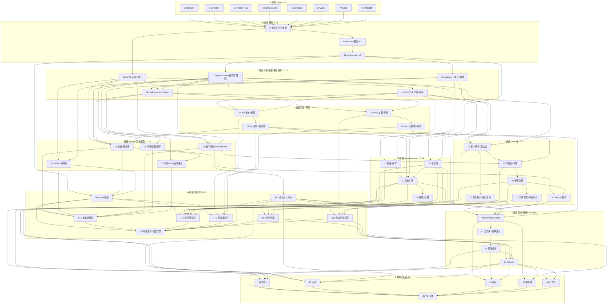

# 任务列表（营销任务平台 v2）

> 版本：**v2.9**　需求：[requirements.md](requirements.md) v3.9　设计：[design.md](design.md) v2.13
> 输入：requirements 验收标准 = 任务完成定义；design §2–§7 为实现锚点（分册见 design §0）；component-selection §6 = Spike 八项；三份 feasibility §2 = 步骤 24 + 对账 28 + 风控 30
> 验收对照：[../../docs/verification-matrix.md](../../docs/verification-matrix.md)
> 格式：可勾选动作 + 三行元信息（`_需求：_` / `_设计：_` / `_测试：_`）；依赖只写在《任务总览》与文末《任务依赖图》
> 口径：**39 表** · **66 属性** · **三份场景矩阵** · **三端口** · **JDK 26 + Spring Boot 4** · **11 个 Maven 模块**

## 概述

本文件记录全部实现计划（**53 个可追踪任务**：原 49，37/38 正式拆为 37.1–37.3 与 38.1–38.3），映射 [requirements.md](requirements.md) v3.9 与 [design.md](design.md) v2.13。

**状态**：`- [ ]` 待办，`- [x]` 完成且验收通过。

**纪律**：① 测试与实现同任务交付（场景矩阵 / E2E / k6 属编组 I）；② 依赖见文末依赖图，无环；③ 实现锚点 = design §2–§7；与 requirements 冲突则停笔写冲突，禁止静默跟 design；④ P1（编组 J）不与 P0 交叉；⑤ Spike、编码、提交需授权。

**范围**：编组 A–J，任务 1–49（37/38 以子号交付与勾选）。

## 任务总览（全局任务表）

> 一行一任务。"依赖"列 = 直接前置任务号。逐任务小节见《任务列表》。

### 编组 A：T1 依赖基线 Spike（任务 1–8，component-selection §6 八项，可并行；任务 1 最先）

| # | 任务 | 模块 | 主要需求/依据 | 依赖 |
|---|------|------|--------------|------|
| 1 | Redisson on JDK 26 + Boot 4 冒烟（锁 + Lua 滑窗限流；无 starter 则手动装配） | 独立 spike | design §2.7.3 | — |
| 2 | Sa-Token SB4 Spike（双 StpLogic + Redis 会话冒烟） | 独立 spike 工程 | §6-2、design §6.1 | — |
| 3 | MyBatis-Plus SB4 Spike（starter + 代码生成器冒烟） | 独立 spike 工程 | §6-3、design §2.7.1 | — |
| 4 | 两级缓存冒烟（Spring Cache + Caffeine + Redis 广播 evict） | 独立 spike | design §6.2 | — |
| 5 | springdoc-openapi SB4 Spike（启动 + 三分组 JSON 导出） | 独立 spike 工程 | §6-5、design §4.1 | — |
| 6 | AviatorScript 5 Spike（编译/求值/AST 遍历/中断 + P99<1ms 基准） | 独立 spike 工程 | §6-6、design §5.10 | — |
| 7 | Hutool Spike（与 tools.jackson 共存 + 脱敏/HMAC 冒烟） | 独立 spike 工程 | §6-7、design §6.5 | — |
| 8 | 杂项冒烟（easy-captcha/jqwik/Testcontainers/ArchUnit/logstash，JDK 26 + Boot 4） | 独立 spike | design §2.7.1 | — |

### 编组 B：工程骨架（任务 9–11）

| # | 任务 | 模块 | 主要需求/依据 | 依赖 |
|---|------|------|--------------|------|
| 9 | 仓库与 POM 骨架（**11 模块**：kernel/contract/db/infra + identity/task/reward/risk/tracking + admin-app/portal-app） | P0 模块 | design §1.3/§2.2 | 1–8 |
| 10 | ArchUnit 首批规则 + CI 门禁骨架（RL-01~04 上线 + AT-C01 + surefire/failsafe 划分 + D-04 覆盖率阈值） | admin-app 测试模块 | design §2.8/§7.1/§7.6/§7.10 | 9 |
| 11 | platform-kernel 基础组件（Result/ErrorCode 分段骨架/BusinessException/UserContext/JsonUtil 单例/分页模型/全局异常处理器/traceId MDC/Clock Bean D-03 + MutableClock 测试基建） | platform-kernel | design §2.2.1/§2.9/§6.6/§7.2 | 9, 10 |

### 编组 C：契约与数据与基础设施（任务 12–16）

| # | 任务 | 模块 | 主要需求/依据 | 依赖 |
|---|------|------|--------------|------|
| 12 | platform-contract（三端口 Reward/UserAttribute/RiskCheck + `lockAndGet`/`accountStatus` + 事件常量 + RL-06） | platform-contract | design §2.2.3/§6.4 | 11 |
| 13 | platform-db V1（sys 12 表 + 种子：超管角色/权限树=§4.10 菜单 28 行 + 附录 A 52 键 / 初始字典 6 类含 portal_route 8 条目 + `sys_outbox.producer` + `sys_audit_log.operator_id` 可空 + Flyway 配置 + RL-09） | platform-db | design §3.1/§3.2/§4.10 | 9, 10 |
| 14 | platform-db V2–V4（task 12 + rwd 7 + pnt 2 + risk 4 + evt 2 表；分类种子 7 行含 `recon_action_policy=REVIEW`；risk 种子 R-a–R-f；evt_event_metadata 种子=附录 D + D-05；evt 首月分区 pYYYYMM） | platform-db | design §3.1/§3.3–§3.7 | 13 |
| 15 | platform-infra 缓存/锁/限流（PlatformCache + 广播 evict + 锁键族 + 统一 Lua 滑窗 + 降级矩阵） | platform-infra | design §6.2/§6.3/§6.8 | 11 |
| 16 | platform-infra Outbox（append 写 `producer` + Relay 按 producer 过滤 + 空消费者不得 DELETE 已声明事件 + DEAD + 路由表） | platform-infra | design §6.4 | 12, 13, 15 |

### 编组 D：风控 + 埋点域（任务 17–20；先于 identity/task/reward——三者经 RiskCheckPort 依赖本编组实现，拓扑说明见《执行顺序与拓扑说明》）

| # | 任务 | 模块 | 主要需求/依据 | 依赖 |
|---|------|------|--------------|------|
| 17 | domain-risk 名单域（risk_list_item + 管理端点 + 批量导入 + risk:list Redis 投影同步 + 黑优先/时效过滤 + 命中处置端点） | domain-risk | R25/R27、design §3.6/§4.6/§5.9 名单段 | 14, 15, 16 |
| 18 | domain-risk 规则引擎与判定链（RiskCheckPort + verdict=PASS\|REJECT\|SILENT_REJECT\|MARK + R-a–R-f + R-e 不写 risk:cnt + REQUIRES_NEW 命中留痕 + fallback） | domain-risk | R26、design §2.2.3 RiskCheckPort/§3.10/§5.9 | 17 |
| 19 | domain-tracking 上报与事件（track/batch 客户端直写 evt + 服务端只经 Outbox + 部分接受 + 未登记/停用策略 + 分区调度 8 + 清理调度 9） | domain-tracking | R28、design §3.7/§4.9.3/§6.4/§6.7-8/9 | 14, 16 |
| 20 | domain-tracking 元数据与调试（/admin/track/metadata CRUD + evt_event_metadata 种子联动 + 调试查询 + 采样口径） | domain-tracking | R29、design §3.7.2/§4.7 | 19 |

### 编组 E：identity + 系统管理（任务 21–25）

| # | 任务 | 模块 | 主要需求/依据 | 依赖 |
|---|------|------|--------------|------|
| 21 | admin 认证与双账号会话（登录/验证码/CSRF/改密 + 双 StpLogic + 并发上限热调 + 踢下线 + D-02 401 原因码 + 注册/登录风控接入 RiskCheckPort） | domain-identity | R1/R4/R32 部分、design §4.2/§4.9.1/§6.1 | 13, 15, 16, 18 |
| 22 | RBAC 与权限树（五表端点 + 权限树/菜单（种子=§4.10） + rbac:permission 缓存 + RL-10） | domain-identity | R2、design §3.2.2/§4.2/§6.2 | 13, 15 |
| 23 | 用户管理三组端点（admin-user / portal-user 含 DELETE 逻辑删除级联 / internal-apps 端点组 + UserAttributePort.`attributes`/`lockAndGet` + `accountStatus` + identity:user-attr 缓存） | domain-identity | R3/R5/R15.2 管理侧、design §2.2.3/§4.2 | 12, 13, 15 |
| 24 | 字典/配置/缓存管理（§4.3 全部端点 + 配置旧值审计 + cache stats/evict level 必填校验） | domain-identity | R7/R8/R9、design §4.3/§6.2/§6.5 | 13, 15 |
| 25 | 审计 AOP 与会话管理端点（@Audited 仅 `/admin/**` 写 + 失败登录 operator_id 空 + 脱敏截断 + Outbox + R10.2 必记 + sessions/kick 账号维度） | domain-identity | R6/R10、design §4.2/§6.1/§6.5 | 16, 21 |

### 编组 F：task 域（任务 26–31）

| # | 任务 | 模块 | 主要需求/依据 | 依赖 |
|---|------|------|--------------|------|
| 26 | 任务定义聚合与表达式引擎（save-aggregate + §5.10 白名单/7 函数/空值哨兵/整数域与长度上限 + 校验端点 + copy + M-01~M15 恶意样本） | domain-task | R11、design §3.3/§4.4/§5.10/§7.7 | 12, 14, 15 |
| 27 | 发布版本与定时发布（D-01 修订草稿模型 + publish 含 SCHEDULED 语义 + 影响面两段确认 + 版本对比 + 调度 1 + schedule-failures） | domain-task | R12、design §3.3.1/§4.4/§6.7-1 | 26 |
| 28 | 可见性与领取（§5.3 分桶 + §5.5 校验链：`lockAndGet` 账号状态 → 幂等短路 → 可见性 → 风控 → 互斥 → 每日上限 + start + C 端列表/详情；过滤/灰度经 `attributes`，禁止直查 `sys_portal_user`） | domain-task | R13/R34、design §4.9.2/§5.3/§5.5 | 26, 18, 23 |
| 29 | 步骤引擎（§5.1 四入口 + 完成 CAS + 级联含 REWARD 三分支（RewardPort 测试替身单测，真实现集成见编组 I）+ 进度去重表 + task.step.complete 事件） | domain-task | R14、design §3.3.7–8/§4.8/§4.9/§5.1/§5.2 | 28, 12 |
| 30 | internal 回调端点（HMAC §4.8 全规范 + nonce 防重放 + appId 限流 + A-01~A-06 攻击样本 + bizNo 留痕） | domain-task | R15、design §3.2.8/§4.8/§7.7 | 23（sys_internal_app）, 29 |
| 31 | 实例管理与平台动作（后台实例查询/详情事件时间线/终止 + 过期调度 2 + task.instance.* 事件 + 动作合并回退链 NONE 占位语义 + expire_at 计算） | domain-task | R16/R14.8–14.11、design §3.3/§4.4/§4.9/§5.3 末/§5.5 末 | 29 |

### 编组 G：reward + points 域（任务 32–35）

| # | 任务 | 模块 | 主要需求/依据 | 依赖 |
|---|------|------|--------------|------|
| 32 | 奖品分类/配置与库存（category CRUD + 内置 7 类 + `reconActionPolicy` + prize CRUD + 成本字段校验 + stock-replenish + §5.7 原子扣减） | domain-reward | R17、design §3.4/§4.5/§5.7 | 14, 15 |
| 33 | 发放引擎（RewardPort.grant + 领取七态 + INSTANT 同事务 `PointsPort.earn` + ASYNC 记发送中 + REQUIRES_NEW 留痕 + 调度 3 + retry/manual-grant） | domain-reward | R18、design §2.2.3/§3.4.2/§4.5/§5.6/§6.7-3 | 32, 18, 12, 35 |
| 34 | 领取、履约、对账与过期（claim + 履约回调 + 成本快照 + spend + recon 批次/匹配/核渠/补发关原单 + 调度 4/5/10 + C 端展示） | domain-reward | R19/R18.3/R37/R35、design §4.5/§4.8/§4.9.3/§5.6/§5.11/§6.7 | 33 |
| 35 | 积分（domain-reward 子包：earn 懒创建 + 轧平 + adjust + 过期调度 + C 端 points） | domain-reward | R20、design §3.5/§5.8 | 14, 11 |

### 编组 H：双前端（任务 36–39；页面清单 = design §4.10）

| # | 任务 | 模块 | 主要需求/依据 | 依赖 |
|---|------|------|--------------|------|
| 36 | admin 前端骨架（pure-admin-thin + 动态路由/权限指令（菜单种子=§4.10）+ OpenAPI 类型生成管线 + 登录页） | web/apps/admin | design §2.7.2/§4.10/§7.9 | 21, 22（认证与菜单端点）, 11（两应用 GroupedOpenApi 导出，不用 spike 5） |
| 37.1 | admin 系统管理页 | web/apps/admin | R2–R10、design §4.10 | 36, 21, 22, 23, 24, 25 |
| 37.2 | admin 任务+奖励页 | web/apps/admin | R11–R12、R17–R20、R37、design §4.10 | 36, 26, 27, 31, 32, 33, 34, 35 |
| 37.3 | admin 风控+埋点页 | web/apps/admin | R25–R29、design §4.10 | 36, 17, 18, 20 |
| 38.1 | portal 会话+个人中心（含 H5 骨架） | web/apps/client | R32–R33、design §4.9 | 21 |
| 38.2 | portal 任务浏览与参与 | web/apps/client | R34、design §4.9 | 38.1, 28, 29 |
| 38.3 | portal 奖品积分 + 埋点 SDK | web/apps/client | R35、R28.10/13/14、design §4.9 | 38.1, 19, 34, 35 |
| 39 | 前端测试与类型门禁（Vitest 组件单测全点位 + Playwright 用例骨架 + openapi-typescript diff CI 门禁） | web/* | design §7.9 | 36, 37.1, 37.2, 37.3, 38.1, 38.2, 38.3 |

### 编组 I：集成测试 / 部署 / E2E（任务 40–43）

| # | 任务 | 模块 | 主要需求/依据 | 依赖 |
|---|------|------|--------------|------|
| 40 | ScenarioMatrixIT 场景 01–23（场景号→期望行为映射常量 + REWARD 分支接真 RewardPort；场景 24 归 41） | portal-app 测试模块 | design §7.5、feasibility §2 | 27, 30, 31, 33, 35, 20 |
| 41 | 双实例拓扑与故障注入（TwoAdminAppIT + PortalAssemblyIT RL-05 + NamespaceIsolationIT + Redis pause §6.8 + awaitOutboxDrain + §7.4 C-1~C-8/C-12；C-9/C-10/C-11 归 44/45/48） | admin/portal 测试模块 | design §7.2/§7.4/§7.6 | 40 |
| 42 | 部署编排（compose：MySQL/Redis/Nginx 前缀路由/双应用 + Prometheus 抓取两应用 `/actuator/prometheus` + 健康检查与启动顺序 + .env.example 无真实密钥 + Flyway 仅 admin-app + 备份恢复演练 + R31 上线清单） | deploy/ | R31、design §2.4/§2.6/§6.9 | 40, 41 |
| 43 | Playwright E2E 旅程 + k6 性能基线（journey-core/journey-admin 对 staging compose + k6 P0 性能项（NFR 性能 1–8 中 P0 子集）门槛执行） | web/e2e + perf/ | design §7.8/§7.9 | 38.1, 38.2, 38.3, 42 |

### 编组 J：P1 域（任务 44–49；P0 完成并验收后启动，不与 P0 交叉）

| # | 任务 | 模块 | 主要需求/依据 | 依赖 |
|---|------|------|--------------|------|
| 44 | 签到域（V5 sgn_activity/snapshot/record(uk activity+user+date) + 补签与 CONSUME 同事务 + SIGNIN_DAY 每档 sourceId 不重复 + 连签事实源=record + C-9） | domain-signin | R21/R36、design §3.11/§2.9 sgn_ 前缀/§5.6 复用 | 33, 35, 38.1, 43 |
| 45 | 活动域（V6 act_activity/participation + 限量 CAS + HTML 白名单消毒 + 规则链 + C-10） | domain-activity | R22、design §3.11 | 29, 33, 38.1, 43 |
| 46 | 聚合看板（按日 uk 聚合表 + 排除 simulated + 事件条数口径 + 调度恰一 + 延迟附录 A） | admin-app + web/apps/admin | R23、design §3.11/§6.7 | 40, 42, 43 |
| 47 | 模拟器（端点 list/detail/start/click/callback/progress/flow + simulated 贯穿 + 冲正不调渠道） | admin-app | R24、design §2.2.3 GrantContext/§3.11/§5.9 | 40, 43 |
| 48 | 广告位域（V7 position/material/rel + Redis 频控键 + R30.5 输出 + 弹窗冷却 + C-11；**接线** `ad:position`） | domain-ad + web/apps/client | R30、design §3.11/§6.2 | 38.1, 43 |
| 49 | P1 压测与容量复验（k6 全量 NFR 性能 1–8 + 容量假设（§2.6 100 万用户/3000 eps）复验 + 慢查询复盘） | perf/ | NFR 性能、design §2.6/§7.8 | 42, 44, 45, 46, 47, 48 |

## 执行顺序与拓扑说明

1. **总顺序**：A Spike → B 骨架 → C 契约/数据/基础设施 → D 风控+埋点 → E identity+系统管理 → F task → G reward（含积分）→ H 双前端 → I 集成/部署/E2E → J P1。
2. **依赖顺序**：风控域（任务 17–18）先于 identity / task / reward——注册登录、领取、发放经 **RiskCheckPort**（design §2.2.3）调用真实实现；E2E / k6（任务 43）在部署编排（任务 42）之后，对 staging compose 执行（design §7.8 / §7.9）。**37.1 / 37.3 / 38.x 可与 31 并行**；37.2 等 31。
3. **REWARD 分支**：任务 29 步骤引擎单测使用 RewardPort 测试替身（任务 12 契约）；任务 33 依赖任务 35（`PointsPort.earn`）；ScenarioMatrixIT（任务 40）接真实 RewardPort，覆盖场景 17 / 18 / 19。
4. **Spike 装配**：任务 1 无官方 starter 时手动装配 RedissonClient；任务 4 验证 Spring Cache 两级缓存 + 广播失效。任一 Spike 无法在 JDK 26 + Boot 4 上完成则阻塞任务 9 起编码，结论写入 `dependency-matrix.md`。
5. **迁移批次**：V1 = 任务 13；V2–V4 = 任务 14；V5（sgn）/ V6（act）/ V7（ad）= 任务 44 / 45 / 48。
6. **P1 串行**：编组 J（44–49）依赖任务 43（P0 E2E / k6 验收），不与 P0 交叉；P1 建表不得打进 V1–V4。

## 任务列表

> 每任务 = 可勾选动作 + 三行元信息。编组 A 为 Spike，冒烟断言即验收。Spike 与后续编码均需授权。

### 任务 1：Redisson Spike（编组 A）

- [x] 空工程（JDK 26 + Spring Boot 4）引 Redisson（starter 或手动装配）启动成功
- [x] RLock 冒烟：并发 2 线程争抢 `lock:sched:test` 恰一获得；持锁 >30s 看门狗续期生效
- [x] Lua 滑窗限流冒烟：同一脚本、按 key 分桶；rate=5/s 连发 10 次恰 5 次通过
- [x] 无官方 starter 时手动装配 `RedissonClient`，完成上述两冒烟
- [x] 首建 `.kiro/specs/platform-v2/dependency-matrix.md` 并落 Redisson 行（锁定版本 / 结论 / 证据锚点）
- [x] 交付 `spike/1-redisson/REPORT.md`（结论 / 版本 / 复现步骤）

_需求：NFR 可用性 3-4（技术基线验证，component-selection §6-1）_
_设计：design §2.7.3（版本策略）、§3.10（锁键族）、§6.3（限流）、§6.7（调度恰一）、§6.8（降级矩阵）_
_测试：RedissonSmokeTest（Testcontainers Redis 7）：锁互斥+看门狗、限流阈值两断言；Spike 无 §7 测试类映射_

### 任务 2：Sa-Token SB4 Spike（编组 A）

- [x] SB4 空工程集成启动成功，锁定 Sa-Token 具体版本坐标入矩阵
- [x] 双 StpLogic（admin/client）各自登录互不串扰、token 不互通
- [x] Redis 会话模式（LAN Redis DB 2）：新 StpLogic 实例仍能读到登录态
- [x] 并发上限冒烟：同账号新登录挤掉最早会话（maxConcurrent=2）
- [x] 踢下线：logout(userId) 后旧 token 校验失败（D-02 kick-reason 机制前提）
- [x] 交付 `spike/2-sa-token/REPORT.md` + 矩阵行（配置要点供任务 21 直接采用）

_需求：R1.13, R6.1-R6.4（会话组件能力冒烟，非实现交付）；NFR 安全 1（Cookie 安全属性基线）_
_设计：design §4.1（D-02 401 原因码）、§6.1（双账号会话/踢下线/并发上限热调）_
_测试：SaTokenSmokeTest 四断言（双体系隔离/重启会话存活/并发挤占/踢下线）_

### 任务 3：MyBatis-Plus SB4 Spike（编组 A）

- [x] SB4 专用 starter 启动 + LAN MySQL 8.0.25 连接成功
- [x] BaseMapper CRUD + 条件构造器冒烟
- [x] ASSIGN_ID 雪花主键生成冒烟（高写入表策略）
- [x] `@Version` 乐观锁插件冒烟：并发更新 affected 断言（全部 CAS 语句的插件前提）
- [x] 代码生成器对单表生成 Entity/Mapper 编译通过
- [x] 交付 `spike/3-mybatis-plus/REPORT.md` + 矩阵行

_需求：NFR 可维护性 1, 3（ORM 与迁移/构建技术基线，component-selection §6-3）_
_设计：design §2.7.1（ORM 行）、§5（CAS/原子 UPDATE 全节前提）_
_测试：MpSmokeTest（CRUD/雪花/乐观锁三断言）_

### 任务 4：两级缓存冒烟（编组 A）

- [x] JDK 26 + Boot 4 启动：Spring Cache + 本地 Caffeine L1 + 远端 Redis L2
- [x] 两级读写冒烟：L2 回源加载器触发
- [x] 广播失效：`PUBLISH cache:evict` 第二连接收到（双 client 模拟）
- [x] 结论写入矩阵（锁定坐标；任务 15 按同一 `PlatformCache` 实现）
- [x] 交付 `spike/4-cache/REPORT.md`

_需求：R9.1-R9.3（缓存组件能力冒烟，非实现交付）_
_设计：design §6.2（组件边界/命名空间注册表/广播失效）、§3.10（缓存结构行）_
_测试：TwoLevelCacheSmokeTest（两级命中/回源/广播失效三断言）_

### 任务 5：springdoc-openapi SB4 Spike（编组 A）

- [x] SB4 启动 + `/v3/api-docs` JSON 导出成功
- [x] 三 GroupedOpenApi 分组各自导出且路径互不串组（按 controller 包分组）
- [x] 生产关闭 UI 验证：`springdoc.swagger-ui.enabled=false` 生效
- [x] 交付 `spike/5-springdoc/REPORT.md` + 矩阵行

_需求：NFR 可维护性 2（OpenAPI 导出技术基线，component-selection §6-5）_
_设计：design §4.1（OpenAPI 三分组）、§2.3.3-4（生产暴露收口）_
_测试：SpringdocSmokeTest（三分组导出 + UI 关闭断言）_

### 任务 6：AviatorScript 5 Spike（编组 A）

- [x] 编译含自定义函数表达式（`province() == 'GD' AND userLevel() >= 3`）求值冒烟
- [x] AST 逐节点类型可枚举（可判定白名单拒绝，校验流程步骤 2）
- [x] 无限循环函数场景求值可中断（中断标志/超时异常可控）
- [x] 性能基准：编译缓存后求值 P99 < 1ms（1 万次采样，`perf/expression-benchmark.md` 归档）
- [x] 整数域与长度上限前置校验冒烟（long 域拒绝，M-08 口径）
- [x] 不可用时采用 design §2.7.1 备选（自建极简解释器），结论写入矩阵
- [x] 交付 `spike/6-aviator/REPORT.md` + 矩阵行

_需求：R11.5, R11.9（表达式引擎能力冒烟，非实现交付）_
_设计：design §5.10 全节（白名单节点集/7 函数/空值哨兵/≤200 节点/≤1024 字符）_
_测试：AviatorSmokeTest（四能力断言 + long 域拒绝）；正式沙箱恶意样本测试属任务 26_

### 任务 7：Hutool Spike（编组 A）

- [x] hutool-core（非 JSON 模块）与 tools.jackson 共存无冲突（序列化互不干扰）
- [x] DesensitizedUtil 手机号/密码脱敏冒烟
- [x] SecureUtil.hmacSha256 小写十六进制输出冒烟
- [x] 交付 `spike/7-hutool/REPORT.md` + 矩阵行

_需求：R10.6, R15.2（脱敏与签名工具冒烟，非实现交付）_
_设计：design §2.7.1（工具行，强制非 JSON 模块）、§6.5（脱敏管线）、§4.8（HMAC）_
_测试：HutoolSmokeTest 三断言（共存/脱敏/HMAC）_

### 任务 8：杂项组件组合冒烟（编组 A）

- [x] easy-captcha 生成/一次性校验冒烟
- [x] jqwik 属性测试运行且与 JUnit 5 并存（样例：随机 int 交换律）
- [x] LAN MySQL 8 + Redis 并行连通冒烟（本机无 Docker，Testcontainers 标备选）
- [x] ArchUnit 样例规则：故意违规类报错、合规类通过（任务 10 机制前提；须 1.5.0）
- [x] logstash-logback-encoder JSON 日志含 traceId MDC 字段冒烟
- [x] 交付 `spike/8-misc/REPORT.md` + 矩阵五行

_需求：R1.7（验证码）；NFR 可观测性 2-4, 可维护性 3（技术基线验证，component-selection §6-8）_
_设计：design §6.6（traceId/JSON 日志）、§3.10（captcha TTL）、§7.2（测试基建）_
_测试：Captcha/Jqwik/Containers/ArchUnit/JsonLog 五个冒烟测试类各自断言_

### 任务 9：仓库与多模块 POM 骨架（编组 B）

- [x] 按 design §1.3 / §2.2.1 建 `server/` 11 模块空壳（kernel / contract / db / infra + identity / task / reward / risk / tracking + admin-app / portal-app）+ 父 POM
- [x] 父 POM 依赖版本只来自 `.kiro/specs/platform-v2/dependency-matrix.md`（任务 1–8 结论）；enforcer 禁止未登记坐标
- [x] JDK 26 + Spring Boot 4 能 `mvn -q -DskipTests compile`
- [x] 两应用启动类存在，暂不装配业务域；命名空间守卫过滤器骨架就位（非本应用前缀 → 404；允许 `/actuator`）
- [x] 交付模块清单与 `dependency-matrix.md` 锁定版本对照表
- [x] **禁止**建 `web/`、P1 域、`domain-points`；`groupId=com.mkt`

_需求：NFR 可扩展性 1–5、可维护性 1_
_设计：design §1.3、§2.2、§2.7.3、§2.3（RL-08 命名空间）_
_测试：空壳编译通过即可；ArchUnit 首批在任务 10_

### 任务 10：ArchUnit 首批规则 + CI 门禁骨架（编组 B）

- [x] 落地 RL-01~04（单向依赖 / 域间无 Maven 直依 / 禁域间直访表 / 禁跨域实体 / 端口仅经 contract）与 AT-C01（禁直调 `Instant.now()` / `LocalDateTime.now()`）
- [x] 骨架同时挂上 RL-07（事务内禁远程）、RL-11（禁直读配置表 / 禁自建 ObjectMapper）、RL-12（审计/事件/命中无 update/delete）空规则，域代码进来后自然转绿
- [x] surefire = 单测 + 属性 + ArchUnit；failsafe = `*IT`
- [x] 覆盖率门禁 D-04：全局行覆盖 ≥70%，关键包 ≥85%；禁止 `@Disabled` / 跳过标签
- [x] CI 最小流水线：compile + surefire + failsafe(空套件可过) + enforcer

_需求：NFR 可维护性 1–3；可扩展性 2_
_设计：design §2.8、§7.1、§7.6、§7.10_
_测试：故意违规类失败、合规类通过；ClockDirectCallArchTest_

### 任务 11：platform-kernel 基础组件（编组 B）

- [x] `Result<T>` / `ErrorCode` 分段骨架（§3.9 中段表）/ `BusinessException` / 全局异常处理器（附录 C HTTP 映射）
- [x] `UserContext`、分页模型、`JsonUtil` 单例（禁第二套 JSON 库）
- [x] `Clock` Bean + 测试用 `MutableClock`（D-03）
- [x] traceId 入口过滤：读 `X-Trace-Id` 或生成，写 MDC / 响应头 / 响应体
- [x] 错误码格式断言：`<域>.<场景>.<原因>`
- [x] 两应用 `GroupedOpenApi` 三分组（admin / portal / internal）能导出 JSON；任务 36 消费本导出，**禁止**锁死 spike/5 的 JSON

_需求：附录 C；NFR 可观测性 2_
_设计：design §2.2.1、§2.9、§3.9、§6.6、§7.2_
_测试：ResultJsonIT、ErrorCodeFormatTest、MutableClockTest、TraceIdFilterIT_

### 任务 12：platform-contract 跨域契约（编组 C）

- [x] 三写端口：`RewardPort` / `UserAttributePort` / `RiskCheckPort`（签名见 §2.2.3）
- [x] D-13 只读：`RewardPort.userSummary`、`RiskCheckPort.userSummary`、`TaskReadPort.instanceCounts`（无写方法）
- [x] `UserAttributePort`：`attributes` + `lockAndGet`；`UserAttributes` 含 `accountStatus`（`ACTIVE|DISABLED|DELETED|NOT_FOUND`）
- [x] 记录类型：`GrantContext` / `UserAttributes` / `RiskVerdict` / `RiskScene` / `RiskSubject` / `UserRewardSummary` / `UserRiskSummary` / `InstanceCounts`
- [x] D-05 事件常量 + 事件基类；`audit.log` 为内部码不进附录 D
- [x] RL-06 纯度：contract 模块无 Spring / 无 JDBC / 无 Redis 依赖

_需求：R14.5、R18.1、R15.2、R26、R9.1、R13.6_
_设计：design §2.2.2、§2.2.3、§6.4、D-12_
_测试：ContractPurityArchTest；端口方法签名编译期锁定_

### 任务 13：platform-db V1 sys 基线（编组 C）

- [x] Flyway 仅 admin-app 执行（RL-09）；`validate` + 幂等 CI
- [x] V1：sys 12 表（含 `sys_internal_app`）字段级 DDL = design §3.2
- [x] `sys_outbox.producer`（`admin|portal`）+ `idx_producer_status_next`；`sys_audit_log.operator_id` 可空
- [x] 种子：超管角色；权限树 = §4.10 菜单 28 行；附录 A 52 键；字典 6 类（含 `portal_route` 8 条目，value 封闭表 = design §3.2.4）
- [x] 主键 / 时间 / 字符集 / 逻辑删除约定按 §3.1

_需求：R1–R10、R15.2、附录 A/B_
_设计：design §3.1、§3.2、§4.10、§6.9_
_测试：FlywayV1IT（表数=12、种子行数断言、超管可登录所需最小行）_

### 任务 14：platform-db V2–V4 全量建表（编组 C）

- [x] V2 task 12 表、V3 rwd 7 + pnt 2（含分类种子 7 行、须对账三类 `recon_action_policy=REVIEW`）、V4 risk 4 + evt 2；合计 39 表
- [x] 全部 CHECK / 唯一约束 / 索引与 §3 一致（含 `next_retry_at`、`skip_reason`、`last_biz_no`）
- [x] risk 种子 R-a–R-f；`evt_event_metadata` 种子 = 附录 D 全量；`evt_event_log` 首月分区 `pYYYYMM`
- [x] `simulated` 列贯穿实例 / 发放 / 流水 / 命中 / 事件五表

_需求：R11–R20、R25–R29、R24.5_
_设计：design §3.1、§3.3–§3.7、§3.8_
_测试：FlywayFullIT（CREATE TABLE=39、关键唯一约束存在、分区存在、分类种子=7）_

### 任务 15：platform-infra 缓存锁限流（编组 C）

- [x] `PlatformCache` 接口；实现 = Spring Cache + Caffeine L1 + Redis L2 + `PUBLISH cache:evict`
- [x] 命名空间注册表 = R9.1 全量（含 `identity:user-attr`）；`ad:position` **只登记占位**（stats=0/N/A，evict 空操作），禁止广告读写；接线归任务 48
- [x] afterCommit evict + `cache:evict` 广播
- [x] 锁键族 `lock:*` / `sched:*` / `rwd-claim`；统一 Lua 滑窗限流（登录 IP + 账号双桶）
- [x] kick-reason 键（D-02）；§6.8 降级矩阵按行实现（会话拒绝、限流放行、nonce 拒绝）

_需求：R7.4、R8.3、R9、R1.11、NFR 可用性 3–4_
_设计：design §3.10、§6.2、§6.3、§6.8_
_测试：CacheEvictBroadcastIT、RateLimitLuaIT、DegradeMatrixIT（Redis pause）_

### 任务 16：platform-infra Outbox（编组 C）

- [x] `EventPublisher.append` 断言当前事务，否则抛 `IllegalStateException`；写入 `producer` = 本应用
- [x] Relay 双应用分锁（`outbox:relay:admin` / `portal`）；**SELECT 必须带 `producer=:self`**（D-11）
- [x] 消费者注册表 = §6.4 路由表（含 R-a/R-b/R-c/R-d 的 `risk:cnt`）；声明了消费方向而 Bean 缺失 → 不 DELETE，重试 + 告警
- [x] 退避 10s–30m；5 次后 DEAD
- [x] `evt_event_log` 写入 id 复用 `sys_outbox.id`；主键冲突当成功
- [x] 测试基建 `awaitOutboxDrain`

_需求：R10.3、R28.8、R28.9_
_设计：design §3.2.7、§6.4_
_测试：OutboxRollbackIT、OutboxRelayRetryIT、OutboxIdempotentInsertIT_

### 任务 17：domain-risk 名单域（编组 D）

- [x] `risk_list_item` 管理端点 + 批量导入；维度 user / IP / device
- [x] `risk:list` Redis 投影同步；黑优先、时效过滤
- [x] 命中查询 `GET /admin/risk/hits` + 处置端点（解封 / 加白 / 备注）写 `risk_handle_log`
- [x] 名单变更审计；§7.3 R27.1 `CaseHandleAuditIT`

_需求：R25、R27_
_设计：design §3.6、§4.6、§5.9 名单段；[feasibility-risk.md](feasibility-risk.md)_
_测试：§7.3 R25.1–R25.2、§7.4 C-12_

### 任务 18：domain-risk 规则引擎与判定链（编组 D）

- [x] 实现 `RiskCheckPort.check`：不抛业务异常，返回 `RiskVerdict{action}`；`action ∈ {PASS, REJECT, SILENT_REJECT, MARK}`；冻结不经本端口（步骤推进由 task 域内查名单投影）
- [x] `REGISTER` / `LOGIN` 名单后直接 PASS，**不跑 R-a–R-f**（R26.3）；实现 `userSummary`（D-13）
- [x] `risk:cnt` 只服务 R-a/R-b（异步：`task.instance.complete` / `reward.grant.success` 消费）与 R-c/R-d（登录注册成功消费）与 R-f（判定点同步 ZADD）；窗口裁剪 = ZREMRANGEBYSCORE，计数 = ZCOUNT
- [x] R-e：只在 GRANT 且 `elapsedSeconds != null` 时比较阈值；同请求新建实例 / 非 TASK_STEP / simulated → 跳过；**不写 `risk:cnt`**
- [x] 命中留痕 REQUIRES_NEW + `risk.hit.recorded`；失败降级告警
- [x] `risk.fallback-policy` 异常降级（默认 allow）

_需求：R26_
_设计：design §2.2.3 RiskCheckPort、§3.10、§5.9；[feasibility-risk.md](feasibility-risk.md)_
_测试：§7.3 R26.1–R26.4；判定链单测覆盖黑优先 / 白名单跳规则不跳产品 / R-e 跳过与拦截分支_

### 任务 19：domain-tracking 上报与事件（编组 D）

- [x] `POST /api/common/track/batch`：部分接受；畸形丢弃计数；登录 / 匿名双身份
- [x] 客户端批次 **直写** `evt_event_log`（批次一行 JSON，R28.9）
- [x] 服务端业务事件 **只经 Outbox**（§6.4 路由表），禁止业务事务内直写 evt
- [x] 未登记 / 停用策略读附录 A（`track.unregistered-policy` / `track.disabled-event-policy`）
- [x] 分区调度 8（`sched:evt-partition`）。审计保留清理是调度 9，归任务 25，本任务不要删 `sys_audit_log`

_需求：R28_
_设计：design §3.7、§4.9.3、§6.4、§6.7-8/9_
_测试：§7.3 R28.1–R28.3；批量部分接受断言；业务回滚零 evt（Outbox）_

### 任务 20：domain-tracking 元数据与调试（编组 D）

- [x] `/admin/track/metadata` CRUD 与 `evt_event_metadata` 种子联动
- [x] 调试查询：编码 / 用户 / 来源 / 时间；抽样 `track.query.sample-ratio-percent` + 限流
- [x] 元数据变更审计

_需求：R29_
_设计：design §3.7.2、§4.7_
_测试：§7.3 R29.1_

### 任务 21：admin 认证与双账号会话（编组 E）

- [x] 后台登录 / 验证码 / CSRF / 改密；门户注册 / 登录
- [x] 双 `StpLogic`（admin / client）互不串扰；并发上限热调；踢下线 + D-02 401 原因码
- [x] 注册 / 登录入口接 `RiskCheckPort`
- [x] Cookie 安全属性按 NFR 安全 1

_需求：R1、R4、R32 部分_
_设计：design §4.2、§4.9.1、§6.1_
_测试：§7.3 R1.1–R1.3、R4.1、R32.1；`LoginLockPropertyTest`、`LoginAuditIT`、`PasswordChangeSessionIT`、`NamespaceIsolationIT`、`AdminAuthServiceTransactionalTest`、`PortalAuthServiceTransactionalTest`、`LoginLockCommitIT`_

### 任务 22：RBAC 与权限树（编组 E）

- [x] 用户—角色—权限五表端点；权限树 / 菜单种子 = §4.10
- [x] `rbac:permission` 缓存；变更 afterCommit 立即生效（RL-10 无鉴权后门）
- [x] 超管内置、不可改权限集

_需求：R2_
_设计：design §3.2.2、§4.2、§6.2_
_测试：§7.3 R2.1–R2.2_

### 任务 23：用户管理三组端点（编组 E）

- [x] admin-user CRUD / 重置 / 停用
- [x] portal-user 查询 / 档案覆盖式编辑 / 停用 / 重置 / `DELETE` 逻辑删除级联失效
- [x] internal-apps 五要素：query / add / rotate / disable / enable；secret AES-256-GCM + 24h 双活
- [x] 实现 `UserAttributePort.attributes`（缓存）与 `lockAndGet`（`SELECT ... FOR UPDATE`，不走缓存）；`accountStatus` 四态
- [x] R5.6 详情聚合：identity 控制器组装 `RewardPort.userSummary` + `RiskCheckPort.userSummary` + `TaskReadPort.instanceCounts`（任务 12 契约；实现可先替身，真实现分别在 28/32/18）。**禁止**直查他域表
- [x] 启停 / 逻辑删除 / 档案变更 afterCommit evict `identity:user-attr`

_需求：R3、R5、R15.2_
_设计：design §2.2.3、§3.2.8、§4.2_
_测试：§7.3 R3.1、R5.1；InternalAppSecretIT_

### 任务 24：字典 / 配置 / 缓存管理（编组 E）

- [x] §4.3 字典类型 / 项 CRUD；停用类型两侧查空列表
- [x] 配置 CRUD；掩码项不回显；未带 value = 保持原值；配置旧值审计
- [x] 缓存 stats / evict；level 必填校验；三级粒度；`identity:session` 一律 400 `system.cache.session-forbidden`；`ad:position` evict 合法但无键（P0 未接线）

_需求：R7、R8、R9_
_设计：design §4.3、§6.2、§6.5_
_测试：§7.3 R7.1、R8.1、R9.1_

### 任务 25：审计 AOP 与会话管理端点（编组 E）

- [x] `@Audited` 机械规则：**仅**非 GET 的 `/admin/**`；`/api/common/**` 与 `/internal/**` 禁止标注
- [x] 落库只经 Outbox `audit.log`（R10.3）；拦截器 403 由过滤器补审计（R2.3）
- [x] 失败登录 `operator_id=NULL`、`operator_name`=提交用户名
- [x] 脱敏截断管线经 Outbox；R10.2 必记清单全覆盖
- [x] 调度 9 `sched:audit-clean`（`retention.audit-days`，分批 5000）
- [x] 会话列表 / 踢下线按 accountType + account 维度

_需求：R6、R10_
_设计：design §4.2、§6.1、§6.5_
_测试：§7.3 R6.1、R10.1_

### 任务 26：任务定义聚合与表达式引擎（编组 F）

- [x] save-aggregate 原子保存定义 / 步骤 / 分支 / 动作 / 互斥 / 人群包
- [x] §5.10 白名单 + 7 函数 + 空值哨兵 + long 域 + 长度 1024 + 节点 ≤200
- [x] 校验端点 + copy；人群包导入去重 / 无效跳过
- [x] M-01~M-15 恶意样本全部拒绝

_需求：R11_
_设计：design §3.3、§4.4、§5.10、§7.7_
_测试：§7.3 R11.1–R11.2、§7.7_

### 任务 27：发布版本与定时发布（编组 F）

- [ ] D-01 修订草稿：单套编辑态 + `pending_revision`；SCHEDULED 修订不 +version 不落快照
- [ ] publish / 批量 / 影响面两段确认 / 版本对比
- [ ] SCHEDULED + `early=true`：手动提前发布 → PUBLISHED + 快照 + version+1（R12.1）；`early` 缺省只清修订
- [ ] 调度 1 定时发布；失败列表端点 + 审计 `schedule-publish-failure`

_需求：R12_
_设计：design §3.3.1、§4.4、§6.7-1_
_测试：§7.3 R12.1–R12.3_

### 任务 28：可见性与领取（编组 F）

- [ ] §5.3 分桶：md5 前 8 字节大端 `remainderUnsigned` + 3 组标准测试向量
- [ ] §5.5 校验链：`UserAttributePort.lockAndGet`（账号非 ACTIVE → 403）→ 幂等短路 → 可见性 → 风控 → 互斥 → 每日上限
- [ ] INSERT 前计算 `expire_at`（R14.10）并 append `task.instance.start`
- [ ] 实现 `TaskReadPort.instanceCounts`；灰度 CROWD = 允许包 AND NOT 排除包（`gray_exclude_crowd_id`）
- [ ] 过滤 / 灰度 / 列表经 `UserAttributePort.attributes`（任务 23）；属性缺失按 §5.10 空值哨兵；**禁止**本域 `SELECT`/`FOR UPDATE` `sys_portal_user`
- [ ] C 端列表 / 详情三分渲染；OFFLINE 兜底 200 + 状态；一次性任务放弃后再领返回终态实例

_需求：R13、R34_
_设计：design §2.2.3 UserAttributePort、§4.9.2、§5.3、§5.5、§5.10_
_测试：§7.3 R13.1–R13.4、R5.1、§7.4 C-1_

### 任务 29：步骤引擎（编组 F）

- [ ] 四入口前置检查 + 完成 CAS + 级联（含 REWARD 三分支）
- [ ] 已完成步骤重复 click/callback → 200 幂等；乱序/INACTIVE → 400 `state-mismatch`；progress 重试耗尽 → 400 `task.progress.processing`
- [ ] REWARD 单测用 `RewardPort` 测试替身；真实现在任务 40 闭环
- [ ] 进度去重表 `(instance, step, reportId)` 唯一约束同事务
- [ ] 调度 7 `sched:progress-clean`（7 天前，分批 5000）
- [ ] 发出 `task.step.complete` / `task.instance.complete`

_需求：R14_
_设计：design §3.3.7–8、§4.8、§4.9、§5.1、§5.2_
_测试：§7.3 R14.1–R14.4、§7.4 C-2/C-3_

### 任务 30：internal 回调端点（编组 F）

- [ ] HMAC §4.8 全文：签名串、容差、nonce、常量时间比较
- [ ] appId 限流；`sys_internal_app` 失效 / 双密钥窗口
- [ ] `last_biz_no` 覆盖留痕
- [ ] A-01~A-06 攻击样本全部拒绝且业务表零变化

_需求：R15_
_设计：design §3.2.8、§4.8、§7.7_
_测试：§7.3 R15.1、§7.7 A-01~A-06_

### 任务 31：实例管理与平台动作（编组 F）

- [ ] 后台实例查询 / 详情事件时间线 / 终止
- [ ] 过期调度 2：按任务 28 已写入的 `expire_at` 翻转（含 NULL 口径复验）
- [ ] 动作合并回退链；`NONE` 占位不再回退；实例只读快照
- [ ] `task.instance.abandon` / `expire` 事件（`start` 已在任务 28 领取事务内发出）

_需求：R16、R14.8–14.11_
_设计：design §3.3、§4.4、§4.9、§5.3 末、§5.5 末_
_测试：§7.3 R16.1–R16.4、R14.4_

### 任务 32：奖品配置与库存（编组 G）

- [ ] 奖品分类 CRUD；内置 7 类种子；内置不可删
- [ ] 分类 `reconActionPolicy`：`REVIEW`|`AUTO`；须对账内置三类（支付宝红包/微信红包/话费）种子 = `REVIEW`；启用后仍可改
- [ ] 奖品 CRUD / 停用二次确认 / enable / `stock-replenish`；分类决定目标/履约/成本算法
- [ ] 奖品 `reconActionPolicy` 可空（空 = 继承分类）；启用后仍可改（运营策略，不冻结）
- [ ] `unitCostFen` / `faceFen` / `points` 按分类校验
- [ ] §5.7 库存原子扣减；限领 = READ COMMITTED + 库存行锁内 COUNT
- [ ] `rwd_stock_log` 扣减 / 回补留痕

_需求：R17、R37.7_
_设计：design §3.4、§4.5、§5.7、§5.11 有效政策_
_测试：§7.3 R17.1–R17.3、§7.4 C-4/C-5_

### 任务 33：发放引擎（编组 G）

- [ ] 实现 `RewardPort.grant`；领取七态全量迁移表
- [ ] 规则链首步：`UserAttributePort.attributes` 非 ACTIVE → `USER_INVALID`；地域/等级/标签同一份属性，禁止直查用户表
- [ ] 进入 GRANTED 时 `startFulfillment`：INSTANT 同事务到账（POINTS 调任务 35 的 `PointsPort.earn`）；ASYNC 记 SENDING；写入 costFen/faceFen/recon_status
- [ ] 可重试失败：REQUIRES_NEW 先留痕（含 `reward.grant.failed` Outbox）再回滚主事务；`next_retry_at`；RETRY_PENDING 不短路
- [ ] 成功后按 sourceId 反查步骤 → CAS 完成 → 续级联；终态实例权益保留不复活
- [ ] 规则链尾接 `RiskCheckPort`；调度 3 + retry / manual-grant 端点

_需求：R18_
_设计：design §2.2.3、§3.4.2、§4.5、§5.6、§6.7-3、D-12_
_测试：§7.3 R18.1–R18.2、§7.4 C-6_

### 任务 34：领取与过期（编组 G）

- [ ] claim 前置含 RETRY_PENDING；领取锁退化 CAS（§6.8）；claim 成功后启动履约
- [ ] CLAIMING 超时调度 4；WON / RETRY_PENDING 过期调度 5；履约调度 10（超时写 `fulfill_fail_reason=TIMEOUT`，须对账则 `recon_status=PENDING`）
- [ ] `POST /internal/reward/fulfillment/callback`；后台 fulfill-confirm / fulfill-retry
- [ ] 花销查询 `/admin/reward/spend`；对账批次导入/匹配（平台集含 `FULFILL_FAILED`）
- [ ] 对账核渠 `POST .../items/{id}/review` + 差异动作门禁（§5.11）：`TIMEOUT`/`SENDING` 未 CONFIRMED 拒补发与履约重试；`MANUAL_GRANT` 永不自动；`AUTO` 仅 REFULFILL 且受 `reward.recon.auto-refulfill-enabled`
- [ ] 补发成功同事务关原单：`FULFILL_FAILED` + `fulfill_fail_reason=MANUAL`；原 `fulfillmentRef` 回调 / confirm 200 不改态（R37.5）
- [ ] C 端 prize 端点组：领取状态 × 履约状态（已到账 / 发送中 / 发送失败）

_需求：R19、R18.3、R37、R35 后端_
_设计：design §4.5、§4.8、§4.9.3、§5.6、§5.11、§6.7-4/5/10；[feasibility-recon.md](feasibility-recon.md)_
_测试：§7.3 R19.1–R19.2、R35.1、R37.1–R37.3、§7.4 C-6/C-7；对账 28 场景落入三 IT（见 feasibility-recon）_

### 任务 35：积分域（编组 G）

- [ ] 实现 `PointsPort.earn`；账户 `INSERT IGNORE` 懒创建
- [ ] 实现 `RewardPort.userSummary`（D-13：余额 + 奖品 won/granted 计数）
- [ ] 流水轧平；adjust 端点；过期调度 6 批量 5000（`EXPIRE.biz_id` 反指 EARN）
- [ ] C 端 points 端点组

_需求：R20_
_设计：design §3.5、§4.5、§4.9.3、§5.8、§6.7-6_
_测试：§7.3 R20.1–R20.2、§7.4 C-8_

### 任务 36：admin 前端骨架（编组 H）

- [ ] vue-pure-admin-thin：动态路由 + 权限指令；菜单种子 = §4.10
- [ ] OpenAPI 类型生成管线（消费任务 11 两应用导出的 admin/portal/internal JSON，**不用** spike/5）
- [ ] 登录页 + 工作台空壳

_需求：R1、R2_
_设计：design §2.7.2、§4.10、§7.9_
_测试：登录页 Vitest；路由守卫单测_

### 任务 37.1：admin 系统管理页（编组 H）

> 正式子号。可独立提交 / 验收。无对应端点不画空页。

- [ ] 用户 / 角色 / 会话 / 门户用户 / internal-apps / 字典 / 配置 / 缓存 / 审计（§4.10 系统 9 页）
- [ ] 掩码配置编辑、停用二次确认按契约

_需求：R2–R10_
_设计：design §4.10、§7.9_
_测试：各页关键交互 Vitest；见 verification-matrix 任务 37.1_

### 任务 37.2：admin 任务+奖励页（编组 H）

- [ ] 定义画布（vue-flow）/ 版本 / 互斥 / 人群 / 实例
- [ ] 分类 / 奖品 / 发放 / 对账 / 积分账户与流水
- [ ] 发布影响面两段确认、奖品停用二次确认按契约

_需求：R11–R12、R17–R20、R37_
_设计：design §4.10、§7.9_
_测试：画布 / 两段确认 / 停用确认 Vitest；见 verification-matrix 任务 37.2_

### 任务 37.3：admin 风控+埋点页（编组 H）

- [ ] 名单 / 规则 / 命中与处置
- [ ] 元数据 / 调试查询

_需求：R25–R29_
_设计：design §4.10、§7.9_
_测试：名单 / 规则 / 调试 Vitest；见 verification-matrix 任务 37.3_

### 任务 38.1：portal 会话+个人中心（编组 H）

> 正式子号。本任务交付 H5 骨架（Vant 4 + 底栏），后续 38.2 / 38.3 依赖本任务。

- [ ] Vant 4 + R33.1 信息架构（底部导航：首页 / 我的）
- [ ] 登录 / 注册 / 改密 / 档案 / 退出；§4.9.4 会话体验注记

_需求：R32–R33_
_设计：design §4.9、§7.9_
_测试：§7.3 R32.1 / R33.1；验证码 / 协议 / 空态 Vitest_

### 任务 38.2：portal 任务浏览与参与（编组 H）

- [ ] 列表 / 详情 / 领取 / 推进 / 放弃
- [ ] §4.9.4 任务相关注记：按钮状态机 / 时间线 / 占位图 / 空态 / 冻结展示

_需求：R34_
_设计：design §4.9、§7.9_
_测试：§7.3 R34.1；任务状态机 Vitest_

### 任务 38.3：portal 奖品积分 + 埋点 SDK（编组 H）

- [ ] 我的奖品（领取状态机 + 倒计时）+ 积分余额 / 流水
- [ ] 埋点 SDK：本地聚合 20 条 / 5 秒、sendBeacon、补发（对接任务 19 的 `/api/common/track/batch`）

_需求：R35、R28.10/13/14_
_设计：design §4.9、§7.9_
_测试：§7.3 R35.1 `PrizeButtonStateTest`；SDK Vitest_

### 任务 39：前端测试与类型门禁（编组 H）

- [ ] Vitest 组件单测覆盖 §7.9 点位
- [ ] Playwright 用例骨架（正式旅程在任务 43）
- [ ] `openapi-typescript` diff CI 门禁：后端契约变前端未更则失败

_需求：NFR 可维护性 2_
_设计：design §7.9_
_测试：类型 diff CI 红灯样例一条_

### 任务 40：ScenarioMatrixIT 场景矩阵全量（编组 I）

- [ ] feasibility §2 的 scenario01–23 落地；场景号 → 期望行为映射常量
- [ ] REWARD 分支接真实 `RewardPort`
- [ ] 场景 24（定时发布恰一）归任务 41；禁止再出现 scenario25

_需求：R14、R18_
_设计：design §7.5、feasibility §2_
_测试：ScenarioMatrixIT 23/23 绿_

### 任务 41：双实例拓扑与故障注入（编组 I）

- [ ] 拓扑 B：TwoAdminAppIT + PortalAssemblyIT（RL-05：portal-app 装配 task 与 reward）+ NamespaceIsolationIT
- [ ] scenario24 定时发布多实例恰一（feasibility §2 末行，TwoAdminAppIT）
- [ ] Redis pause 按 §6.8 矩阵逐行
- [ ] §7.4 **P0**：C-1~C-8、C-12；`awaitOutboxDrain`
- [ ] **本任务不跑 P1**：C-9 归任务 44、C-10 归任务 45、C-11 归任务 48（签到 / 活动 / 广告表未建，跑则红）

_需求：NFR 可用性 4、可维护性 4_
_设计：design §7.2、§7.4、§7.6_
_测试：上述 P0 IT 全绿_

### 任务 42：部署编排（编组 I）

- [ ] compose：MySQL / Redis / Nginx 前缀路由 / 双应用；健康检查与启动顺序
- [ ] Prometheus 抓取两应用 `/actuator/prometheus`（内网）；Grafana 看板可后置，告警项按 NFR 可观测性 3 列出
- [ ] `.env.example` 无真实密钥；密钥只走环境变量
- [ ] Flyway 仅 admin-app；备份恢复演练；R31 上线清单

_需求：R31_
_设计：design §2.4、§2.6、§6.9_
_测试：compose 拉起后健康检查 + 登录冒烟_

### 任务 43：Playwright E2E + k6 性能基线（编组 I）

- [ ] `journey-core`（匿名→注册→领任务→完成→领奖→积分）
- [ ] `journey-admin`（登录→编排→发布→实例查询）
- [ ] k6：NFR 性能 1–8 的 P0 子集，对 staging compose 执行

_需求：R32–R35、NFR 性能、R31_
_设计：design §7.8、§7.9_
_测试：两条旅程绿；k6 门槛不破_

### 任务 44：签到域（编组 J，P1）

- [ ] 父 POM 加 `domain-signin`；ArchUnit RL-02 域名单扩包；**禁止**打进 V1–V4
- [ ] V5：`sgn_activity` / `sgn_activity_snapshot` / `sgn_record`（uk(`activity_id`,`user_id`,`sign_date`)）
- [ ] 管理端 + §4.9 signin 端点组
- [ ] 连签自然日 UTC+8；事实源 = `sgn_record`（含补签）
- [ ] 补签与积分 `CONSUME` 同事务；窗口 / 日限 / 消耗读附录 A
- [ ] `SIGNIN_DAY` 发放复用 `RewardPort`；每档 `sourceId` 不重复（断链重攒不重复发放）
- [ ] §7.4 C-9（本任务交付，不在任务 41）

_需求：R21、R36_
_设计：design §3.11、§2.9 sgn_ 前缀、§5.6 复用_
_测试：§7.3 R21.1、R36.1、§7.4 C-9_

### 任务 45：活动域（编组 J，P1）

- [ ] 父 POM 加 `domain-activity`；ArchUnit RL-02 扩包；**禁止**打进 V1–V4
- [ ] V6：`act_activity` / `act_participation`
- [ ] 管理端 + C 端活动页
- [ ] 限量 CAS（全局日限量 / 用户当日 / 累计）
- [ ] 富文本 HTML 白名单消毒
- [ ] 活动参与规则在本域实现（**不**复用任务领取 §5.5）；`ACTIVITY_PARTICIPATION` 发放来源
- [ ] §7.4 C-10（本任务交付，不在任务 41）

_需求：R22_
_设计：design §3.11、§8.1 R22 落点_
_测试：§7.3 R22.1、§7.4 C-10_

### 任务 46：聚合看板（编组 J，P1）

- [ ] 按日聚合表 `mtr_task_funnel_d` / `mtr_reward_spend_d` / `mtr_risk_hit_d` / `mtr_ad_material_d`，uk(`day`,`dim_key`)；保留 ≥ 1 年；排除 `simulated`
- [ ] 事件条数口径（曝光 / 领取 / 完成等按 evt 行计，不按用户去重除非条款另述）
- [ ] 增量聚合调度恰一（Redisson tryLock(0)，§6.7 增）
- [ ] 延迟 ≤ 附录 A `metrics.aggregate.max-delay-minutes`
- [ ] 指标端点 + ECharts 页（漏斗 / 成本 / 风控 / 广告）

_需求：R23_
_设计：design §3.11、§6.7 增聚合调度、§7.3 R23.1_
_测试：§7.3 R23.1_

### 任务 47：模拟器（编组 J，P1）

- [ ] `/admin/simulate/**` 端点清单：list / detail / start / click / callback / progress / flow
- [ ] `GrantContext.simulated` 贯穿实例 / 发放 / 流水 / 事件 / 命中
- [ ] 统计查询排除 simulated；R-a/R-b/R-e/R-f 不统计、R-c/R-d 观察不拦截
- [ ] 冲正：回补库存 / 反向积分流水；`SENDING` 桩只回补+标记；**不调渠道撤销**

_需求：R24_
_设计：design §2.2.3 GrantContext、§3.11、§5.9 simulated 排除_
_测试：§7.3 R24.1_

### 任务 48：广告位域（编组 J，P1）

- [ ] 父 POM 加 `domain-ad`；ArchUnit RL-02 扩包；**禁止**打进 V1–V4
- [ ] V7：`ad_position` / `ad_material` / `ad_position_material`
- [ ] §4.9 ad 端点组；**接线** `ad:position`（P0 任务 15 只占位，本任务才写 L2 / evict / 拉取）
- [ ] Redis 频控：`ad:freq:{userId|dev}:{materialId}:{yyyyMMdd}`；弹窗冷却 `ad:popup:cd:{subject}`；登录 userId / 匿名 deviceId
- [ ] R30.5 输出：轮播 weight 降序（并列 id 升序）；单图 / 开屏 / 弹窗取 weight 最大一条（并列 id 小者）
- [ ] 门户 ad 组件（开屏 / 弹窗 / 轮播 / 悬浮）
- [ ] §7.4 C-11（本任务交付，不在任务 41）

_需求：R30_
_设计：design §3.11、§3.10、§6.2、§4.9 ad_
_测试：§7.3 R30.1–R30.2、§7.4 C-11_

### 任务 49：P1 压测与容量复验（编组 J，P1）

- [ ] k6 全量 NFR 性能 1–8
- [ ] 容量假设（§2.6 100 万用户 / 3000 eps）复验 + 慢查询复盘

_需求：NFR 性能 1–8_
_设计：design §2.6、§7.8_
_测试：k6 全量门槛报告归档_

## 备注

- Spike 工程统一放仓库根 `spike/<任务号>-<名称>/`（独立 Maven 工程，不入 `server/` 反应堆）；结论落矩阵后整目录删除或归档。
- `dependency-matrix.md`（`.kiro/specs/platform-v2/`，任务 1 首建）六列结构：组件 / 锁定版本 / 验证任务 / 结论（采用 / 备选 / 阻塞） / 冒烟证据（REPORT 锚点） / 备注；父 POM 以该矩阵为唯一版本来源。
- 迁移批次与任务对应：V1=任务 13；V2–V4=任务 14；V5(sgn)/V6(act)/V7(ad)=任务 44/45/48（P1 交付时新增，RL-09 约束不变）。
- 冒烟组件用法以 design §2.7.1 技术栈表为准，冒烟代码不得引入表外依赖。

---

## 任务依赖图

> 本章节固定为**文档最后一个章节**（用户规范，2026-08-17）；含 mermaid 与 JSON 两种形态，与《任务总览》表依赖列、各编组任务"依赖"字段三者一致，每写入新编组后同步更新。

### mermaid 全局依赖图



> 完整逐步依赖以《任务总览》各表"依赖"列为准（图中等价边有合并简化，如 36 对 11 的 OpenAPI 导出依赖）。37.x / 38.x 已是正式任务号。

### JSON 依赖图（tasks + waves，与上方 mermaid 图、《任务总览》依赖列三者一致）

> `id` / `dependencies` / `waves.tasks` **一律字符串**。已无父号 `37` / `38`，拆为 `37.1`–`37.3`、`38.1`–`38.3`。
>
> waves = 依赖拓扑分层的并行执行批次（任务 wave = max(依赖任务 wave)+1，无依赖 = wave 1；同 wave 内任务互不依赖、可并行）。每写入新编组后本 JSON 随《任务总览》表与本章节 mermaid 图同步更新。

```json
{
  "version": "1.0.0",
  "tasks": [
    { "id": "1", "name": "Redisson Spike", "dependencies": [] },
    { "id": "2", "name": "Sa-Token SB4 Spike", "dependencies": [] },
    { "id": "3", "name": "MyBatis-Plus SB4 Spike", "dependencies": [] },
    { "id": "4", "name": "两级缓存冒烟", "dependencies": [] },
    { "id": "5", "name": "springdoc-openapi SB4 Spike", "dependencies": [] },
    { "id": "6", "name": "AviatorScript 5 Spike", "dependencies": [] },
    { "id": "7", "name": "Hutool Spike", "dependencies": [] },
    { "id": "8", "name": "杂项组件组合冒烟", "dependencies": [] },
    { "id": "9", "name": "仓库与多模块 POM 骨架", "dependencies": ["1", "2", "3", "4", "5", "6", "7", "8"] },
    { "id": "10", "name": "ArchUnit 首批规则 + CI 门禁骨架", "dependencies": ["9"] },
    { "id": "11", "name": "platform-kernel 基础组件", "dependencies": ["9", "10"] },
    { "id": "12", "name": "platform-contract 跨域契约", "dependencies": ["11"] },
    { "id": "13", "name": "platform-db V1 sys 基线", "dependencies": ["9", "10"] },
    { "id": "14", "name": "platform-db V2-V4 全量建表", "dependencies": ["13"] },
    { "id": "15", "name": "platform-infra 缓存锁限流", "dependencies": ["11"] },
    { "id": "16", "name": "platform-infra Outbox", "dependencies": ["12", "13", "15"] },
    { "id": "17", "name": "domain-risk 名单域", "dependencies": ["14", "15", "16"] },
    { "id": "18", "name": "domain-risk 规则引擎与判定链", "dependencies": ["17"] },
    { "id": "19", "name": "domain-tracking 上报与事件", "dependencies": ["14", "16"] },
    { "id": "20", "name": "domain-tracking 元数据与调试", "dependencies": ["19"] },
    { "id": "21", "name": "admin 认证与双账号会话", "dependencies": ["13", "15", "16", "18"] },
    { "id": "22", "name": "RBAC 与权限树", "dependencies": ["13", "15"] },
    { "id": "23", "name": "用户管理三组端点", "dependencies": ["12", "13", "15"] },
    { "id": "24", "name": "字典/配置/缓存管理", "dependencies": ["13", "15"] },
    { "id": "25", "name": "审计 AOP 与会话管理端点", "dependencies": ["16", "21"] },
    { "id": "26", "name": "任务定义聚合与表达式引擎", "dependencies": ["12", "14", "15"] },
    { "id": "27", "name": "发布版本与定时发布", "dependencies": ["26"] },
    { "id": "28", "name": "可见性与领取", "dependencies": ["26", "18", "23"] },
    { "id": "29", "name": "步骤引擎", "dependencies": ["28", "12"] },
    { "id": "30", "name": "internal 回调端点", "dependencies": ["23", "29"] },
    { "id": "31", "name": "实例管理与平台动作", "dependencies": ["29"] },
    { "id": "32", "name": "奖品配置与库存", "dependencies": ["14", "15"] },
    { "id": "33", "name": "发放引擎", "dependencies": ["32", "18", "12", "35"] },
    { "id": "34", "name": "领取与过期", "dependencies": ["33"] },
    { "id": "35", "name": "积分域", "dependencies": ["14", "11"] },
    { "id": "36", "name": "admin 前端骨架", "dependencies": ["11", "21", "22"] },
    { "id": "37.1", "name": "admin 系统管理页", "dependencies": ["36", "21", "22", "23", "24", "25"] },
    { "id": "37.2", "name": "admin 任务+奖励页", "dependencies": ["36", "26", "27", "31", "32", "33", "34", "35"] },
    { "id": "37.3", "name": "admin 风控+埋点页", "dependencies": ["36", "17", "18", "20"] },
    { "id": "38.1", "name": "portal 会话+个人中心", "dependencies": ["21"] },
    { "id": "38.2", "name": "portal 任务浏览与参与", "dependencies": ["38.1", "28", "29"] },
    { "id": "38.3", "name": "portal 奖品积分+埋点 SDK", "dependencies": ["38.1", "19", "34", "35"] },
    { "id": "39", "name": "前端测试与类型门禁", "dependencies": ["36", "37.1", "37.2", "37.3", "38.1", "38.2", "38.3"] },
    { "id": "40", "name": "ScenarioMatrixIT 场景 01–23", "dependencies": ["27", "30", "31", "33", "35", "20"] },
    { "id": "41", "name": "双实例拓扑与故障注入", "dependencies": ["40"] },
    { "id": "42", "name": "部署编排", "dependencies": ["40", "41"] },
    { "id": "43", "name": "Playwright E2E 旅程 + k6 性能基线", "dependencies": ["38.1", "38.2", "38.3", "42"] },
    { "id": "44", "name": "签到域", "dependencies": ["33", "35", "38.1", "43"] },
    { "id": "45", "name": "活动域", "dependencies": ["29", "33", "38.1", "43"] },
    { "id": "46", "name": "聚合看板", "dependencies": ["40", "42", "43"] },
    { "id": "47", "name": "模拟器", "dependencies": ["40", "43"] },
    { "id": "48", "name": "广告位域", "dependencies": ["38.1", "43"] },
    { "id": "49", "name": "P1 压测与容量复验", "dependencies": ["42", "44", "45", "46", "47", "48"] }
  ],
  "waves": [
    { "wave": 1, "tasks": ["1", "2", "3", "4", "5", "6", "7", "8"] },
    { "wave": 2, "tasks": ["9"] },
    { "wave": 3, "tasks": ["10"] },
    { "wave": 4, "tasks": ["11", "13"] },
    { "wave": 5, "tasks": ["12", "14", "15"] },
    { "wave": 6, "tasks": ["16", "22", "23", "24", "26", "32", "35"] },
    { "wave": 7, "tasks": ["17", "19", "27"] },
    { "wave": 8, "tasks": ["18", "20"] },
    { "wave": 9, "tasks": ["21", "28", "33"] },
    { "wave": 10, "tasks": ["25", "29", "34", "36", "38.1"] },
    { "wave": 11, "tasks": ["30", "31", "37.1", "37.3", "38.2", "38.3"] },
    { "wave": 12, "tasks": ["37.2", "40"] },
    { "wave": 13, "tasks": ["39", "41"] },
    { "wave": 14, "tasks": ["42"] },
    { "wave": 15, "tasks": ["43"] },
    { "wave": 16, "tasks": ["44", "45", "46", "47", "48"] },
    { "wave": 17, "tasks": ["49"] }
  ]
}
```
