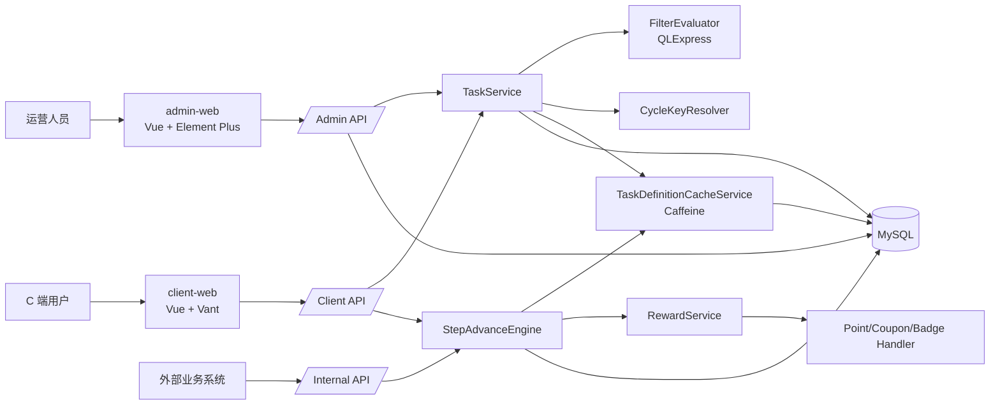
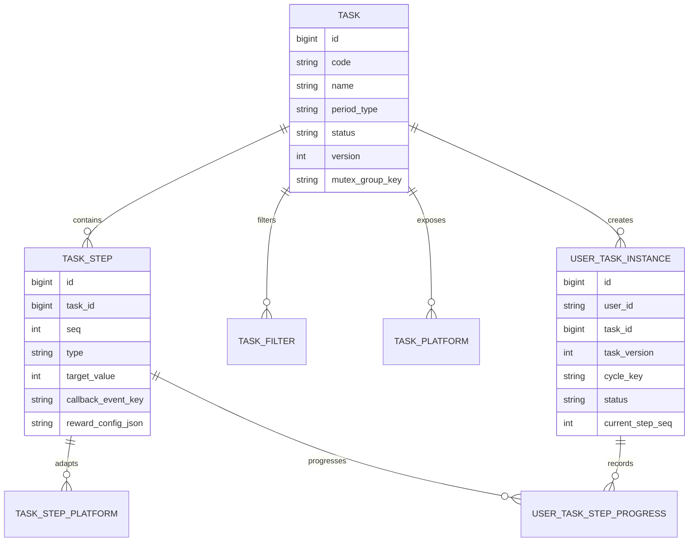
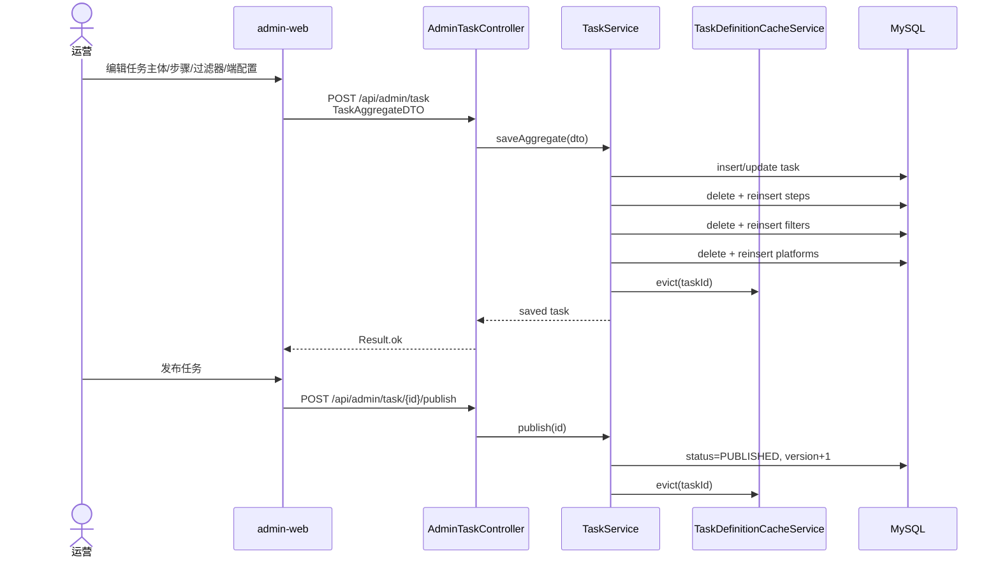
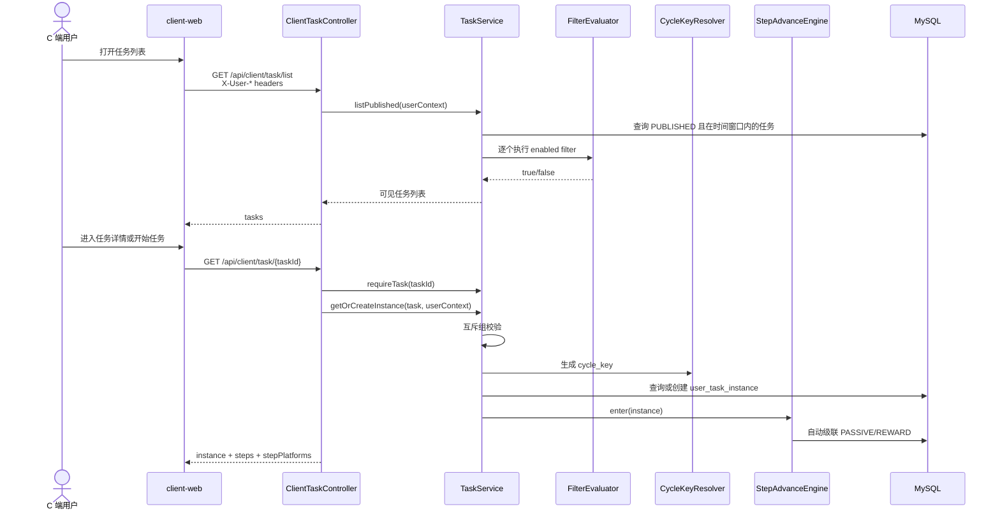
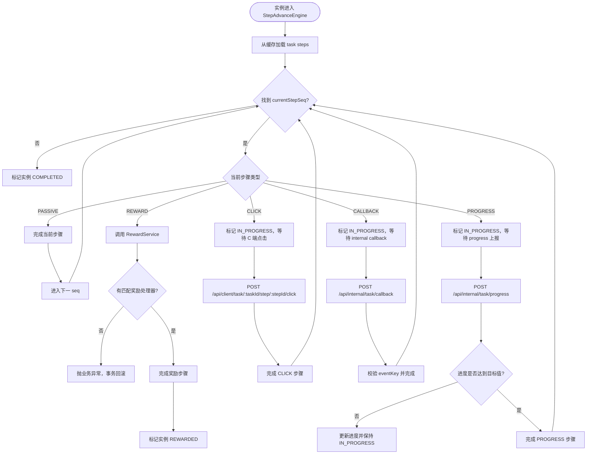
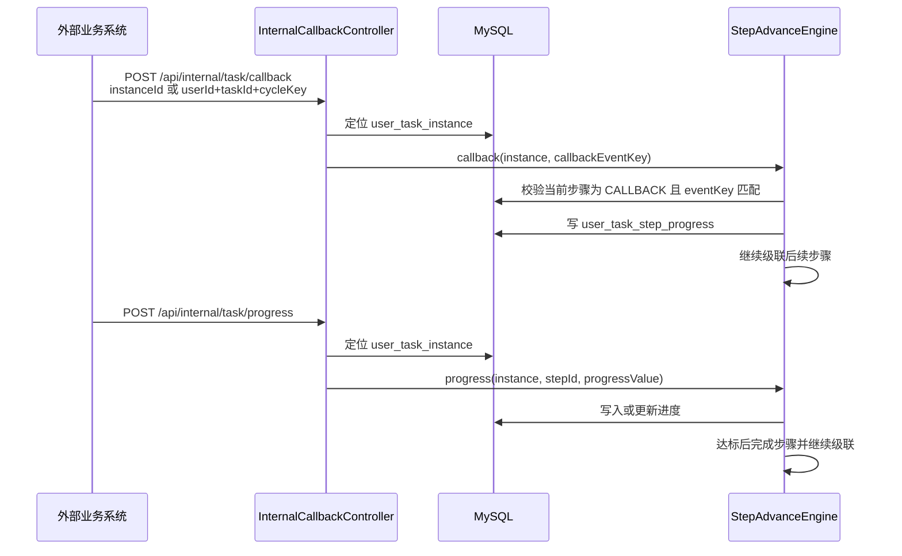

# 自动化营销任务系统当前架构流程图

日期：2026-05-22

本文档基于当前代码整理，覆盖系统定位、核心流程图、已完成内容、当前限制和后续计划。

## 1. 系统定位

本系统是一个自动化营销任务平台，用于让运营配置任务，让 C 端用户按任务步骤完成行为，并在任务完成后触发奖励发放。

当前代码已经形成三个入口：

| 入口 | 使用方 | 主要职责 |
|---|---|---|
| `admin-web` + `/api/admin/**` | 运营后台 | 配置任务、步骤、过滤器、平台入口、发布/下线任务、查询用户实例 |
| `client-web` + `/api/client/**` | C 端用户 | 查看可参与任务、创建/查看任务实例、点击推进任务步骤 |
| `/api/internal/**` | 外部业务系统 | 回调 CALLBACK 步骤、上报 PROGRESS 进度 |

## 2. 总体架构流程图

## 3. 核心领域模型

## 4. Admin 配置与发布流程

补充：当前还保留了步骤、过滤器、端配置的独立 CRUD API；这些写操作已补充缓存失效，避免 C 端读取旧定义。

## 5. C 端任务参与流程

## 6. 步骤推进流程

## 7. 内部回调与进度上报流程

