# 自动化营销任务系统架构文档

日期：2026-05-28

本文档基于当前代码整理，覆盖系统定位、技术栈、核心架构、领域模型、关键流程和模块职责。

## 1. 系统定位

本系统是一个自动化营销任务平台，用于让运营配置任务，让 C 端用户按任务步骤完成行为，并在任务完成后触发奖励发放。

当前代码已形成三个入口和一个独立奖品子域：

| 入口 | 使用方 | 主要职责 |
|---|---|---|
| `admin-web` + `/api/admin/**` | 运营后台 | 配置任务、步骤、过滤器、平台入口、互斥组、奖品；发布/下线任务；查询用户实例、指标、审计日志；管理后台/客户端用户 |
| `client-web` + `/api/client/**` | C 端用户 | 查看可参与任务、创建/查看任务实例、点击推进任务步骤、领奖专区 |
| `/api/internal/**` | 外部业务系统 | 回调 CALLBACK 步骤、上报 PROGRESS 进度 |

## 2. 技术栈

| 层级 | 技术 |
|---|---|
| 后端 | Java 21 + Spring Boot 3.5 + MyBatis-Plus 3.5 + MySQL 8 + Flyway |
| 鉴权 | Sa-Token 1.44（admin / client 多账号 JWT） |
| 表达式引擎 | QLExpress 3.3（任务过滤器、条件分支，沙箱 + 白名单） |
| API 文档 | springdoc-openapi 2.x |
| 缓存 | Caffeine 本地缓存 |
| 管理端 | Vue 3 + TypeScript + Vite + Element Plus + VueFlow |
| C 端 | Vue 3 + TypeScript + Vite + Vant 4 |
| 包管理 | pnpm workspace |
| CI | GitHub Actions |

## 3. 总体架构流程图

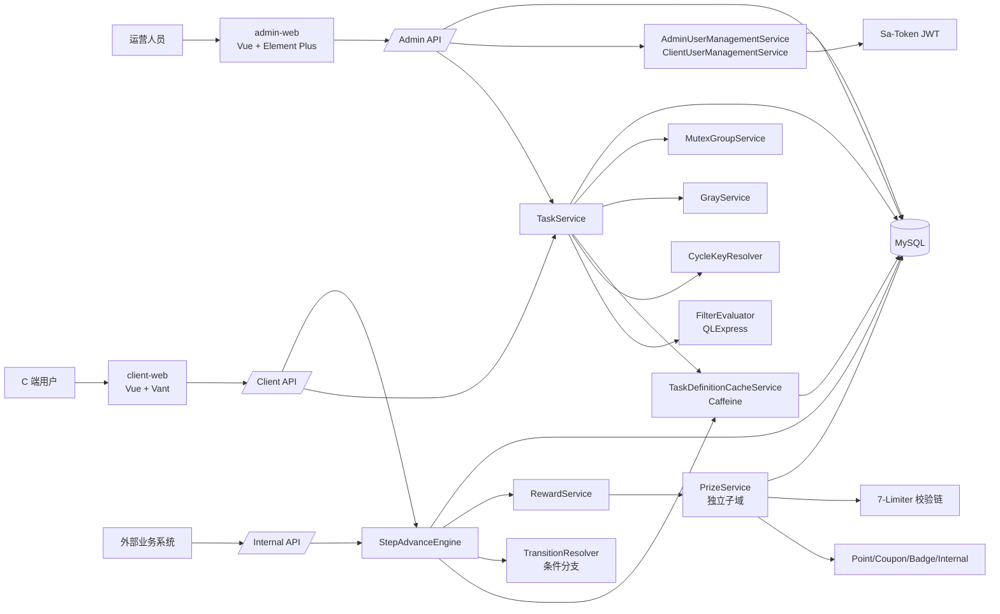

## 4. 核心领域模型

### 4.1 任务与步骤

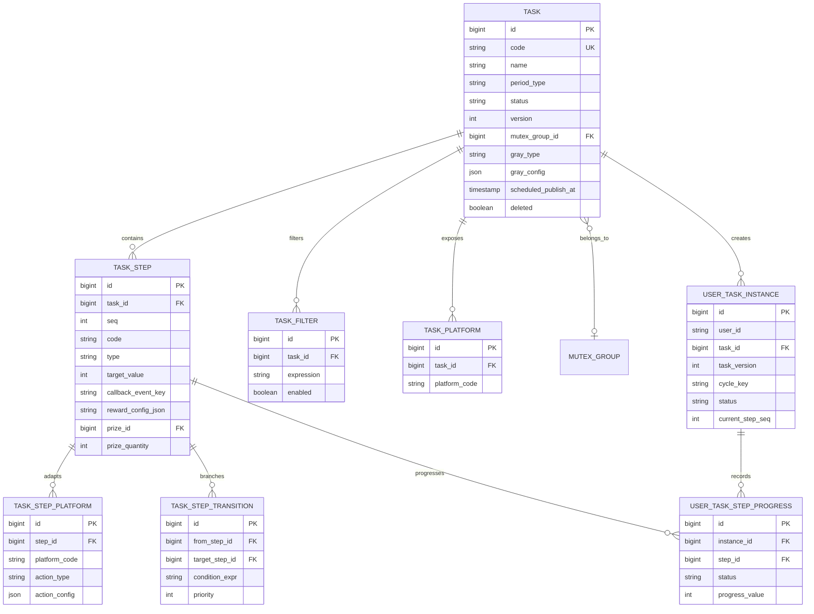

### 4.2 奖品子域

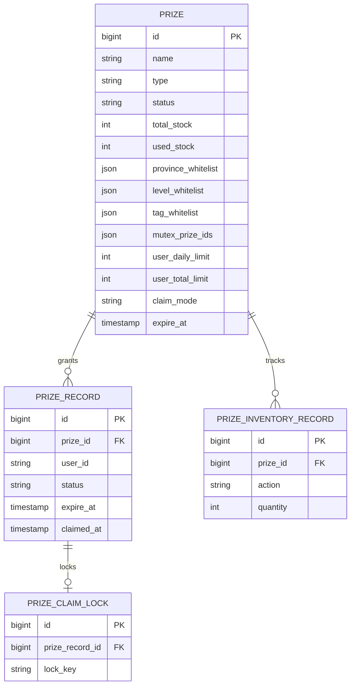

### 4.3 系统支撑表

```mermaid
erDiagram
    ADMIN_USER {
        bigint id PK
        string username UK
        string password
        boolean enabled
    }

    CLIENT_USER {
        bigint id PK
        string user_id UK
        string nickname
        string password
        boolean enabled
    }

    MUTEX_GROUP {
        bigint id PK
        string name
        string key UK
        boolean cross_cycle
    }

    REWARD_RECORD {
        bigint id PK
        bigint instance_id
        bigint step_id
        string status
        string reward_type
        json reward_config
    }

    TASK_DEFINITION_SNAPSHOT {
        bigint id PK
        bigint task_id
        int version
        json snapshot_json
    }

    LIST_DATA {
        bigint id PK
        string list_key
        string value
    }

    EVENT_LOG {
        bigint id PK
        string event_type
        string user_id
        bigint task_id
        json extra
    }

    TASK_METRICS {
        bigint id PK
        bigint task_id
        date metric_date
        int exposure_count
        int participate_count
        int complete_count
        int reward_success_count
        int reward_fail_count
    }

    OPERATION_LOG {
        bigint id PK
        string operator
        string action
        string target_type
        string target_id
        json detail
    }
```

## 5. 后端模块职责

### 5.1 Controller 层 (21 个)

| 模块 | Controller | 命名空间 |
|---|---|---|
| 认证 | AdminAuthController, ClientAuthController | `/api/admin/auth`, `/api/client/auth` |
| 用户管理 | AdminUserController, ClientUserController | `/api/admin/admin-users`, `/api/admin/client-users` |
| 任务管理 | AdminTaskController | `/api/admin/task` |
| 步骤管理 | AdminStepController | `/api/admin/step` |
| 过滤器管理 | AdminFilterController, AdminFilterCrudController | `/api/admin/filter` |
| 平台管理 | AdminPlatformController, AdminStepPlatformController, AdminTaskStepPlatformController | `/api/admin/platform` |
| 实例管理 | AdminInstanceController | `/api/admin/instance` |
| 互斥组管理 | AdminMutexGroupController | `/api/admin/mutex-group` |
| 指标与日志 | AdminMetricsController, AdminOperationLogController | `/api/admin/metrics`, `/api/admin/operation-log` |
| 模拟测试 | AdminSimulateController | `/api/admin/simulate` |
| C 端任务 | ClientTaskController | `/api/client/task` |
| 内部回调 | InternalCallbackController | `/api/internal/task` |
| 验证码 | CaptchaController | `/api/captcha` |
| 奖品管理 | AdminPrizeController, ClientPrizeController | `/api/admin/prize`, `/api/client/prize` |

### 5.2 Service 层 (~60 个)

| 领域 | 核心 Service | 职责 |
|---|---|---|
| 任务 | TaskService, TaskDefinitionCacheService | 聚合 CRUD、发布/下线、缓存失效 |
| 调度 | TaskCycleScheduler, TaskPublishScheduler | CRON/MONTHLY 周期激活、定时发布 |
| 互斥组 | MutexGroupService | 互斥组 CRUD、任务关联/移除 |
| 步骤推进 | StepAdvanceEngine + 5 Handler | Click/Passive/Callback/Progress/Reward 分发 |
| 条件分支 | TransitionResolver (内嵌 StepAdvanceEngine) | 按 priority 评估 QLExpress 条件表达式 |
| 奖励 | RewardService + 3 Handler | Point/Coupon/Badge 奖励发放 |
| 奖品 | PrizeService, ClaimService | 统一发奖入口、领奖、7-Limiter 校验链 |
| 过滤器 | FilterEvaluator, FilterExpressionEngine, GrayService, ListDataService | QLExpress 表达式沙箱、灰度分流、名单 |
| 平台 | PlatformAdapterRegistry + 5 Adapter | Web/Admin/Android/iOS/Miniapp 适配 |
| 周期 | CycleKeyResolver | ONCE/DAILY/MONTHLY/CRON/SPECIAL 周期 key 生成 |
| 用户管理 | AdminUserManagementService, ClientUserManagementService | 分页查询、重置密码、启用/停用、踢下线 |
| 认证 | AdminAuthService, ClientAuthService | Sa-Token 登录、验证码校验 |
| 监控 | EventTrackingService, MetricsService, TaskMetricsScheduler | 事件埋点、Micrometer 指标、定时聚合 |
| 审计 | OperationLogService | 异步审计日志记录 |

### 5.3 数据层

- **21 个 Entity** (17 核心 + 4 奖品)，每个对应 MyBatis-Plus Mapper
- **16 个 Flyway 迁移** (V1 ~ V16)
- Caffeine 本地缓存：任务定义、步骤、过滤器、端配置、版本快照、互斥组、转换规则

## 6. 关键流程

### 6.1 Admin 配置与发布流程

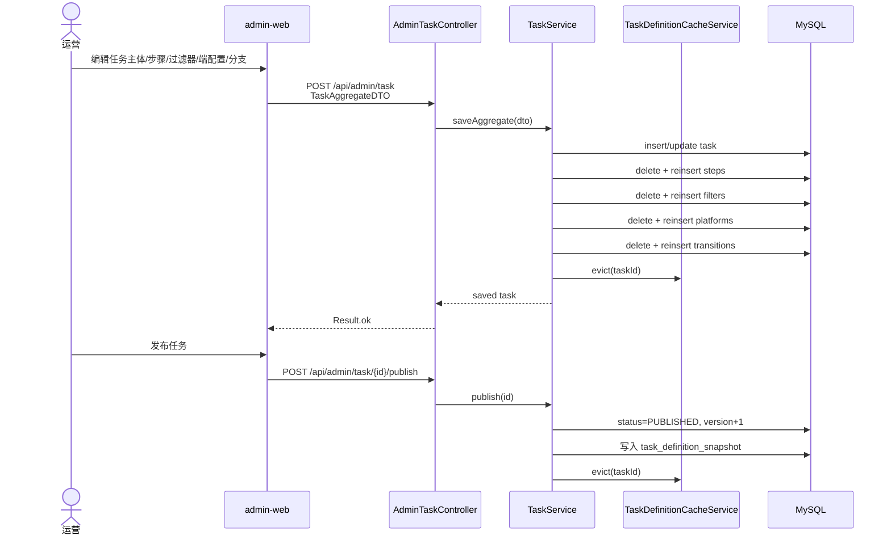

### 6.2 C 端任务参与流程

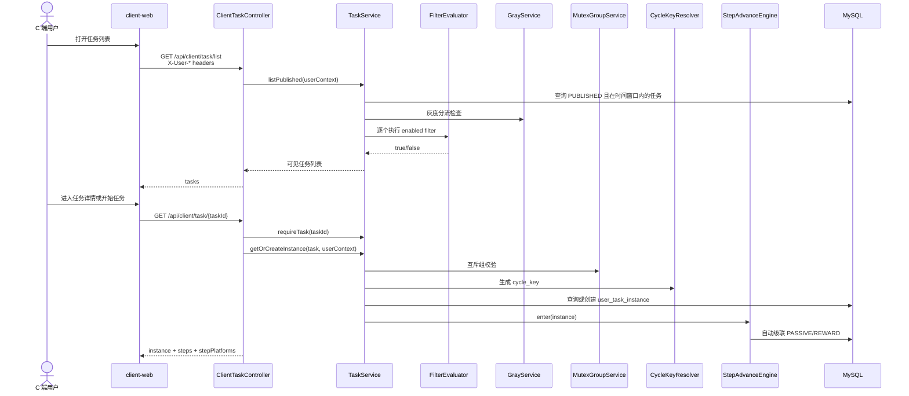

### 6.3 步骤推进流程（含条件分支）

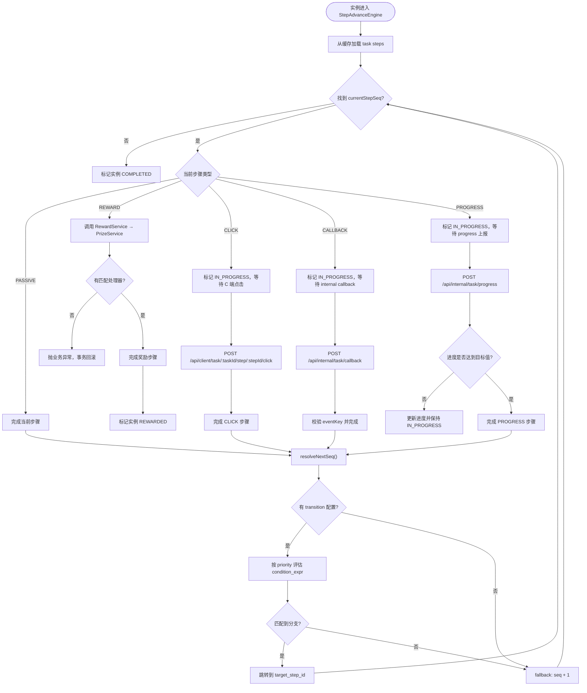

### 6.4 奖品发放流程

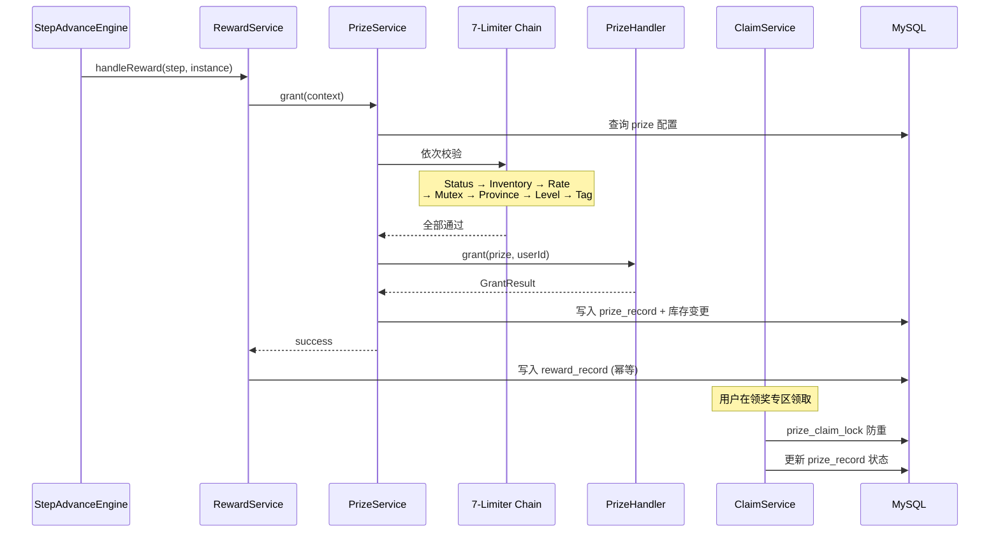

### 6.5 用户管理流程

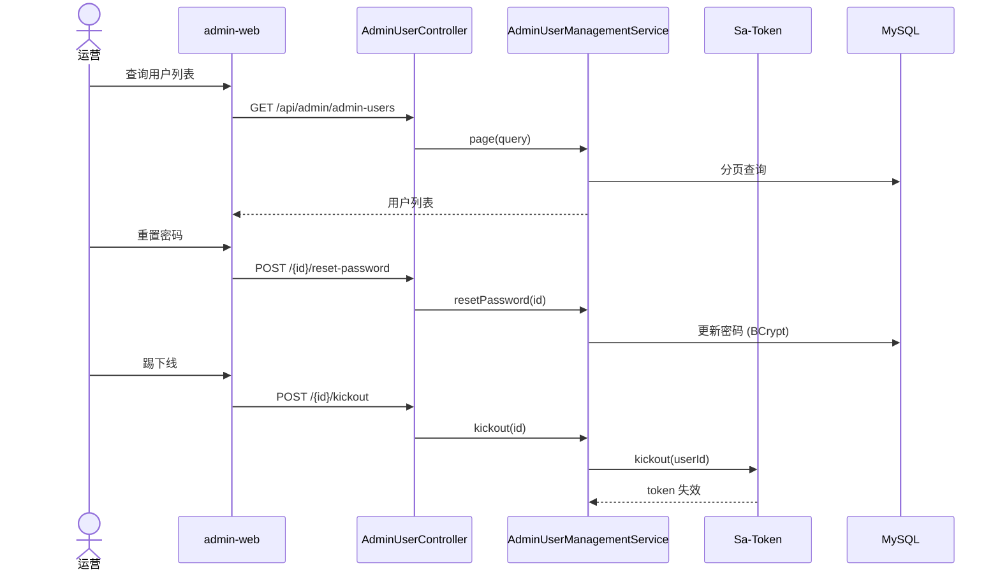

## 7. 鉴权架构

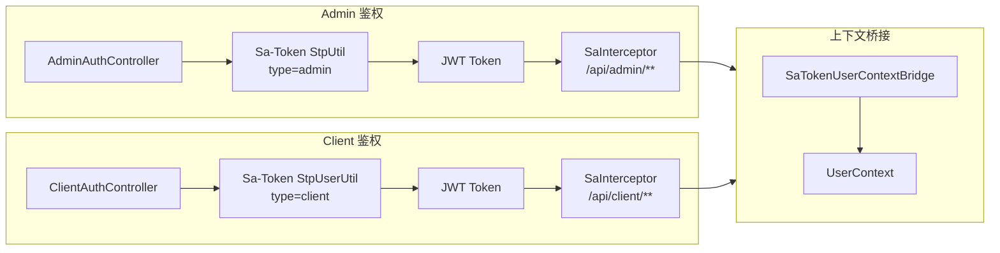

- SaTokenConfig @PostConstruct 注入 `StpLogicJwtForSimple`
- SaTokenRouteConfig 注册拦截器，mock 模式跳过
- 两套 JWT secret 独立管理
- 支持 Token 自动续期 (active-timeout)、并发登录控制、登出/失效

## 8. 缓存架构

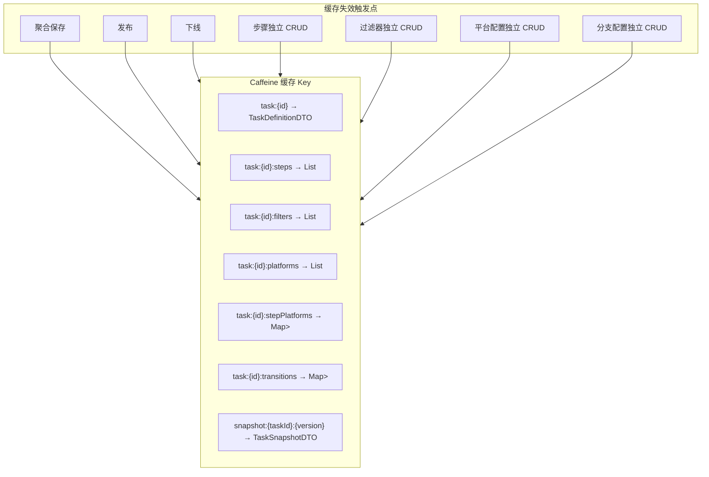

## 9. 前端架构

### 9.1 Admin Web (管理端)

| 模块 | 页面 | 功能 |
|---|---|---|
| 任务管理 | TaskList, TaskEdit (BasicTab, StepsTab, FiltersTab, PlatformsTab) | 任务 CRUD、步骤可视化编辑 (VueFlow)、过滤器配置、平台配置 |
| 互斥组 | MutexGroupList, MutexGroupDetail | 互斥组 CRUD、任务关联管理、移除关联 |
| 奖品管理 | PrizeList, PrizeEdit, PrizeRecordList | 奖品配置、库存管理、发放记录 |
| 实例管理 | InstanceList, InstanceDetail | 用户任务实例查询、事件日志 |
| 用户管理 | AdminUserList, ClientUserList | 分页查询、重置密码、启用/停用、踢下线 |
| 监控 | Dashboard, TaskMetrics | 仪表盘概览、任务指标趋势 |
| 审计 | OperationLogs | 操作日志查询 |
| 模拟测试 | SimulatePage, SimulateTab | 用户身份模拟、全流程测试 |
| 认证 | Login, MockLogin | 管理端登录 |

### 9.2 Client Web (C 端)

| 模块 | 页面 | 功能 |
|---|---|---|
| 任务 | TaskList, TaskDetail | 可见任务列表、任务详情、CLICK 步骤操作 |
| 领奖 | PrizeRecords | 领奖专区、状态 Tab、一键领取 |
| 认证 | Login | C 端登录 |

### 9.3 前端技术要点

- **API 层**: 基于 OpenAPI 生成类型 (`scripts/generate-api-types.sh`)，类型安全
- **管理端**: Element Plus + VueFlow DAG 可视化编辑器 + 拖拽节点 + localStorage 位置持久化
- **C 端**: Vant 4 + Axios 自动注入 `X-User-*` 与 `X-Platform` headers
- **路由**: 侧边栏菜单 + TabBar 多标签页 + keep-alive

## 10. 数据库迁移历史

| 版本 | 名称 | 说明 |
|---|---|---|
| V1 | init_task_core | 核心任务表 (task, task_step, task_filter, task_platform, user_task_instance, user_task_step_progress) |
| V2 | seed_demo_data | 3 个示例任务 |
| V3 | auth_tables | admin_user, client_user |
| V4 | task_snapshot | task_definition_snapshot 版本快照 |
| V5 | reward_record | 奖励流水表 |
| V6 | prize_module | 奖品子域四表 (prize, prize_record, prize_claim_lock, prize_inventory_record) |
| V7 | list_data | 名单数据表 (allowlist/denylist) |
| V8 | mutex_group | 互斥组独立表，task.mutex_group_key → mutex_group_id FK |
| V9 | step_platform_action | 步骤平台配置新增 action_type, action_config |
| V10 | event_log_and_metrics | 事件日志 + 任务指标聚合表 |
| V11 | task_gray_config | 任务灰度配置 (gray_type, gray_config) |
| V12 | cross_cycle_mutex | 互斥组跨周期标记 |
| V13 | operation_log | 审计日志表 |
| V14 | step_branching | 步骤条件分支表 (task_step_transition) |
| V15 | task_scheduled_publish | 定时发布字段 |
| V16 | task_soft_delete | 任务软删除标记 |
