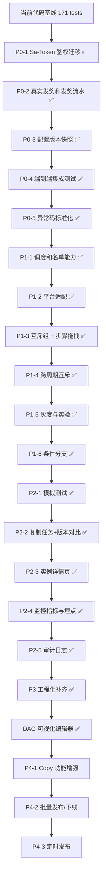

最后更新：2026-05-26

## 1.已经完成的内容

### 后端

- 任务主体、步骤、过滤器、平台配置、用户实例、步骤进度的核心表结构和实体。
- Admin API：
  - 任务分页、详情、聚合保存、发布、下线。
  - 步骤 CRUD。
  - 过滤器 CRUD 与表达式校验。
  - 端配置 CRUD。
  - 步骤端特化配置 CRUD。
  - 用户任务实例分页查询。
- Client API：
  - 可见任务列表。
  - 任务详情，返回实例、步骤和端特化配置。
  - 创建/获取用户任务实例。
  - CLICK 步骤推进。
- Internal API：
  - CALLBACK 步骤回调。
  - PROGRESS 步骤进度上报。
- 任务过滤：
  - 基于 QLExpress 的表达式引擎。
  - 支持省份、标签、角色、组织、等级等白名单函数。
  - 表达式长度、禁用关键字、执行超时保护。
- 任务周期：
  - `ONCE`、`DAILY`、`MONTHLY`、`CRON`、`SPECIAL` 到 `cycle_key` 的解析。
- 步骤推进：
  - `PASSIVE` 自动完成。
  - `CLICK` 由 C 端点击推进。
  - `CALLBACK` 由内部回调推进。
  - `PROGRESS` 由内部进度上报推进。
  - `REWARD` 自动触发奖励。
- 奖品模块（独立 prize package）：
  - prize / prize_record / prize_claim_lock / prize_inventory_record 四表。
  - PrizeService 统一发奖入口 + PrizeHandler 策略模式 (Point/Coupon/Badge/Internal)。
  - 7 个 PrizeLimiter 校验链（状态/库存/互斥/省份/等级/标签/用户频率）。
  - ClaimService 领奖 + prize_claim_lock 防重锁 + 自动/手动领奖模式。
  - PrizeExpiryScheduler 三机制过期（用户进专区 + 每小时扫描 + 领奖时校验）。
  - ClientPrizeController 领奖专区 API + AdminPrizeController 奖品管理 API。
  - task_step 新增 prize_id / prize_quantity，RewardStepHandler 接入 PrizeService。
  - 39 个单元测试。
- 奖励处理：
  - `RewardConfig` 解析。
  - `point`、`coupon`、`badge` 三类 handler 实现。
  - 无匹配奖励处理器时抛异常，避免错误标记为已奖励。
  - `reward_record` 表记录发奖流水（PENDING/SUCCESS/FAILED）。
  - 幂等：`(instance_id, step_id)` 唯一约束，重复触发直接跳过。
  - 失败重试：FAILED 记录可重试，异常不阻塞任务实例。
- 性能与一致性：
  - Caffeine 本地缓存任务定义、步骤、过滤器、端配置、版本快照。
  - 聚合保存、发布、下线、子表独立 CRUD 后都会失效缓存。
- 配置版本快照：
  - `task_definition_snapshot` 表，发布时固化 task + steps + filters + platforms JSON。
  - `ClientTaskController.detail()` 在实例有 `taskVersion` 时优先读快照。
  - 快照查不到时 fallback 到实时表（向后兼容旧实例）。
  - 步骤平台配置 (`task_step_platform`) 和分支配置 (`task_step_transition`) 已纳入快照。
- 业务约束：
  - `mutex_group_key` 互斥组校验。
  - 空白互斥组按不参与互斥处理。
- 条件分支 (v0.4.0)：
  - `task_step_transition` 表 (Flyway V14)，支持步骤多分支路由。
  - `StepAdvanceEngine.resolveNextSeq()` 按 priority 依次评估 condition_expr (QLExpress)。
  - 首个匹配分支 → target_step_id；全不匹配 → fallback seq + 1（向后兼容）。
  - DAG 约束：target_step_id 不可指向自身，目标 seq > 来源 seq（禁止回退）。
  - NULL condition_expr = 默认分支，最低优先级自动匹配。
  - TaskStepTransition entity/mapper/VO，TaskDefinitionCacheService 缓存 transitions。
  - API：GET transitions by step_id, POST 批量保存, DELETE 删除。
- Sa-Token 鉴权迁移 (v0.4.0)：
  - 引入 `sa-token-spring-boot3-starter` + `sa-token-jwt` (1.44.0)，移除 jjwt 依赖。
  - 多账号模式：`StpUtil` (admin, type="admin") + `StpUserUtil` (client, type="client")。
  - SaTokenConfig @PostConstruct 注入 `StpLogicJwtForSimple`，各自独立 JWT secret。
  - SaTokenRouteConfig 注册 SaInterceptor (`/api/admin/**` + `/api/client/**`)，mock 模式跳过鉴权。
  - SaTokenUserContextBridge 桥接 Sa-Token 会话到现有 UserContext/UserContextHolder。
  - 保留 admin_user/client_user 表结构、BCrypt 密码校验、验证码、登录 Controller 签名。
  - 获得：Token 自动续期 (active-timeout)、并发登录控制、登出/失效、SSO/OAuth2 扩展点预留。
- 工程化补齐 (v0.4.0)：
  - 步骤平台配置纳入快照：TaskSnapshotDTO 新增 stepPlatforms，发布时写入。
  - HTTP 层集成测试：AdminTaskControllerTest (4) + ClientTaskControllerTest (5) MockMvc 测试 (H2)。
  - 前端类型安全：刷新 generated/ 类型，消除手写与生成差异。
- 测试：
  - 过滤表达式测试。
  - 奖励配置解析测试。
  - 无匹配奖励处理器测试。
  - 步骤推进测试。
  - 任务互斥测试。
  - 端到端集成测试（9 个场景，H2 内存库，Spring Boot Test）。

	- 监控指标与埋点 (v0.3.0)：
	  - `event_log` 表 + EventType 枚举（8 种事件类型）。
	  - EventTrackingService 在 10 个调用点注入。
	  - MetricsService 封装 Micrometer（6 个 Counter + 1 个 Timer）。
	  - task_metrics 聚合表 + TaskMetricsScheduler 每 5 分钟聚合。
	  - AdminMetricsController：dashboard / task summary / daily 趋势 API。
	- 管理端模拟测试 (v0.3.0)：
	  - SimulateContextHolder ThreadLocal 模拟用户上下文。
	  - AdminSimulateController：impersonate / callback / progress / full-flow API。
	  - 复用现有 StepAdvanceEngine + TaskService 完成全流程。
	- 测试：
	  - EventTrackingServiceTest 4 tests。
	  - MetricsServiceTest 3 tests。
	  - TaskMetricsSchedulerTest 3 tests。
	  - AdminMetricsControllerTest 3 tests。

### Admin 前端

- 任务列表、发布、下线、跳转编辑。
- 任务编辑页：
  - 基本信息。
  - 步骤配置（含分支条件配置：优先级 / 目标步骤 / 条件表达式 + 校验按钮 / 默认分支）。
  - 过滤器配置和表达式校验。
  - 平台入口配置。
  - 聚合保存 `TaskAggregateDTO`（含 transitions）。
- 用户任务实例查询。
- Mock 用户上下文配置，用于联调请求头。
- 管理端主题样式优化。
- 奖品配置管理：PrizeList（分页/启用禁用）、PrizeEdit（类型/库存/限制/领取设置/时间窗口/奖品组）。
- 运营仪表盘 (v0.3.0)：Dashboard 概览卡片（今日曝光/参与/完成/发奖成功率）+ 任务排行 Top 10。
- 任务指标页 (v0.3.0)：TaskMetrics 累计指标 + 按日趋势表格 + 日期范围选择。
- 模拟测试 Tab (v0.3.0)：SimulateTab 用户身份模拟 + CALLBACK/PROGRESS 手动触发 + 一键全流程测试。
- 条件分支 UI (v0.4.0)：步骤编辑弹窗新增"分支配置"区域，分支图标 + 数量 badge，target 下拉排除自身。
- DAG 可视化步骤编辑器 (v0.4.0)：VueFlow 画布 + 拖拽节点创建 + 属性面板 + 自定义节点/边渲染 + DAG 布局算法 + 键盘快捷键 + localStorage 位置持久化。

### Client 前端

- C 端任务列表。
- 任务详情页。
- CLICK 步骤操作。
- 领奖专区：PrizeRecords（状态 Tab 切换/"待领取/已到账/已过期"/状态计数 badge/领取倒计时）、奖品详情弹窗 + 一键领取。
- Mock 用户上下文配置。
- Axios 请求自动注入 `X-User-*` 与 `X-Platform`。

### 数据与示例

- Flyway 初始化核心任务表、实例表。
- Seed 示例任务：
  - 每日签到类任务。
  - 问卷回调类任务。
  - 阅读进度类任务。

## 2. 当前限制

| 限制 | 当前状态 | 风险 |
|---|---|---|
| 真实鉴权 | ✅ Sa-Token 多账号 JWT 已实现，SSO/OAuth2 扩展点已预留 | 尚未对接外部用户中心/单点登录 |
| 真实发奖 | reward_record 表 + 幂等 + 失败重试已实现，handler 暂为模拟（无外部API） | 外部奖励系统对接后再替换 handler 实现 |
| 配置版本快照 | ✅ 已纳入 task/steps/filters/platforms/stepPlatforms/transitions | — |
| CRON 调度 | `TaskCycleScheduler` 每 5 分钟扫描并激活新周期 | 尚未实现批量预创建用户实例 |
| allowlist/denylist | ✅ list_data 表 + ListDataService 已实现，inAllowlist/notInDenylist 可查表 | — |
| 平台适配器 | Adapter 已注册，detail() 已通过 PlatformAdapterRegistry 合并 step + stepPlatform | IOS/Android/Miniapp adapter 均为默认实现 |
| 步骤推进 | ✅ 条件分支已实现，多分支路由 + 默认线性 fallback | — |
| DAG 可视化编辑 | ✅ VueFlow 画布 + 拖拽节点 + 属性面板 | — |
| 集成测试 | ✅ 171 tests 全量通过 (153 unit + 18 integration)，含 HTTP MockMvc 层 | — |
| OpenAPI 类型 | ✅ 已刷新，消除手写与生成差异 | — |

## 3. 后续计划

### P0：正确性与生产前置

1. ~~接入真实鉴权链路：Sa-Token 多账号 JWT~~ ✅ 已完成 (2026-05-26)：
   - Sa-Token 1.44.0 集成，StpUtil (admin) + StpUserUtil (client) 双账号模式。
   - SaInterceptor 注册，SaTokenUserContextBridge 桥接，mock 模式兼容。
   - Token 自动续期、并发登录控制、登出/失效、SSO/OAuth2 扩展点预留。
2. ~~完成真实奖励系统对接~~ ✅ 已完成 (2026-05-24)：
   - reward_record 表 + 幂等 + 失败重试（P0-2 阶段）。
   - 独立 prize 模块：PrizeService + PrizeHandler 策略 + 7 个 Limiter 校验链。
   - prize_claim_lock 防重锁 + ClaimService 领奖 + 自动/手动模式。
   - 三机制过期处理 + 领奖专区 API + 管理后台 API。
   - 39 个单元测试 (PrizeServiceTest 13 + ClaimServiceTest 9 + PrizeLimiterTest 17)。
3. ~~增加任务配置快照~~ ✅ 已完成：
   - 发布时固化 task、steps、filters、platforms 到 `task_definition_snapshot`。
   - 用户实例按 `task_version` 读取对应快照，无快照时 fallback 到实时表。
   - v0.4.0：stepPlatforms 和 transitions 同步纳入快照。
4. ~~增加端到端集成测试~~ ✅ 已完成 (2026-05-24)：
   - TaskLifecycleIntegrationTest 9 个场景。
   - H2 内存库 + @SpringBootTest + @ActiveProfiles("test")。
   - 覆盖：每日签到/问卷回调/阅读进度全链路、互斥组、省份过滤、配置快照、奖品集成。
5. ~~完善异常码和错误文案~~ ✅ 已完成 (2026-05-24)：
   - ErrorCode 枚举从 5 个扩展为 28 个，新增 subCode 业务子码（如 TASK_001, PRIZE_001）。
   - 全量替换 31 处 throw new BusinessException 使用具体 ErrorCode。
   - GlobalExceptionHandler 新增 BindException / HttpMessageNotReadableException / NoResourceFoundException / AccessDeniedException 处理。
   - Catch-all 不再泄露 ex.getMessage()，只返回通用"服务器内部错误"。

### P1：任务能力增强

1. ~~完成 CRON/MONTHLY 调度能力~~ ✅ 已完成 (2026-05-24)：
   - TaskCycleScheduler @Scheduled 每 5 分钟扫描 PUBLISHED + CRON/MONTHLY 任务。
   - 检测 cycleKey 变更自动激活新周期，ConcurrentHashMap 跟踪已激活周期防重复。
   - CycleKeyResolver 已有周期 key 生成逻辑（CRON=yyyyMMddHHmm, MONTHLY=yyyyMM），调度器复用。
   - 7 个单元测试。
2. ~~完成 allowlist/denylist~~ ✅ 已完成 (2026-05-24)：
   - list_data 表 (Flyway V7) + ListData entity/mapper/service。
   - inAllowlist(listKey) / notInDenylist(listKey) 查 list_data 表。
   - FilterExpressionEngine 构造函数注入 ListDataService。
   - 4 个新增 + 1 个修改测试 (FilterExpressionEngineTest: 17 tests)。
3. ~~完善平台适配~~ ✅ 已完成 (2026-05-24)：
   - ClientTaskController.detail() 注入 PlatformAdapterRegistry，合并 step + stepPlatform。
   - TaskStepVO 新增 platformConfig 字段 (buttonText/jumpType/jumpTarget)，@JsonInclude(NON_NULL)。
   - adapter.renderStep() 为每个步骤调用，支持平台特化渲染。
4. ~~优化互斥组能力~~ ✅ 已完成 (2026-05-25)：
   - mutex_group 独立表 + Admin CRUD（MutexGroupList/MutexGroupDetail）。
   - Task 表 mutex_group_key 迁移为 mutex_group_id 外键。
   - 任务编辑中互斥组改为下拉选择器；死锁修复（keyOwner 模式）。
   - 跨周期互斥 (cross_cycle 列 + Flyway V12 + 前端切换 UI)。
5. ~~增加任务灰度与实验能力~~ ✅ 已完成 (2026-05-24, v0.3.1)：
   - 百分比分流 (inGrayPercent)。
   - AB 实验分组 (inABGroup)。
   - 人群包绑定 (inCrowd)。
   - GrayService hash-based 灰度决策 + Flyway V11 (gray_type/gray_config)。
6. ~~增加条件分支能力~~ ✅ 已完成 (2026-05-26, v0.4.0)：
   - task_step_transition 表 (Flyway V14) + entity/mapper/VO。
   - StepAdvanceEngine.resolveNextSeq() 按 priority + QLExpress 条件表达式路由。
   - DAG 约束（目标 seq > 来源 seq，禁止自指）。
   - StepsTab 分支配置 UI + 分支 badge 图示。
   - 测试：VIP 快速通道、无匹配 fallback、无 transition 兼容、多分支汇合。

### P2：运营效率与可观测性

1. ~~Admin 增加任务预览和模拟用户命中测试。~~ ✅ 已完成 (2026-05-24, v0.3.0)：
   - SimulateContextHolder 模拟用户上下文。
   - AdminSimulateController：impersonate / callback / progress / full-flow API。
   - admin-web SimulateTab：用户身份模拟 + CALLBACK/PROGRESS 手动触发 + 一键全流程测试。
2. ~~Admin 增加步骤拖拽排序、复制任务、版本对比~~ ✅ 已完成 (2026-05-25)：
   - 步骤拖拽排序 (HTML5 drag-drop) + Modal 编辑 + code 唯一性校验 + extraJson 编辑器已实现。
   - 复制任务 (POST /{id}/copy) + 版本对比 (GET /{id}/versions + 版本历史弹窗)。
3. ~~增加实例详情页~~ ✅ 已完成 (2026-05-25)：InstanceDetail.vue + 事件日志 API
4. ~~增加监控指标~~ ✅ 已完成 (2026-05-24, v0.3.0)：
   - 任务曝光数 / 参与数 / 完成数 / 发奖成功/失败数 / 过滤表达式耗时。
   - event_log 表 + EventTrackingService + Micrometer MetricsService。
   - task_metrics 日聚合表 + TaskMetricsScheduler 每 5 分钟聚合。
   - AdminMetricsController API + admin-web Dashboard + TaskMetrics 页面。
5. ~~增加审计日志~~ ✅ 已完成 (2026-05-25)：operation_log 表 + OperationLogService (@Async) + 前端审计日志页面，已接入任务/奖品/互斥组操作追踪。

### P3：工程化 ✅ 全部完成 (2026-05-26)

1. ✅ 启用 OpenAPI 类型生成并接入 admin-web/client-web。
   - `scripts/generate-api-types.sh` / `.cmd` 一键生成脚本。
   - admin-web 和 client-web 均添加 `generate-api` npm script。
   - `admin-web/src/api/generated/client.ts` 提供类型安全的 API 客户端包装。
   - `src/api/generated/` 已加入 `.gitignore`，生成文件不入库。
2. ✅ 固定前端依赖版本，减少 `latest` 带来的不可重复构建风险。
   - admin-web 和 client-web 的 `package.json` 全部替换为精确版本。
   - 新增 `.npmrc` 配置 `save-exact=true`。
3. ✅ 将 `tsconfig.tsbuildinfo` 等构建产物从版本管理中移除。
4. ✅ 增加 CI（`.github/workflows/ci.yml`）：
   - 后端 `mvn test`（H2 内存库，无需 MySQL service）。
   - admin-web build。
   - client-web build。
5. ✅ 增加部署文档（`docs/deployment.md`）：
   - 本地开发。
   - 测试环境。
   - 生产配置 & 检查清单。
   - 数据库迁移流程（Flyway）。
   - 常见问题。
6. ✅ 步骤平台配置纳入快照 (v0.4.0)：TaskSnapshotDTO 新增 stepPlatforms，发布时固化。
7. ✅ HTTP 层 MockMvc 集成测试 (v0.4.0)：AdminTaskControllerTest (4) + ClientTaskControllerTest (5)。
8. ✅ 前端类型刷新 (v0.4.0)：admin-web 类型与后端 OpenAPI 保持一致。

### P4：发布效率增强 (v0.5.0)

1. **Copy 功能增强**：
   - 后端 copy 端点支持自定义名称/code 参数。
   - 前端复制弹窗，预填默认名称，允许修改。
2. **批量发布/下线**：
   - `POST /api/admin/task/batch-publish` + `batch-offline` 端点。
   - 独立执行语义，返回成功/失败明细。
   - 前端多选 checkbox + 批量操作工具栏 + 结果反馈弹窗。
3. **定时发布**：
   - `task` 表新增 `scheduled_publish_at` 列 (Flyway V15)。
   - `TaskStatus` 枚举新增 `SCHEDULED`。
   - 新建 `TaskPublishScheduler` 每分钟扫描并自动发布。
   - 前端定时发布弹窗 + 取消定时功能。

## 4. 建议的下一步落地顺序

