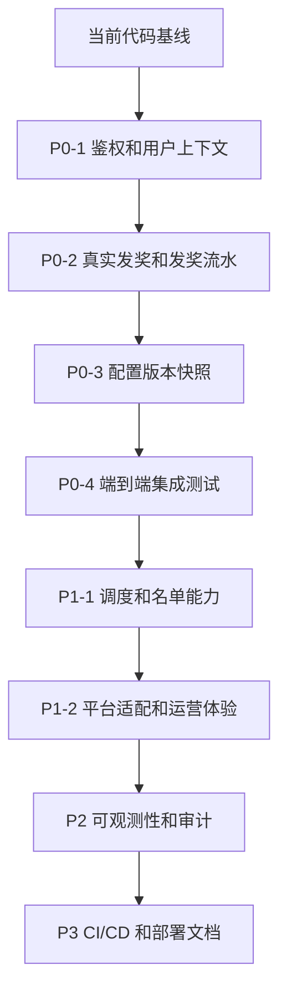

## 1.已经完成的内容

### 后端

- 任务主体、步骤、过滤器、平台配置、用户实例、步骤进度的核心表结构和实体。
- Admin API：
  - 任务分页、详情、聚合保存、发布、下线。
  - 步骤 CRUD。
  - 过滤器 CRUD 与表达式校验。
  - 端配置 CRUD。
  - 步骤端特化配置 CRUD。
  - 用户任务实例分页查询。
- Client API：
  - 可见任务列表。
  - 任务详情，返回实例、步骤和端特化配置。
  - 创建/获取用户任务实例。
  - CLICK 步骤推进。
- Internal API：
  - CALLBACK 步骤回调。
  - PROGRESS 步骤进度上报。
- 任务过滤：
  - 基于 QLExpress 的表达式引擎。
  - 支持省份、标签、角色、组织、等级等白名单函数。
  - 表达式长度、禁用关键字、执行超时保护。
- 任务周期：
  - `ONCE`、`DAILY`、`MONTHLY`、`CRON`、`SPECIAL` 到 `cycle_key` 的解析。
- 步骤推进：
  - `PASSIVE` 自动完成。
  - `CLICK` 由 C 端点击推进。
  - `CALLBACK` 由内部回调推进。
  - `PROGRESS` 由内部进度上报推进。
  - `REWARD` 自动触发奖励。
- 奖品模块（独立 prize package）：
  - prize / prize_record / prize_claim_lock / prize_inventory_record 四表。
  - PrizeService 统一发奖入口 + PrizeHandler 策略模式 (Point/Coupon/Badge/Internal)。
  - 7 个 PrizeLimiter 校验链（状态/库存/互斥/省份/等级/标签/用户频率）。
  - ClaimService 领奖 + prize_claim_lock 防重锁 + 自动/手动领奖模式。
  - PrizeExpiryScheduler 三机制过期（用户进专区 + 每小时扫描 + 领奖时校验）。
  - ClientPrizeController 领奖专区 API + AdminPrizeController 奖品管理 API。
  - task_step 新增 prize_id / prize_quantity，RewardStepHandler 接入 PrizeService。
  - 39 个单元测试。
- 奖励处理：
  - `RewardConfig` 解析。
  - `point`、`coupon`、`badge` 三类 handler 实现。
  - 无匹配奖励处理器时抛异常，避免错误标记为已奖励。
  - `reward_record` 表记录发奖流水（PENDING/SUCCESS/FAILED）。
  - 幂等：`(instance_id, step_id)` 唯一约束，重复触发直接跳过。
  - 失败重试：FAILED 记录可重试，异常不阻塞任务实例。
- 性能与一致性：
  - Caffeine 本地缓存任务定义、步骤、过滤器、端配置、版本快照。
  - 聚合保存、发布、下线、子表独立 CRUD 后都会失效缓存。
- 配置版本快照：
  - `task_definition_snapshot` 表，发布时固化 task + steps + filters + platforms JSON。
  - `ClientTaskController.detail()` 在实例有 `taskVersion` 时优先读快照。
  - 快照查不到时 fallback 到实时表（向后兼容旧实例）。
- 业务约束：
  - `mutex_group_key` 互斥组校验。
  - 空白互斥组按不参与互斥处理。
- 测试：
  - 过滤表达式测试。
  - 奖励配置解析测试。
  - 无匹配奖励处理器测试。
  - 步骤推进测试。
  - 任务互斥测试。

### Admin 前端

- 任务列表、发布、下线、跳转编辑。
- 任务编辑页：
  - 基本信息。
  - 步骤配置。
  - 过滤器配置和表达式校验。
  - 平台入口配置。
  - 聚合保存 `TaskAggregateDTO`。
- 用户任务实例查询。
- Mock 用户上下文配置，用于联调请求头。
- 管理端主题样式优化。

### Client 前端

- C 端任务列表。
- 任务详情页。
- CLICK 步骤操作。
- Mock 用户上下文配置。
- Axios 请求自动注入 `X-User-*` 与 `X-Platform`。

### 数据与示例

- Flyway 初始化核心任务表、实例表。
- Seed 示例任务：
  - 每日签到类任务。
  - 问卷回调类任务。
  - 阅读进度类任务。

## 2. 当前限制

| 限制 | 当前状态 | 风险 |
|---|---|---|
| 真实鉴权 | 仍使用 Header Mock UserContext | 不能直接用于生产 |
| 真实发奖 | reward_record 表 + 幂等 + 失败重试已实现，handler 暂为模拟（无外部API） | 外部奖励系统对接后再替换 handler 实现 |
| 配置版本快照 | 已实现，发布时创建 `task_definition_snapshot`，C 端按版本读取 | 步骤平台配置尚未纳入快照 |
| CRON 调度 | `CRON` 当前只是按当前分钟生成 cycle_key | 还没有调度触发器 |
| allowlist/denylist | 函数已注册但暂未接入名单数据源 | 相关过滤表达式不可用 |
| 平台适配器 | Adapter 已注册，但 C 端详情仍主要返回原始 stepPlatforms | 端差异渲染还不完整 |
| 集成测试 | 主要是单元测试 | 跨 API 的端到端回归覆盖不足 |
| OpenAPI 类型 | 已加入生成脚本，但前端类型仍有手写部分 | 接口变更可能导致类型漂移 |

## 3. 后续计划

### P0：正确性与生产前置

1. 接入真实鉴权链路：网关/JWT/用户中心，替换 Mock Header。
2. ~~完成真实奖励系统对接~~ ✅ 已完成 (2026-05-24)：
   - reward_record 表 + 幂等 + 失败重试（P0-2 阶段）。
   - 独立 prize 模块：PrizeService + PrizeHandler 策略 + 7 个 Limiter 校验链。
   - prize_claim_lock 防重锁 + ClaimService 领奖 + 自动/手动模式。
   - 三机制过期处理 + 领奖专区 API + 管理后台 API。
   - 39 个单元测试 (PrizeServiceTest 13 + ClaimServiceTest 9 + PrizeLimiterTest 17)。
3. ~~增加任务配置快照~~ ✅ 已完成：
   - 发布时固化 task、steps、filters、platforms JSON 到 `task_definition_snapshot`。
   - 用户实例按 `task_version` 读取对应快照，无快照时 fallback 到实时表。
4. 增加端到端集成测试：
   - Admin 创建发布任务。
   - Client 创建实例并推进 CLICK/CALLBACK/PROGRESS/REWARD。
   - 缓存失效后的定义更新验证。
5. 完善异常码和错误文案，区分用户可见错误与系统错误。

### P1：任务能力增强

1. 完成 CRON/MONTHLY 调度能力：
   - 调度任务生成周期窗口。
   - 明确补偿、重跑、过期策略。
2. 完成 allowlist/denylist：
   - 接入名单表、Redis 或外部画像服务。
   - 支持名单版本和缓存。
3. 完善平台适配：
   - 在 C 端详情按 `X-Platform` 合并 step + stepPlatform。
   - 使用 `PlatformAdapterRegistry` 输出统一前端渲染模型。
4. 优化互斥组能力：
   - Admin 展示互斥组冲突说明。
   - 支持互斥范围配置，例如同周期互斥或全周期互斥。
5. 增加任务灰度与实验能力：
   - 百分比分流。
   - AB 实验分组。
   - 人群包绑定。

### P2：运营效率与可观测性

1. Admin 增加任务预览和模拟用户命中测试。
2. Admin 增加步骤拖拽排序、复制任务、版本对比。
3. 增加实例详情页：
   - 当前步骤。
   - 每步进度。
   - 发奖状态。
   - 错误记录。
4. 增加监控指标：
   - 任务曝光数。
   - 参与数。
   - 完成数。
   - 发奖成功/失败数。
   - 过滤表达式耗时。
5. 增加审计日志：
   - 谁创建/修改/发布/下线任务。
   - 每次配置变更 diff。

### P3：工程化

1. 启用 OpenAPI 类型生成并接入 admin-web/client-web。
2. 固定前端依赖版本，减少 `latest` 带来的不可重复构建风险。
3. 将 `tsconfig.tsbuildinfo` 等构建产物从版本管理中移除。
4. 增加 CI：
   - 后端 `mvn test`。
   - admin-web build。
   - client-web build。
   - 文档 Mermaid lint 可选。
5. 增加部署文档：
   - 本地开发。
   - 测试环境。
   - 生产配置。
   - 数据库迁移流程。

## 4. 建议的下一步落地顺序

