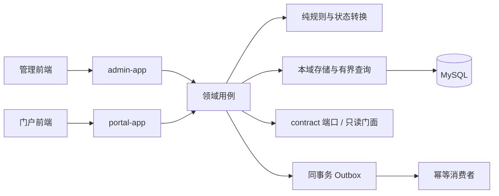

# 项目诊断与重构方案

审计日期：2026-10-07。范围：当时本地工作区的重点后端链路、两端前端、契约、测试、性能与部署入口。下表保留初次静态审计依据；当日运行结果见 [核验报告](full-flow-verification-2026-10-07.md)。门户个人中心 R5-01 与任务生命周期 R2-01 已推进，不能据此声称全仓重构或全部业务验收完成。

2026-10-09 文档清理说明：旧 Kiro 规格已退役。下文设计章节、需求编号和“设计允许”等描述是初次审计背景，不再构成实施授权；执行任何批次前核实现状，以用户本次要求和 [已确认决定](decisions.md) 确定行为及验收。

## 1. 总体判断

当前问题不在于缺少框架或模块，而在于业务边界没有始终落实、查询与事务编排职责混杂、前端异步状态容易失控，以及文档和测试门禁给出的保证超过实际证据。只改目录、统一命名或换 UI 不能解决这些问题。

继续采用**模块化单体内核 + 管理/门户双应用**。保留现有技术栈、账号隔离、任务版本快照及 task/reward 同事务发奖。没有证据支持现在拆成微服务或引入通用工作流平台。未上线允许按用例直接替换实现，但必须保住已经需要的功能、数据不变量和已确认契约。

已有单元、属性、架构、真实 MySQL/Redis IT、前端组件和 E2E 测试，不能称为“没有测试”；需要检查它们是否验证了正确行为、是否真正被执行、门禁是否覆盖实际实现。

## 2. 已核实问题与影响

下列路径和符号来自本轮工作区。未运行测试复现的竞争问题明确标为风险；业务偏差后续先补回归再修改。其他模块在第 5 节列为待审范围，不据此声称已全部验证。

| 编号 | 静态证据 | 影响与后续处理 |
|---|---|---|
| F01 | [TaskPortalAppService](../server/domain-task/src/main/java/com/mkt/task/application/TaskPortalAppService.java) 的 `list` 遍历发布任务，逐项取快照及用户周期实例，再内存分页；`mine` 还扫描用户历史 | 查询量随目录/历史增长。建立统一快照入口与有界状态批读，保留可见性过滤后的分页语义 |
| F02 | [TaskPublishAppService](../server/domain-task/src/main/java/com/mkt/task/application/TaskPublishAppService.java) 的 `freezeToPublished` 在事务提交前写共享快照缓存，索引则在提交后失效 | 回滚可能提前暴露快照，需提交/回滚交错回归后改缓存时机 |
| F03 | [TwoLevelPlatformCache](../server/platform-infra/src/main/java/com/mkt/infra/cache/TwoLevelPlatformCache.java) 为查缓存 → loader → put；evict 不约束正在进行的 loader | 静态竞争风险：并发加载放大、失效后旧值回填。验证同 key 合并加载、跨节点失效与故障回源 |
| F04 | 原领取互斥只扫 PUBLISHED，原下线操作未更新在途期限 | 已在 R2-01 修复为绑定快照互斥、下线有界重算及并发保护；规则由 DEC-007 明确，后续真实 MySQL 结果见 2026-10-07 核验报告 |
| F05 | [AdPortalAppService.visible](../server/domain-ad/src/main/java/com/mkt/ad/application/AdPortalAppService.java) / [ParticipationRules.firstReject](../server/domain-activity/src/main/java/com/mkt/activity/domain/ParticipationRules.java) 人群求值缺口 | **本轮**：`CrowdPort` + 活动人群码/广告 `crowdId` 已接；组合条件与 admin 跨域 SQL 仍见 DEC-003 |
| F06 | [MetricsAggregateService](../server/admin-app/src/main/java/com/mkt/admin/metrics/MetricsAggregateService.java)、[MetricsQueryService](../server/admin-app/src/main/java/com/mkt/admin/metrics/MetricsQueryService.java)、[JdbcSimulateGrantLookup](../server/admin-app/src/main/java/com/mkt/admin/simulate/JdbcSimulateGrantLookup.java) 直接查询其他域表 | 应用层跨域 SQL 的归属与范围需明确；设计允许聚合扫描，不能一概判为违规。一般读模型与聚合例外分别约束，见 DEC-003 |
| F07 | [GrantFailureLedger](../server/domain-reward/src/main/java/com/mkt/reward/application/GrantFailureLedger.java) 永久失败独立事务与设计例外不一致；任务保存的控制器审计晚于业务提交，存在分开提交窗口 | 资金与留痕语义先决策、再改实现，见 DEC-004 |
| F08 | [OutboxRelay](../server/platform-infra/src/main/java/com/mkt/infra/outbox/OutboxRelay.java) 每轮单批 100，调度间隔 5 秒 | 需明确持续事件吞吐与恢复预算；这不是可通过清理代码风格解决的问题，见 DEC-002 |
| F09 | [TrackBatchService](../server/domain-tracking/src/main/java/com/mkt/tracking/application/TrackBatchService.java) 在 accepted event 路径重复读取元数据状态 | 批次按事件码去重和批读；跨请求缓存另按命名空间设计处理 |
| F10 | [我的列表页面](../web/apps/client/src/views/mine/) 原实现把 Vant `v-model:loading` 与请求入口的 loading 拦截混用，缺少请求代次隔离 | 已在 R5-01 通过统一分页、错误恢复和会话隔离修复；组件与浏览器回归入口见验证映射，历史结果不代替本次执行 |
| F11 | [后台页面](../web/apps/admin/src/views/) 中用户、角色、看板等抽样加载路径缺少统一 finally 收尾；布局与全局样式职责集中 | 失败后加载状态可能不恢复。先统一请求生命周期，再按页面迁移；不以文件长短单独判定质量 |
| F12 | 原仅 [check-openapi-types.sh](../ci/check-openapi-types.sh)（JSON→TS） | 已由 [check-openapi-backend.sh](../ci/check-openapi-backend.sh) 补全非 prod 后端 live 导出 → 已提交 JSON → TS；prod springdoc 保持关闭（#99） |
| F13 | [server/pom.xml](../server/pom.xml) 关键覆盖率曾指向不存在的 `com.mkt.reward.grant` / `com.mkt.risk.engine`；现以 CLASS 门禁覆盖 `GrantAppService`、`RuleDecisionEngine`、`ListDecisionEngine`，PACKAGE 仍覆盖 kernel / task.engine / task.expression / reward.points；架构规则只覆盖部分访问形式 | 覆盖率百分比不等于关键链路覆盖；关键包/类范围已与实现对齐，架构检查盲区仍待逐项核对 |
| F14 | [perf](../perf/README.md) 中 callback 复用有限单步实例，业务 checks / 接收吞吐 / dropped iterations 门槛不足 | callback 场景逐渐主要覆盖完成后的重复回调路径，仍可能写库，但不代表新的业务推进；不泛化到 progress。先修数据生命周期与断言 |
| F15 | [TrackDropCounters](../server/domain-tracking/src/main/java/com/mkt/tracking/support/TrackDropCounters.java) 只有进程计数/日志，告警配置与业务指标注册未闭环 | 逐项证明指标实际暴露、单位与标签一致、告警可触发；不能把配置文件存在当作监控完成 |
| F16 | [恢复说明](../deploy/backup/RESTORE-DRILL.md) 对应脚本未使用备份 binlog 起点；部署模板缺完整静态资源/TLS接线；[本地脚本](../scripts/README.md) 停止进程按端口处理 | 分别补恢复正确性、完整部署及本地进程归属验证。先在隔离环境取证，不在本轮执行恢复或停进程 |

## 3. 目标实现边界

- Controller 处理协议、参数、身份与权限；application 组织一个清晰用例及事务；domain/engine 保留状态转换与纯规则；store/mapper 负责有界读写和原子 SQL；convert/response 负责投影。
- 只有真实复杂规则或复用需求才新增抽象。简单 CRUD 保持简单，不机械增加 Manager、BaseService、通用 Repository 或万能流程层。
- 查询路径准备数据后统一求值；公开目录与用户私有状态分开。缓存不可跨用户泄漏，不能用无限历史扫描替代逐条查询。
- 写路径以数据库唯一约束、条件扣减、CAS 和短事务保证一致性。事务内不掺外部渠道 IO；积分与发奖不因拆类而改变传播行为。
- 端口由业务数据拥有域实现；应用负责装配与跨用例协调，聚合扫描按设计的例外明确归属，不在应用层堆放任意跨域 SQL。正式装配缺核心依赖应显式失败，不靠测试替身维持启动。
- 两端前端各自持有认证状态与 UI；shared 限于生成契约和纯工具。按查询、分页、提交的实际共性抽取状态管理，写操作不自动重放。

## 4. 实施批次与出口

R5-01：已按用户追加授权实施“门户个人中心完整列表体验”，覆盖任务/奖品/积分分页、筛选、刷新、错误恢复、领取后的重载、详情查找与会话隔离。复用既有 API，可独立交付，不依赖 Outbox 或跨域契约决策；其余后端与页面批次继续按下表准备。验证入口为三个 MinePage、PrizeDetailPage、usePagedList、HTTP/会话测试与独立 `personal-lists.spec.ts` 浏览器回归。

R2-01：用户明确 DEC-007 后实施任务生命周期，覆盖旧快照互斥、下线/重新发布、冻结周期键、到期与幂等优先级、奖励恢复和并发状态保护。保留唯一约束与 CAS，删除无版本完成步骤的旧入口；定时、编辑、恢复及删除加入一致定义锁协议。后续真实检查及环境差异见 2026-10-07 核验报告。

每批都交付必要规格修订、回归、实现、旧路径清理及实际检查记录。批次表示技术依赖；已具备条件的独立前端批次可以先行。可以进一步拆为可独立验收的 PR，不自动实施全部剩余批次。

| 批次 | 工作 | 进入条件 | 验收出口 |
|---|---|---|---|
| R0 文档治理（本轮） | 入口收口、删除重复、纠正失实状态、记录方案分歧 | 仅文档授权 | 链接与引用有效、原代码不变、事实与目标分开 |
| R1 功能与验收基线 | 确认实施版本；盘点用户旅程/契约/数据；核验测试入口、覆盖率范围、OpenAPI 导出与性能脚本 | DEC-001 明确，环境可用 | 可复现测试报告；失败按产品/环境分类；保留能力清单；真实契约导出 |
| R2 业务正确性 | 下线/互斥/过期、人群、事务失败与审计；按缺陷独立交付 | 涉及的 DEC-003/004 已明确 | 回归先能暴露原问题，修改后通过；资金与并发路径真实数据库验证 |
| R3 门户读路径与缓存 | 统一快照读取、批量状态、查询分页边界、提交后缓存处理、竞争与降级 | 关键行为基线稳定 | 查询计数随候选集合有界；回滚、旧 loader 回填、跨节点失效与缓存故障可验证 |
| R4 领域与基础设施整理 | 按第 5 节逐用例整理；跨域 SQL、Outbox、埋点、调度、指标与恢复机制 | 对应契约/容量决定明确 | 无未登记跨域直读；事件不丢不重复副作用；积压恢复与可观测证据 |
| R5 两端前端迁移 | 先分页/异常/会话正确性，再布局、主题与按域页面结构 | 对应 API 稳定；可与后端无关批次并行 | 真实组件顺序、乱序、失败、会话切换、权限与端到端旅程通过；真实浏览器验收 |
| R6 首次发布候选验收 | 空库迁移、全量旅程、双实例故障、容量、恢复与部署 | 计划范围完成；DEC-005/006 已明确 | 实测报告满足现行规格；无废弃双实现；达到发布检查单，另行决定是否上线 |

## 5. 全面覆盖清单

以下是后续审查范围，不是新增模块或本轮完成声明。

| 范围 | 需要保留并验证的能力 | 结构整理重点 |
|---|---|---|
| identity / 系统管理 | 两端认证、会话原因码、RBAC、用户/字典/配置、审计、internal调用方 | 认证与画像读模型分开；授权、事务、会话失效职责可追踪 |
| task | 聚合编辑、发布快照、灰度/人群/互斥、领取、四入口推进、旧版本在途与终态 | 规则与 IO 分离；查询有界；领取/推进/发布分别组织用例 |
| reward / points | 库存、限领、发放、手动领取、履约、重试、积分过期/调整、对账补发 | 清晰事务与幂等键；正常/失败/补偿各路径可测试；保留补发关原单语义 |
| risk | 名单优先级、六条内置规则、命中、降级与处置 | 请求内数据复用，纯判定与计数/留痕分开，拒绝零业务副作用 |
| tracking | 元数据、接收策略、客户端/服务端事件、分区与清理 | 批量处理与有界过载；事件数、请求数、丢弃与落库分开计量 |
| signin / activity / ad | 补签同事务、梯度奖励、参与限制、人群、广告频控与匿名设备 | 规则独立于页面投影；契约复用且不越域查表 |
| app / infra / db | 核心装配、缓存、锁、Outbox、调度、迁移、健康、指标与恢复 | 明确所有权与失效语义；生产装配断言和真实数据库测试 |
| 管理前端 | 系统、任务编辑、奖励积分、风控、埋点、活动/签到/广告、看板与模拟 | 布局与业务页分离；权限可达；表单/查询/提交错误可恢复 |
| 门户前端 | 游客浏览、登录注册、首页、任务、奖品来源/详情、活动、签到、个人中心 | 登录前后数据隔离；分页不串页；完成态/空态/异常态明确 |
| 工程与运行 | 契约生成、质量门禁、开发进程、部署、备份、压力数据 | 实现与门禁一致；报告可复现；环境故障不伪装成测试通过 |

## 6. 验收方式与止损边界

业务验收按本次要求、已确认决定和相关行为回归确定；[验证映射](verification-matrix.md) 仅用于查找历史测试。保留事务、幂等、库存、账号与资源归属边界；性能目标按 DEC-006 确认，不沿用退役规格中的数字作为新门禁。

每个工作项写明：问题与证据、相关契约或决定、保留行为、改动范围、回归场景、检查命令和未验证项。对查询记录 SQL 数量/候选规模，对事务验证回滚及重复请求，对性能同时记录有效状态变更、延迟、错误和资源条件。

本机运行可用的单元/属性/组件测试；需要真实 MySQL/Redis 的集成验证在 Docker CI 完成，不引 H2、不降低断言。浏览器交互与视觉验收覆盖加载、空、错、窄屏、键盘、长文本及会话切换。新接口契约必须贯通后端 → 导出 JSON → TS → 两端调用。

纯结构整理不能顺带修改业务语义。确需改变行为、契约、迁移历史或事务例外时，明确相应[决策项](decisions.md)，同批同步说明与验证。只有一个可描述的完成状态：新路径已验证、旧路径及无效规则已删除，剩余风险明确列出；不以“文件更短”或“测试数量更多”宣称完成。
