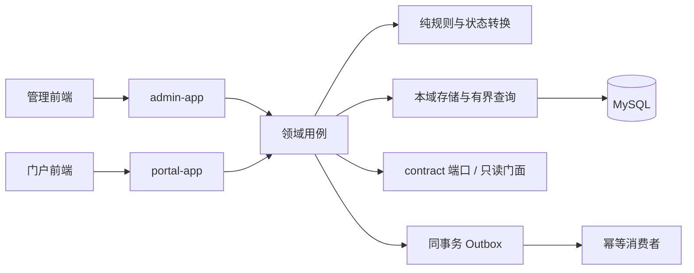

# 项目诊断与重构方案

审计日期：2026-10-10（对照 tip `44c995d` / Merge #122；含 #120/#121 栈）。范围：重点后端链路、两端前端、契约、测试、性能与部署入口。下表保留初次静态审计依据并叠加 2026-10-07～10-10 已合 PR 实况；历史旅程运行结果见 [核验报告](full-flow-verification-2026-10-07.md)。门户个人中心 R5-01 与任务生命周期 R2-01 已推进，不能据此声称全仓重构或全部业务验收完成。

2026-10-09 文档清理说明：旧 Kiro 规格已退役。下文设计章节、需求编号和“设计允许”等描述是初次审计背景，不再构成实施授权；执行任何批次前核实现状，以用户本次要求和 [已确认决定](decisions.md) 确定行为及验收。

**相位命名**：蓝图批次用 **R0–R6**；已合 PR 分支/标题常用 **P1–P4**（约对应 R1 门禁 → R2 业务正确性片段 → R3 读路径/缓存 → R4/R5 基建与 Admin 切片）。二者不是同一套完成证明；下列 §4 表含 2026-10-10 实况注记。

## 1. 总体判断

当前问题不在于缺少框架或模块，而在于业务边界没有始终落实、查询与事务编排职责混杂、前端异步状态容易失控，以及文档和测试门禁给出的保证超过实际证据。只改目录、统一命名或换 UI 不能解决这些问题。

继续采用**模块化单体内核 + 管理/门户双应用**。保留现有技术栈、账号隔离、任务版本快照及 task/reward 同事务发奖。没有证据支持现在拆成微服务或引入通用工作流平台。未上线允许按用例直接替换实现，但必须保住已经需要的功能、数据不变量和已确认契约。

已有单元、属性、架构、真实 MySQL/Redis IT、前端组件和 E2E 测试，不能称为“没有测试”；需要检查它们是否验证了正确行为、是否真正被执行、门禁是否覆盖实际实现。

## 2. 已核实问题与影响

下列路径和符号来自本轮工作区。未运行测试复现的竞争问题明确标为风险；业务偏差后续先补回归再修改。其他模块在第 5 节列为待审范围，不据此声称已全部验证。

| 编号 | 静态证据 | 影响与后续处理 |
|---|---|---|
| F01 | [TaskPortalAppService](../server/domain-task/src/main/java/com/mkt/task/application/TaskPortalAppService.java) 的 `list`/`mine` 曾逐项取快照与周期实例 | **已落地**（#104）：`listByTaskAndVersions` + `listByUserTaskCycles` 批读；可见性过滤后分页语义不变；缓存统一入口已由 F03（#105）覆盖 |
| F02 | [TaskPublishAppService](../server/domain-task/src/main/java/com/mkt/task/application/TaskPublishAppService.java) 的 `freezeToPublished` 曾在事务提交前写共享快照缓存，索引则在提交后失效 | **已修复**：快照改为 `putAfterCommit`（与索引 `evictAfterCommit` 对齐）；回滚不再提前暴露快照；见 `TaskPublishAppServiceTest` / `TwoLevelPlatformCacheTest` |
| F03 | [TwoLevelPlatformCache](../server/platform-infra/src/main/java/com/mkt/infra/cache/TwoLevelPlatformCache.java) 为查缓存 → loader → put；evict 不约束正在进行的 loader | **本轮**：同 key `CompletableFuture` 合并加载 + 按 key/namespace generation 防 stale put；evict/广播后旧 loader 不回填；见 `TwoLevelPlatformCacheTest` |
| F04 | 原领取互斥只扫 PUBLISHED，原下线操作未更新在途期限 | 已在 R2-01 修复为绑定快照互斥、下线有界重算及并发保护；规则由 DEC-007 明确，后续真实 MySQL 结果见 2026-10-07 核验报告 |
| F05 | [AdPortalAppService.visible](../server/domain-ad/src/main/java/com/mkt/ad/application/AdPortalAppService.java) / [ParticipationRules.firstReject](../server/domain-activity/src/main/java/com/mkt/activity/domain/ParticipationRules.java) 人群求值缺口 | **已落地**：`CrowdPort` + `memberOfAll`/`memberOfAny`；活动允许名单 `memberOfAny`；广告登录 `memberOf`；匿名不筛人群（DEC-003） |
| F06 | [MetricsAggregateService](../server/admin-app/src/main/java/com/mkt/admin/metrics/MetricsAggregateService.java)、[MetricsQueryService](../server/admin-app/src/main/java/com/mkt/admin/metrics/MetricsQueryService.java)、[JdbcSimulateGrantLookup](../server/admin-app/src/main/java/com/mkt/admin/simulate/JdbcSimulateGrantLookup.java) 直接查询其他域表 | **已落地**：登记为只读聚合例外（[AdminAggregateSqlInventory](../server/admin-app/src/main/java/com/mkt/admin/arch/AdminAggregateSqlInventory.java)）；源表只读、写仅 `mtr_*`；表所有权仍在数据域；[ArchAdminAggregateSqlTest](../server/admin-app/src/test/java/com/mkt/admin/ArchAdminAggregateSqlTest.java) 未登记跨域 SQL 失败 |
| F07 | [GrantFailureLedger](../server/domain-reward/src/main/java/com/mkt/reward/application/GrantFailureLedger.java) / 审计事务边界 | **本轮（DEC-004 已定）**：永久失败独立留痕；积分过期按笔独立；回滚不写 SUCCESS；补 IT |
| F08 | [OutboxRelay](../server/platform-infra/src/main/java/com/mkt/infra/outbox/OutboxRelay.java) 每轮单批 100，调度间隔 5 秒 | **已落地 #120**（[DEC-002](decisions.md#dec-002outbox-消费容量已关闭)）：持锁多批、2s 预算、空退出、无 MQ；起步 100/5s/2s；容量数字门禁仍属 DEC-006 |
| F09 | [TrackBatchService](../server/domain-tracking/src/main/java/com/mkt/tracking/application/TrackBatchService.java) 在 accepted event 路径重复读取元数据状态 | **本轮**：`statusesOf` 批次去重批读（decide + toAccepted 共用 map）；跨请求缓存另按命名空间设计处理；见 `TrackBatchServiceTest` |
| F10 | [我的列表页面](../web/apps/client/src/views/mine/) 原实现把 Vant `v-model:loading` 与请求入口的 loading 拦截混用，缺少请求代次隔离 | 已在 R5-01 通过统一分页、错误恢复和会话隔离修复；组件与浏览器回归入口见验证映射，历史结果不代替本次执行 |
| F11 | [后台页面](../web/apps/admin/src/views/) 中用户、角色、看板等抽样加载路径缺少统一 finally 收尾；布局与全局样式职责集中 | **列表/系统/编辑加载路径已收口**（#108/#110/#112–#116 + edit/version）：`useLatestRequest` + `runWithLoading`；已迁 user/role/dashboard/audit、system、task/reward/activity/ad/signin 列表、risk/points/track/metrics/simulate、login/change-password、`task/definition/edit.vue` / `version.vue`。画布面板等非请求壳层仍可手写；见 `runWithLoading.spec.ts` |
| F12 | 原仅 [check-openapi-types.sh](../ci/check-openapi-types.sh)（JSON→TS） | 已由 [check-openapi-backend.sh](../ci/check-openapi-backend.sh) 补全非 prod 后端 live 导出 → 已提交 JSON → TS；prod springdoc 保持关闭（#99） |
| F13 | [server/pom.xml](../server/pom.xml) 关键覆盖率曾指向不存在的 `com.mkt.reward.grant` / `com.mkt.risk.engine`；现以 CLASS 门禁覆盖 `GrantAppService`、`RuleDecisionEngine`、`ListDecisionEngine`，PACKAGE 仍覆盖 kernel / task.engine / task.expression / reward.points；架构规则曾只覆盖部分访问形式 | **本轮已核对/收口（访问形式）**：(1) RL-01 改为 `consideringOnlyDependenciesInAnyPackage("com.mkt..")`，关闭 in-layers-only 对非层包中转路径的盲区；(2) 保留 RL-02/RL-03 的 `dependOnClassesThat`（非 `accessClassesThat`），fixture 逐项证明 field type / ctor param / method call / extends / implements / generics / annotation / return type 均会失败，并对照证明 field/implements/return/annotation 对 `accessClassesThat` 不可见（extends 因隐式 `super()` 仍可见）；(3) AT-C01 补齐 `LocalDate`/`ZonedDateTime`/`OffsetDateTime` 无参与 `now(ZoneId)`；`Clock.systemUTC()`（装配入口）与 `System.nanoTime()`（审计耗时）仍为有意例外；见 `ArchLayerRuleTest`、`ArchAccessFormRuleTest`、`ArchClockRuleTest`、`ClockDirectCallArchTest`。JaCoCo 关键包/类此前已对齐。跨域字符串 SQL 已由 F06 清单门禁覆盖；RL-12 继承面不在本轮强关 |
| F14 | [perf](../perf/README.md) 中 callback 复用有限单步实例，业务 checks / 接收吞吐 / dropped iterations 门槛不足 | **本轮**：advance 分区消费单步 callback + progress 持续写入断言；complete 线性消费并在耗尽失败；track 业务 check/`track_accepted` 结构性下限 + CAR `dropped_iterations`；见 `perf/README.md` |
| F15 | [TrackDropCounters](../server/domain-tracking/src/main/java/com/mkt/tracking/support/TrackDropCounters.java) 只有进程计数/日志，告警配置与业务指标注册未闭环 | **本轮**：注册 Micrometer `mkt.track.drop`（Prometheus `mkt_track_drop_total`）+ `reason` 标签（malformed/unregistered/disabled）；AtomicLong/log 保留；见 `TrackDropCountersTest` |
| F16 | [恢复说明](../deploy/backup/RESTORE-DRILL.md) 对应脚本未使用备份 binlog 起点；部署模板缺完整静态资源/TLS接线；[本地脚本](../scripts/README.md) 停止进程按端口处理 | **本轮**：`restore.sh` 从 `BINLOG_START` / dump 内 CHANGE MASTER\|SOURCE 位点重放并要求 `RESTORE_I_ACCEPT_DATA_LOSS=YES`；nginx 双 host 静态根 + TLS include/certs/HTTPS 端口接线（见 `deploy/nginx/README.md`）；`dev.ps1 stop` 先 pid/进程树/命令行归属再清端口（否则跳过，需 `-Force`）。静态取证与 fixture；**2026-10-10** throwaway 隔离 backup→PITR（[drills/2026-10-10-f16-isolated-restore.md](../deploy/backup/drills/2026-10-10-f16-isolated-restore.md)）；**连续 binlog shipping** 独立脚本 `ship-binlog.sh` + 保留/清单 + 调度样例，演练 full→ship→A/B→PITR 见 [drills/2026-10-10-f16-continuous-binlog-ship.md](../deploy/backup/drills/2026-10-10-f16-continuous-binlog-ship.md)；**未**对共享库执行；**2026-10-11** TLS/静态浏览器取证（自签 + 隔离 nginx compose）见 [nginx/drills/2026-10-11-f16-tls-static-browser.md](../deploy/nginx/drills/2026-10-11-f16-tls-static-browser.md)；**2026-10-11** `dev.ps1 stop` 归属收口（路径绑定/`--filter`/深度上限）+ Windows host-owned **N/A** 静态清单见 [../scripts/drills/2026-10-11-f16-dev-ps1-stop-ownership.md](../scripts/drills/2026-10-11-f16-dev-ps1-stop-ownership.md) |

## 3. 目标实现边界

- Controller 处理协议、参数、身份与权限；application 组织一个清晰用例及事务；domain/engine 保留状态转换与纯规则；store/mapper 负责有界读写和原子 SQL；convert/response 负责投影。
- 只有真实复杂规则或复用需求才新增抽象。简单 CRUD 保持简单，不机械增加 Manager、BaseService、通用 Repository 或万能流程层。
- 查询路径准备数据后统一求值；公开目录与用户私有状态分开。缓存不可跨用户泄漏，不能用无限历史扫描替代逐条查询。
- 写路径以数据库唯一约束、条件扣减、CAS 和短事务保证一致性。事务内不掺外部渠道 IO；积分与发奖不因拆类而改变传播行为。
- 端口由业务数据拥有域实现；应用负责装配与跨用例协调，聚合扫描按设计的例外明确归属，不在应用层堆放任意跨域 SQL。正式装配缺核心依赖应显式失败，不靠测试替身维持启动。
- 两端前端各自持有认证状态与 UI；shared 限于生成契约和纯工具。按查询、分页、提交的实际共性抽取状态管理，写操作不自动重放。

## 4. 实施批次与出口

R5-01：已按用户追加授权实施“门户个人中心完整列表体验”，覆盖任务/奖品/积分分页、筛选、刷新、错误恢复、领取后的重载、详情查找与会话隔离。复用既有 API，可独立交付，不依赖 Outbox 或跨域契约决策；其余后端与页面批次继续按下表准备。验证入口为三个 MinePage、PrizeDetailPage、usePagedList、HTTP/会话测试与独立 `personal-lists.spec.ts` 浏览器回归。

R2-01：用户明确 DEC-007 后实施任务生命周期，覆盖旧快照互斥、下线/重新发布、冻结周期键、到期与幂等优先级、奖励恢复和并发状态保护。保留唯一约束与 CAS，删除无版本完成步骤的旧入口；定时、编辑、恢复及删除加入一致定义锁协议。后续真实检查及环境差异见 2026-10-07 核验报告。

每批都交付必要规格修订、回归、实现、旧路径清理及实际检查记录。批次表示技术依赖；已具备条件的独立前端批次可以先行。可以进一步拆为可独立验收的 PR，不自动实施全部剩余批次。

**2026-10-10 实况（P1–P4 vs R）**：P1≈R1 门禁（#99–#101）已合；P2 落地 CrowdPort 最小集（#102）与 DEC-004（#111）；**DEC-003 已关闭**且 F06/组合已落地本批；**不能**据此声称 R2 整批完成（尚有其他业务缺陷面）；P3≈R3 的 F01–F03（#103–#105）代码已合；P4 覆盖 R4/R5 片段（F08/F09/F11/F13/F14/F15/F16 等 #106–#120），**非**完整 R4/R5/R6——**F08（Outbox）已关**（#120）；**F06（跨域 SQL）已关**；F16 隔离恢复 + 连续 shipping 证据见 `deploy/backup/drills/`；TLS/静态浏览器证据见 `deploy/nginx/drills/`；`dev.ps1 stop` 归属静态收口见 `scripts/drills/`（Windows 运行时仍 host-owned / bot N/A）；R6/P5 仍依赖 DEC-005/006。

| 批次 | 工作 | 进入条件 | 验收出口 | 2026-10-10 实况 |
|---|---|---|---|---|
| R0 文档治理（本轮） | 入口收口、删除重复、纠正失实状态、记录方案分歧 | 仅文档授权 | 链接与引用有效、原代码不变、事实与目标分开 | 持续纠偏（本盘点） |
| R1 功能与验收基线 | 确认实施版本；盘点用户旅程/契约/数据；核验测试入口、覆盖率范围、OpenAPI 导出与性能脚本 | DEC-001 明确，环境可用 | 可复现测试报告；失败按产品/环境分类；保留能力清单；真实契约导出 | P1 门禁已合（#99–#101） |
| R2 业务正确性 | 下线/互斥/过期、人群、事务失败与审计；按缺陷独立交付 | 涉及的 DEC-003/004 已明确 | 回归先能暴露原问题，修改后通过；资金与并发路径真实数据库验证 | DEC-003/004 已关；CrowdPort 组合 + F06 门禁已合本批 |
| R3 门户读路径与缓存 | 统一快照读取、批量状态、查询分页边界、提交后缓存处理、竞争与降级 | 关键行为基线稳定 | 查询计数随候选集合有界；回滚、旧 loader 回填、跨节点失效与缓存故障可验证 | F01–F03 已合（#103–#105） |
| R4 领域与基础设施整理 | 按第 5 节逐用例整理；跨域 SQL、Outbox、埋点、调度、指标与恢复机制 | 对应契约/容量决定明确 | 无未登记跨域直读；事件不丢不重复副作用；积压恢复与可观测证据 | F08（#120）/F06（本批）/F09/F13/F14/F15/F16 片段已合；DEC-002 已关且 F08 已落地 |
| R5 两端前端迁移 | 先分页/异常/会话正确性，再布局、主题与按域页面结构 | 对应 API 稳定；可与后端无关批次并行 | 真实组件顺序、乱序、失败、会话切换、权限与端到端旅程通过；真实浏览器验收 | R5-01 门户已完成；Admin F11 列表/系统/edit/version 加载路径已收口 |
| R6 首次发布候选验收 | 空库迁移、全量旅程、双实例故障、容量、恢复与部署 | 计划范围完成；DEC-005/006 已明确 | 实测报告满足现行规格；无废弃双实现；达到发布检查单，另行决定是否上线 | 未开始 |

## 5. 全面覆盖清单

以下是后续审查范围，不是新增模块或本轮完成声明。

| 范围 | 需要保留并验证的能力 | 结构整理重点 |
|---|---|---|
| identity / 系统管理 | 两端认证、会话原因码、RBAC、用户/字典/配置、审计、internal调用方 | 认证与画像读模型分开；授权、事务、会话失效职责可追踪 |
| task | 聚合编辑、发布快照、灰度/人群/互斥、领取、四入口推进、旧版本在途与终态 | 规则与 IO 分离；查询有界；领取/推进/发布分别组织用例 |
| reward / points | 库存、限领、发放、手动领取、履约、重试、积分过期/调整、对账补发 | 清晰事务与幂等键；正常/失败/补偿各路径可测试；保留补发关原单语义 |
| risk | 名单优先级、六条内置规则、命中、降级与处置 | 请求内数据复用，纯判定与计数/留痕分开，拒绝零业务副作用 |
| tracking | 元数据、接收策略、客户端/服务端事件、分区与清理 | 批量处理与有界过载；事件数、请求数、丢弃与落库分开计量 |
| signin / activity / ad | 补签同事务、梯度奖励、参与限制、人群、广告频控与匿名设备 | 规则独立于页面投影；契约复用且不越域查表 |
| app / infra / db | 核心装配、缓存、锁、Outbox、调度、迁移、健康、指标与恢复 | 明确所有权与失效语义；生产装配断言和真实数据库测试 |
| 管理前端 | 系统、任务编辑、奖励积分、风控、埋点、活动/签到/广告、看板与模拟 | 布局与业务页分离；权限可达；表单/查询/提交错误可恢复 |
| 门户前端 | 游客浏览、登录注册、首页、任务、奖品来源/详情、活动、签到、个人中心 | 登录前后数据隔离；分页不串页；完成态/空态/异常态明确 |
| 工程与运行 | 契约生成、质量门禁、开发进程、部署、备份、压力数据 | 实现与门禁一致；报告可复现；环境故障不伪装成测试通过 |

## 6. 验收方式与止损边界

业务验收按本次要求、已确认决定和相关行为回归确定；[验证映射](verification-matrix.md) 仅用于查找历史测试。保留事务、幂等、库存、账号与资源归属边界；性能目标按 DEC-006 确认，不沿用退役规格中的数字作为新门禁。

每个工作项写明：问题与证据、相关契约或决定、保留行为、改动范围、回归场景、检查命令和未验证项。对查询记录 SQL 数量/候选规模，对事务验证回滚及重复请求，对性能同时记录有效状态变更、延迟、错误和资源条件。

本机运行可用的单元/属性/组件测试；需要真实 MySQL/Redis 的集成验证在 Docker CI 完成，不引 H2、不降低断言。浏览器交互与视觉验收覆盖加载、空、错、窄屏、键盘、长文本及会话切换。新接口契约必须贯通后端 → 导出 JSON → TS → 两端调用。

纯结构整理不能顺带修改业务语义。确需改变行为、契约、迁移历史或事务例外时，明确相应[决策项](decisions.md)，同批同步说明与验证。只有一个可描述的完成状态：新路径已验证、旧路径及无效规则已删除，剩余风险明确列出；不以“文件更短”或“测试数量更多”宣称完成。
